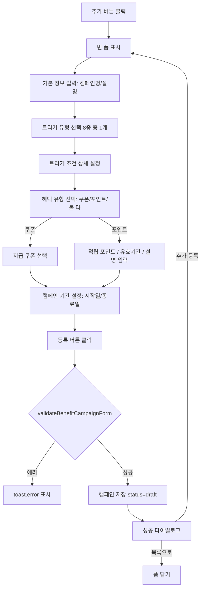
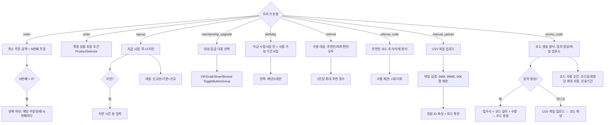
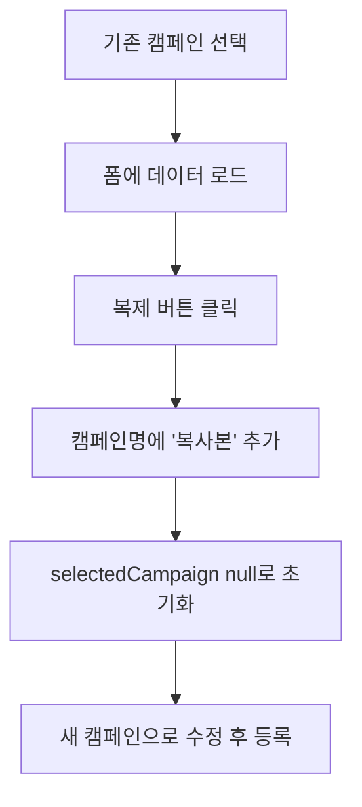

# 캠페인 관리 페이지 기획서

## 📋 개요

**페이지 경로**: `/marketing/campaigns`
**접근 권한**: 인증된 사용자
**주요 목적**: 트리거 기반 혜택 자동 지급 캠페인 등록 및 관리

---

## 🎯 주요 기능

### 1. 트리거 유형 관리 (8종)
| 트리거 | 라벨 | 설명 |
| --- | --- | --- |
| `order` | 주문 시 | 주문 완료 시 자동 지급. 최소 금액, N번째 주문, 반복, 특정 상품 조건 |
| `signup` | 회원 가입 시 | 신규 가입 시 자동 지급. 지연 시간, 신규/기존 대상 설정 |
| `membership_upgrade` | 멤버십 달성 시 | 특정 등급 도달 시 자동 지급 (VIP/Gold/Silver/Bronze) |
| `birthday` | 생일 | 생일 전후 자동 지급. 지급 시점, 사용 가능 기간, 매년 반복 |
| `referral` | 친구 추천 시 | 추천 완료 시 지급. 대상(추천인/피추천인/모두), 최대 횟수 |
| `referral_code` | 추천인 코드 | 코드 입력 시 자동 지급. 코드 목록 관리, 1회/다회 사용 |
| `manual_upload` | 수기 업로드 | CSV 파일로 회원 ID 업로드 후 지급 |
| `promo_code` | 난수 발행쿠폰 | 랜덤 코드 일괄 생성 또는 외부 코드 업로드 후, 코드 입력(매칭) 시 쿠폰 또는 포인트 지급. 코드 접두사, 길이, 수량, 사용 조건 설정 |


### 2. 혜택 유형 설정
- **쿠폰 지급 (coupon)**: 기존 쿠폰 선택하여 자동 발급
- **포인트 적립 (point)**: 적립 포인트, 유효 기간, 적립 내역 설명
- 다중 선택 가능 (쿠폰 + 포인트 동시 지급)
- ToggleButtonGroup (multiple, filled variant) 사용

### 3. 캠페인 상태 관리
| 상태 | 라벨 | Badge Variant |
| --- | --- | --- |
| `draft` | 초안 | secondary |
| `active` | 진행중 | success |
| `paused` | 일시중지 | warning |
| `completed` | 완료 | default |
| `cancelled` | 취소됨 | critical |


### 4. 통계 카드
- 총 캠페인 수
- 진행중 캠페인 수
- 총 혜택 지급 횟수 (누적)
- 총 수혜자 수 (누적)

### 5. 목록 관리
- 상태 필터 (전체/진행중/초안/일시중지/완료)
- 캠페인명 검색 (SearchInput)
- 캠페인 선택 시 수정 모드 통계 표시 (총 지급 수, 총 수혜자)

### 6. 부가 기능
- **캠페인 복제**: 기존 캠페인 기반 복사본 생성
- **저장 완료 다이얼로그**: 등록/수정 완료 후 추가 등록 또는 목록으로 선택
- **폼 유효성 검증**: validateBenefitCampaignForm 함수

### 7. 트리거 조건 폼 (TriggerConditionForm 별도 컴포넌트)
트리거 유형에 따라 동적으로 조건 입력 UI가 전환됨.

---

## 🖼️ 화면 구성

```
┌──────────────────────────────────────────────────────────────┐
│  캠페인 관리                                                   │
│  트리거 기반 혜택 자동 지급 캠페인을 관리합니다.                    │
├──────────────────────────────────────────────────────────────┤
│  ┌──────┐ ┌──────┐ ┌──────┐ ┌──────┐                        │
│  │총 캠페│ │진행중  │ │총 지급│ │총 수혜│                        │
│  │  5   │ │  4   │ │ 1,039│ │  957 │                        │
│  └──────┘ └──────┘ └──────┘ └──────┘                        │
├──────────────────────────────────────────────────────────────┤
│  ┌────────────────────┐ ┌────────────────────────────────┐   │
│  │ 캠페인 목록 (400px) │ │ 캠페인 등록/수정 폼 (1fr)       │   │
│  ├────────────────────┤ ├────────────────────────────────┤   │
│  │      [추가]         │ │ [수정 모드 통계]               │   │
│  │ [전체][진행중][초안] │ │  총 지급수 | 총 수혜자          │   │
│  │ [일시중지][완료]     │ │                                │   │
│  │ [🔍 캠페인명 검색...]│ │ [기본 정보]                     │   │
│  │                    │ │  캠페인명, 설명                  │   │
│  │ ⚡ 첫 주문 포인트   │ │                                │   │
│  │   진행중 · 주문 시   │ │ [트리거 유형]                   │   │
│  │   포인트적립          │ │  ◉ 주문 시   ○ 회원 가입 시     │   │
│  │   지급342 · 수혜342  │ │  ○ 멤버십 달성 ○ 생일           │   │
│  │                    │ │  ○ 친구 추천  ○ 추천인 코드      │   │
│  │ ⚡ 신규 가입 환영   │ │  ○ 수기 업로드 ○ 난수 발행쿠폰  │   │
│  │   진행중 · 회원가입  │ │                                │   │
│  │   쿠폰지급           │ │ [트리거 조건] (동적 UI)         │   │
│  │   지급523 · 수혜523  │ │  (order) 최소금액, N번째, 반복   │   │
│  │                    │ │  (signup) 지연시간, 대상범위      │   │
│  │ ⚡ 생일 축하 캠페인  │ │  (birthday) 지급시점, 기간, 반복 │   │
│  │   진행중 · 생일      │ │  ...                           │   │
│  │   쿠폰+포인트        │ │                                │   │
│  │   지급128 · 수혜64   │ │ [혜택 설정]                     │   │
│  │                    │ │  [쿠폰 지급] [포인트 적립]       │   │
│  │ ⚡ VIP 등급 달성    │ │  쿠폰 선택 / 포인트 금액 설정    │   │
│  │   초안 · 멤버십 달성 │ │                                │   │
│  │   쿠폰지급           │ │ [캠페인 기간]                   │   │
│  │                    │ │  시작일: [____] 종료일: [____]   │   │
│  │                    │ │                                │   │
│  │                    │ │  [복제]      [취소] [등록/수정]   │   │
│  └────────────────────┘ └────────────────────────────────┘   │
└──────────────────────────────────────────────────────────────┘
```

---

## 🔄 사용자 플로우

### 캠페인 등록 플로우


### 트리거별 조건 설정 플로우


### 캠페인 복제 플로우


---

## 📦 데이터 구조

### 캠페인 타입
```typescript
interface BenefitCampaign {
  id: string;
  name: string;
  description: string;

  trigger: BenefitCampaignTrigger;
  orderCondition?: OrderTriggerCondition;
  signupCondition?: SignupTriggerCondition;
  membershipCondition?: MembershipUpgradeTriggerCondition;
  birthdayCondition?: BirthdayTriggerCondition;
  referralCondition?: ReferralTriggerCondition;
  referralCodeCondition?: ReferralCodeTriggerCondition;
  manualUploadCondition?: ManualUploadTriggerCondition;
  promoCodeCondition?: PromoCodeTriggerCondition;

  benefitConfig: BenefitConfig;

  startDate: string;
  endDate: string;
  status: BenefitCampaignStatus;

  totalIssuedCount: number;
  totalBeneficiaryCount: number;

  createdAt: Date;
  updatedAt: Date;
  createdBy: string;
}
```

### 트리거 조건 인터페이스
```typescript
interface OrderTriggerCondition {
  minOrderAmount: number | null;
  nthOrder: number | null;
  isEveryNthOrder: boolean;
  specificProductIds: string[];
}

interface SignupTriggerCondition {
  delayMinutes: number;
  isNewMembersOnly: boolean;
}

interface MembershipUpgradeTriggerCondition {
  targetGrades: MemberGrade[];     // 'vip' | 'gold' | 'silver' | 'bronze'
}

interface BirthdayTriggerCondition {
  daysBefore: number;
  daysAfter: number;
  repeatYearly: boolean;
}

interface ReferralTriggerCondition {
  benefitTarget: 'referrer' | 'referee' | 'both';
  maxReferralsPerMember: number | null;
}

interface ReferralCodeTriggerCondition {
  referralCodes: string[];
  singleUsePerCode: boolean;
}

interface ManualUploadTriggerCondition {
  uploadedFileName: string | null;
  uploadedMemberIds: string[];
  uploadedAt: string | null;
}

type PromoCodeGenerationMethod = 'random' | 'upload';

interface PromoCodeUsageCondition {
  maxUsesPerCode: number;
  maxUsesPerMember: number;
  codeValidityDays: number | null;
}

interface PromoCode {
  code: string;
  usedCount: number;
  isActive: boolean;
  createdAt: string;
}

interface PromoCodeTriggerCondition {
  generationMethod: PromoCodeGenerationMethod;
  codePrefix: string;
  codeLength: number;
  codeQuantity: number;
  promoCodes: PromoCode[];
  uploadedFileName: string | null;
  usageCondition: PromoCodeUsageCondition;
}
```

### 혜택 설정 타입
```typescript
type CampaignBenefitType = 'coupon' | 'point';

interface BenefitConfig {
  benefitTypes: CampaignBenefitType[];
  couponConfig: CouponBenefitConfig | null;
  pointConfig: PointBenefitConfig | null;
}

interface CouponBenefitConfig {
  couponId: string;
  couponName: string;
}

interface PointBenefitConfig {
  pointAmount: number;
  pointValidityDays: number | null;
  pointDescription: string;
}
```

### 폼 데이터
```typescript
interface BenefitCampaignFormData {
  name: string;
  description: string;
  trigger: BenefitCampaignTrigger;

  // order
  orderMinAmount: number | null;
  orderNthOrder: number | null;
  orderIsEveryNth: boolean;
  orderSpecificProductIds: string[];

  // signup
  signupDelayMinutes: number;
  signupNewMembersOnly: boolean;

  // membership_upgrade
  membershipTargetGrades: MemberGrade[];

  // birthday
  birthdayDaysBefore: number;
  birthdayDaysAfter: number;
  birthdayRepeatYearly: boolean;

  // referral
  referralBenefitTarget: 'referrer' | 'referee' | 'both';
  referralMaxPerMember: number | null;

  // referral_code
  referralCodes: string[];
  referralCodeSingleUse: boolean;

  // manual_upload
  uploadFileName: string | null;
  uploadMemberIds: string[];

  // promo_code
  promoCodeMethod: PromoCodeGenerationMethod;
  promoCodePrefix: string;
  promoCodeLength: number;
  promoCodeQuantity: number;
  promoCodes: PromoCode[];
  promoCodeUploadFileName: string | null;
  promoCodeMaxUsesPerCode: number;
  promoCodeMaxUsesPerMember: number;
  promoCodeValidityDays: number | null;

  // 혜택
  benefitTypes: CampaignBenefitType[];
  couponId: string;
  couponName: string;
  pointAmount: number;
  pointValidityDays: number | null;
  pointDescription: string;

  // 기간
  startDate: string;
  endDate: string;
}
```

---

## 🔌 API 엔드포인트

### 1. 캠페인 목록 조회
```
GET /api/marketing/benefit-campaigns
Authorization: Bearer {token}
Query: ?search=캠페인명&status=active&page=1&limit=20

Response:
{
  "data": [
    {
      "id": "bc-1",
      "name": "첫 주문 포인트 적립",
      "trigger": "order",
      "status": "active",
      "benefitConfig": {
        "benefitTypes": ["point"],
        "couponConfig": null,
        "pointConfig": { "pointAmount": 1000 }
      },
      "totalIssuedCount": 342,
      "totalBeneficiaryCount": 342
    }
  ],
  "pagination": {
    "page": 1,
    "limit": 20,
    "total": 5
  }
}
```

### 2. 캠페인 상세 조회
```
GET /api/marketing/benefit-campaigns/:id
Authorization: Bearer {token}

Response:
{
  "data": {
    "id": "bc-1",
    "name": "첫 주문 포인트 적립",
    "description": "첫 주문 시 1,000 포인트 적립",
    "trigger": "order",
    "orderCondition": {
      "minOrderAmount": 15000,
      "nthOrder": 1,
      "isEveryNthOrder": false,
      "specificProductIds": []
    },
    "benefitConfig": {
      "benefitTypes": ["point"],
      "couponConfig": null,
      "pointConfig": {
        "pointAmount": 1000,
        "pointValidityDays": 90,
        "pointDescription": "첫 주문 감사 포인트"
      }
    },
    "startDate": "2026-01-01",
    "endDate": "2026-12-31",
    "status": "active",
    "totalIssuedCount": 342,
    "totalBeneficiaryCount": 342
  }
}
```

### 3. 캠페인 생성
```
POST /api/marketing/benefit-campaigns
Content-Type: application/json
Authorization: Bearer {token}

{
  "name": "생일 축하 캠페인",
  "description": "생일 당일 쿠폰 + 포인트 지급",
  "trigger": "birthday",
  "birthdayCondition": {
    "daysBefore": 0,
    "daysAfter": 30,
    "repeatYearly": true
  },
  "benefitConfig": {
    "benefitTypes": ["coupon", "point"],
    "couponConfig": { "couponId": "2", "couponName": "생일 축하 쿠폰" },
    "pointConfig": {
      "pointAmount": 2000,
      "pointValidityDays": 30,
      "pointDescription": "생일 축하 포인트"
    }
  },
  "startDate": "2026-01-01",
  "endDate": "2026-12-31"
}
```

### 4. 캠페인 수정
```
PATCH /api/marketing/benefit-campaigns/:id
Content-Type: application/json
Authorization: Bearer {token}

{
  "name": "생일 축하 캠페인 (수정)",
  "benefitConfig": {
    "benefitTypes": ["coupon", "point"],
    "couponConfig": { "couponId": "2", "couponName": "생일 축하 쿠폰" },
    "pointConfig": {
      "pointAmount": 3000,
      "pointValidityDays": 60,
      "pointDescription": "생일 축하 포인트 (업그레이드)"
    }
  }
}
```

### 5. 캠페인 삭제
```
DELETE /api/marketing/benefit-campaigns/:id
Authorization: Bearer {token}

Response:
{
  "message": "캠페인이 삭제되었습니다"
}
```

### 6. CSV 회원 업로드 (manual_upload 트리거)
```
POST /api/marketing/benefit-campaigns/upload-members
Content-Type: multipart/form-data
Authorization: Bearer {token}

{
  "file": [CSV 파일]
}

Response:
{
  "data": {
    "fileName": "members.csv",
    "memberIds": ["member-1", "member-2", ...],
    "totalCount": 1500
  }
}
```

### 7. 프로모션 코드 생성 (promo_code 트리거)
```
POST /api/marketing/benefit-campaigns/promo-codes/generate
Content-Type: application/json
Authorization: Bearer {token}

{
  "codePrefix": "SUMMER",
  "codeLength": 8,
  "codeQuantity": 1000
}

Response:
{
  "data": {
    "generatedCount": 1000,
    "codes": ["SUMMER-A1B2C3D4", "SUMMER-E5F6G7H8", ...]
  }
}
```

### 8. 프로모션 코드 업로드 (promo_code 트리거)
```
POST /api/marketing/benefit-campaigns/promo-codes/upload
Content-Type: multipart/form-data
Authorization: Bearer {token}

{
  "file": [CSV 파일]
}

Response:
{
  "data": {
    "fileName": "promo-codes.csv",
    "codes": ["CODE001", "CODE002", ...],
    "totalCount": 500
  }
}
```

### 9. 프로모션 코드 다운로드
```
GET /api/marketing/benefit-campaigns/:id/promo-codes/download
Authorization: Bearer {token}

Response: CSV 파일 스트림 (Content-Disposition: attachment; filename="promo-codes.csv")
```

---

## 🔒 보안 고려사항

### 권한 관리
| 역할 | 조회 | 생성 | 수정 | 삭제 | CSV 업로드 |
| --- | --- | --- | --- | --- | --- |
| Admin | ✅ | ✅ | ✅ | ✅ | ✅ |
| Manager | ✅ | ✅ | ✅ | ❌ | ✅ |
| Viewer | ✅ | ❌ | ❌ | ❌ | ❌ |


### 데이터 검증 (validateBenefitCampaignForm)
```typescript
// 공통 검증
if (!data.name.trim()) → '캠페인명을 입력해주세요.'
if (!data.startDate) → '시작일을 입력해주세요.'
if (!data.endDate) → '종료일을 입력해주세요.'
if (data.startDate > data.endDate) → '종료일은 시작일 이후여야 합니다.'

// 트리거별 검증
order: orderMinAmount >= 0, orderNthOrder >= 1
signup: signupDelayMinutes >= 0
membership_upgrade: targetGrades.length >= 1
birthday: birthdayDaysBefore >= 0, birthdayDaysAfter >= 1
referral: referralMaxPerMember >= 1
referral_code: referralCodes.length >= 1
manual_upload: uploadMemberIds.length >= 1
promo_code: promoCodes.length >= 1, codeLength 4~20, codeQuantity 1~100,000, maxUsesPerCode >= 1

// 혜택 검증
benefitTypes.length >= 1
coupon 포함 시 couponId 필수
point 포함 시 pointAmount > 0, pointAmount <= 1,000,000
```

### CSV 파일 업로드 보안 (TriggerConditionForm)
```typescript
const MAX_CSV_FILE_SIZE = 5 * 1024 * 1024;  // 5MB
const MAX_UPLOAD_MEMBERS = 50000;            // 최대 50,000명

// 파일 크기 검증
if (file.size > MAX_CSV_FILE_SIZE) → '파일 크기는 5MB 이하만 허용됩니다.'

// MIME 타입 검증
if (file.type !== 'text/csv' && file.type !== 'application/vnd.ms-excel') → 'CSV 파일만 업로드 가능합니다.'

// 회원 수 제한
if (memberIds.length > MAX_UPLOAD_MEMBERS) → '회원 수는 최대 50,000명까지 허용됩니다.'

// XSS 방지: 회원 ID 에서 특수문자 제거
id.replace(/[<>"'&]/g, '')

// ID 길이 제한
id.length <= 50
```

### 추천인 코드 검증
```typescript
const REFERRAL_CODE_PATTERN = /^[A-Z0-9]{3,20}$/;
// 영문 대문자 + 숫자만, 3~20자
// 중복 코드 등록 방지
```

### 프로모션 코드 검증
```typescript
// 코드 길이 제한
codeLength >= 4 && codeLength <= 20

// 혼동 문자 제외 (0/O, 1/I/L)
// 생성 시 문자셋에서 제외: 0, O, 1, I, L

// 중복 코드 방지
const uniqueCodes = new Set(codes);  // Set 기반 dedup

// 코드당/회원당 사용 제한 검증
maxUsesPerCode >= 1
maxUsesPerMember >= 1
```

### 코드 업로드 보안 (TriggerConditionForm - promo_code)
```typescript
const MAX_PROMO_CODE_FILE_SIZE = 5 * 1024 * 1024;  // 5MB
const MAX_PROMO_CODE_COUNT = 100000;                 // 최대 100,000개

// 파일 크기 검증
if (file.size > MAX_PROMO_CODE_FILE_SIZE) → '파일 크기는 5MB 이하만 허용됩니다.'

// MIME 타입 검증
if (file.type !== 'text/csv' && file.type !== 'application/vnd.ms-excel') → 'CSV 파일만 업로드 가능합니다.'

// 코드 수 제한
if (codes.length > MAX_PROMO_CODE_COUNT) → '코드 수는 최대 100,000개까지 허용됩니다.'
```

---

## 🎨 UI 컴포넌트

### 사용된 컴포넌트 (BenefitCampaigns.tsx)
- `Card`, `CardHeader`, `CardContent` - 카드 레이아웃
- `Button` - 액션 버튼 (추가, 등록, 수정, 취소, 복제)
- `Input` - 텍스트/숫자/날짜 입력
- `Label` - 필드 라벨 (required 지원)
- `Badge` - 상태 표시 (캠페인 상태, 트리거 유형, 혜택 유형)
- `SearchInput` - 캠페인명 검색
- `ToggleButtonGroup` - 혜택 유형 다중 선택 (multiple, filled variant)

### 사용된 컴포넌트 (TriggerConditionForm.tsx)
- `Button`, `Input`, `Label` - 기본 폼 요소
- `ProductSelector` - 특정 상품 조건 선택 (order 트리거)
- `ToggleButtonGroup` - 토글 버튼 그룹 (단일/다중 선택, outline/filled)
  - 반복 여부 (order), 지급 시점 (signup), 대상 범위 (signup)
  - 대상 등급 (membership_upgrade, multiple)
  - 반복 설정 (birthday), 수령 대상 (referral)
  - 사용 제한 (referral_code)
  - 코드 생성 방식 전환 (promo_code: 임의 생성/파일 업로드)

### Ant Design Icons
- `PlusOutlined`, `DeleteOutlined`, `ThunderboltOutlined`
- `CheckOutlined` (성공 다이얼로그, CSV 업로드 완료)
- `InfoCircleOutlined` (트리거 설명)
- `CopyOutlined` (복제)
- `UploadOutlined` (CSV 업로드)
- `CloseOutlined` (추천인 코드 삭제)
- `DownloadOutlined` (프로모션 코드 CSV 다운로드)

### 레이아웃
- 2컬럼 그리드: `grid-cols-1 lg:grid-cols-[400px,1fr]`
- 통계 카드: `grid-cols-2 md:grid-cols-4`
- 트리거 선택: `grid-cols-1 md:grid-cols-2` 라디오 카드
- 폼 섹션별 h3 구분선 (`border-b border-border pb-2`)
- 상태 필터: pill 버튼 (`rounded-full`)

---

## 🧪 테스트 시나리오

### 기능 테스트
- [ ] 캠페인 목록 조회 및 검색
- [ ] 상태 필터 (전체/진행중/초안/일시중지/완료)
- [ ] 8종 트리거별 캠페인 등록
- [ ] order: 최소 금액 + N번째 주문 + 반복 + 특정 상품
- [ ] signup: 즉시/지연 지급 + 신규/기존 대상
- [ ] membership_upgrade: 등급 다중 선택
- [ ] birthday: 지급 시점 + 기간 + 매년 반복
- [ ] referral: 대상 선택 + 최대 횟수
- [ ] referral_code: 코드 추가/삭제 + 사용 제한
- [ ] manual_upload: CSV 파일 업로드 + 검증
- [ ] promo_code: 임의 생성 (접두사 + 길이 + 수량)
- [ ] promo_code: CSV 파일 업로드
- [ ] promo_code: 코드 사용 조건 설정
- [ ] promo_code: 생성된 코드 CSV 다운로드
- [ ] 혜택 유형 다중 선택 (쿠폰 + 포인트)
- [ ] 쿠폰 선택 (드롭다운)
- [ ] 포인트 설정 (금액/유효기간/설명)
- [ ] 캠페인 기간 설정
- [ ] 캠페인 수정
- [ ] 캠페인 삭제
- [ ] 캠페인 복제
- [ ] 저장 완료 다이얼로그 (추가등록/목록으로)

### 유효성 검사 테스트
- [ ] 캠페인명 빈값
- [ ] 시작일/종료일 미입력
- [ ] 종료일 < 시작일
- [ ] order: 최소 금액 음수, N번째 0 이하
- [ ] signup: 지연 시간 음수
- [ ] membership_upgrade: 등급 0개 선택
- [ ] birthday: 지급 시점 음수, 기간 0일
- [ ] referral: 최대 횟수 0 이하
- [ ] referral_code: 코드 0개, 코드 형식 불일치
- [ ] manual_upload: 회원 리스트 0명
- [ ] promo_code: 코드 0개, 코드 길이 범위 초과 (3 이하 / 21 이상), 수량 범위 초과 (0 이하 / 100,001 이상)
- [ ] 혜택 유형 0개 선택
- [ ] 쿠폰 미선택 (coupon 유형)
- [ ] 포인트 0 이하 / 100만 초과

### CSV 업로드 보안 테스트
- [ ] 5MB 초과 파일 차단
- [ ] CSV 외 파일 형식 차단
- [ ] 50,000명 초과 회원 차단
- [ ] 특수문자 포함 회원 ID 정제
- [ ] ID 길이 50자 초과 필터링

### UI/UX 테스트
- [ ] 트리거 변경 시 조건 폼 동적 전환
- [ ] ToggleButtonGroup 단일/다중 선택 동작
- [ ] 추천인 코드 태그 형태 표시 + 삭제
- [ ] CSV 업로드 성공 시 파일명 + 인원 수 표시
- [ ] 캠페인 선택 시 수정 모드 통계 카드 표시
- [ ] 상태별 Badge 색상 구분
- [ ] 빈 목록 상태 표시

---

## 📌 TODO

### 단기 (1-2주)
- [ ] Mock 데이터를 실제 API로 교체
- [ ] 캠페인 상태 변경 기능 (draft → active → paused → completed)
- [ ] CSV 업로드 서버 API 연동
- [ ] 쿠폰 목록 API 연동 (현재 하드코딩)
- [ ] 프로모션 코드 서버 생성/업로드 API 연동
- [ ] 코드 사용 이력 조회

### 중기 (1-2개월)
- [ ] 캠페인 실행 이력 조회
- [ ] 캠페인 효과 분석 대시보드
- [ ] 캠페인 일시중지/재개 기능
- [ ] 트리거 조건 조합 (AND/OR)
- [ ] 혜택 지급 내역 상세 조회
- [ ] 엑셀 업로드 지원 (CSV 외 xlsx)

### 장기 (3개월+)
- [ ] 캠페인 A/B 테스트
- [ ] 캠페인 자동 최적화 (머신러닝 기반)
- [ ] 캠페인 스케줄링 (미래 시점 자동 시작)
- [ ] 실시간 캠페인 모니터링 대시보드
- [ ] 캠페인 변경 이력 (Audit Log)
- [ ] 캠페인 템플릿

---

**작성일**: 2026-02-11
**최종 수정일**: 2026-02-20
**작성자**: Claude Code
