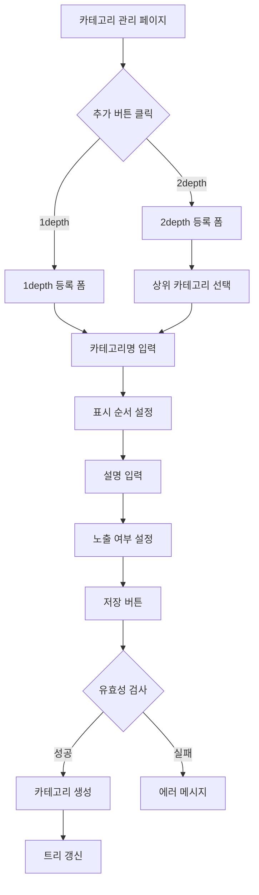
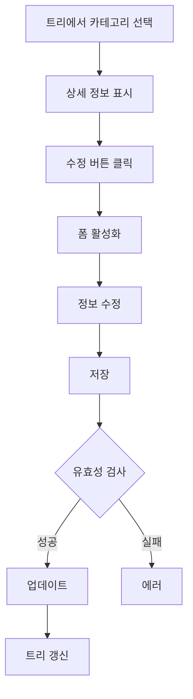
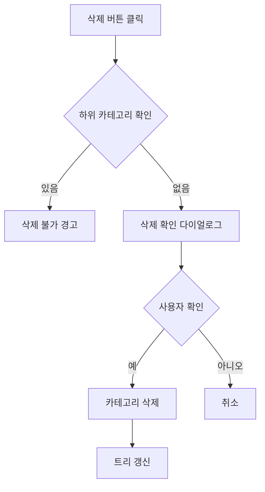

# 카테고리 관리 페이지 기획서

## 📋 개요

**페이지 경로**: `/menu/categories`
**접근 권한**: 인증된 사용자 (모든 역할)
**주요 목적**: 상품 카테고리 계층 구조 관리

---

## 🎯 주요 기능

### 1. 카테고리 계층 구조
- **1depth**: 최상위 카테고리 (예: 한마리, 콤보)
- **2depth**: 하위 카테고리 (예: 뿌링클, 맛초킹)
- 트리 구조 시각화

### 2. CRUD 기능
- **생성**: 1depth/2depth 카테고리 추가
- **조회**: 트리 형태 카테고리 목록
- **수정**: 카테고리 정보 변경
- **삭제**: 카테고리 제거 (하위 카테고리 없을 때만)

### 3. 카테고리 관리
- 표시 순서 설정
- 노출/숨김 토글
- 카테고리 설명 관리
- 상위 카테고리 선택 (2depth)

### 4. 실시간 프리뷰
- 좌측: 카테고리 트리
- 우측: 상세 정보 / 등록 폼
- 선택된 카테고리 하이라이트

---

## 🖼️ 화면 구성

```
┌──────────────────────────────────────────────────────┐
│  카테고리 관리         [1depth 추가] [2depth 추가]    │
│  상품 카테고리를 관리합니다.                          │
├──────────────────────────────────────────────────────┤
│  ┌─────┐ ┌─────┐ ┌─────┐                            │
│  │전체  │ │하위  │ │노출  │                            │
│  │  5  │ │  3  │ │  5  │                            │
│  └─────┘ └─────┘ └─────┘                            │
├──────────────────────────────────────────────────────┤
│  ┌─────────────────┐ ┌──────────────────────────┐   │
│  │ 카테고리 목록    │ │ 카테고리 상세/등록        │   │
│  ├─────────────────┤ ├──────────────────────────┤   │
│  │ ▼ 📁 한마리     │ │ [1depth] [2depth]       │   │
│  │   📄 뿌링클     │ │                          │   │
│  │   📄 맛초킹     │ │ 카테고리명: [뿌링클]     │   │
│  │ ▼ 📁 콤보       │ │ 표시 순서: [1]           │   │
│  │                 │ │ 설명: [BHC 대표 메뉴]    │   │
│  │                 │ │ ☑ 노출 여부             │   │
│  │                 │ │                          │   │
│  │                 │ │ [저장] [취소]           │   │
│  └─────────────────┘ └──────────────────────────┘   │
└──────────────────────────────────────────────────────┘
```

---

## 🔄 사용자 플로우

### 카테고리 생성


### 카테고리 수정


### 카테고리 삭제


---

## 📦 데이터 구조

### 카테고리 타입
```typescript
interface Category {
  id: string;
  name: string;
  order: number;
  isVisible: boolean;
  description: string;
  depth: 1 | 2;
  parentId?: string;
  children?: Category[];
}
```

### 폼 데이터
```typescript
interface CategoryFormData {
  name: string;
  order: number;
  description: string;
  isVisible: boolean;
  parentId: string;  // 2depth만 사용
}
```

---

## 🔌 API 엔드포인트

### 1. 카테고리 목록 조회
```
GET /api/menu/categories
Authorization: Bearer {token}

Response:
{
  "data": [
    {
      "id": "1",
      "name": "한마리",
      "order": 1,
      "isVisible": true,
      "description": "치킨 한마리 메뉴",
      "depth": 1,
      "children": [
        {
          "id": "1-1",
          "name": "뿌링클",
          "order": 1,
          "isVisible": true,
          "description": "BHC 대표 메뉴",
          "depth": 2,
          "parentId": "1"
        }
      ]
    }
  ]
}
```

### 2. 카테고리 생성
```
POST /api/menu/categories
Content-Type: application/json

{
  "name": "신메뉴",
  "order": 3,
  "description": "새로운 카테고리",
  "isVisible": true,
  "depth": 1
}
```

### 3. 카테고리 수정
```
PATCH /api/menu/categories/:id
Content-Type: application/json

{
  "name": "수정된 카테고리명",
  "order": 2,
  "isVisible": false
}
```

### 4. 카테고리 삭제
```
DELETE /api/menu/categories/:id
Authorization: Bearer {token}
```

---

## 🎯 비즈니스 로직

### 1. 카테고리 생성 규칙
- 카테고리명 필수 (1~50자)
- 1depth: parentId 없음
- 2depth: parentId 필수
- 표시 순서: 1 이상

### 2. 삭제 제약
```typescript
const canDeleteCategory = (category: Category): boolean => {
  // 하위 카테고리가 있으면 삭제 불가
  if (category.children && category.children.length > 0) {
    return false;
  }
  return true;
};
```

### 3. 정렬 로직
- 같은 depth 내에서 order 값으로 정렬
- order 값 중복 시 생성일 기준

---

## 🎨 UI 컴포넌트

### 사용된 컴포넌트
- `Card`, `CardHeader`, `CardContent`
- `Button`, `Input`, `Label`
- `Textarea`, `Select`, `Switch`
- `Badge`, `Separator`
- Ant Design Icons

### 트리 구조 시각화
```tsx
// 재귀적 렌더링
const renderCategoryTree = (categories: Category[], depth = 0) => {
  return categories.map((category) => (
    <div key={category.id} style={{ paddingLeft: `${depth * 20}px` }}>
      <CategoryItem category={category} />
      {category.children && renderCategoryTree(category.children, depth + 1)}
    </div>
  ));
};
```

---

## 🎨 디자인 가이드

### 트리 아이템 스타일
- **선택됨**: 배경 bg-hover, 링 ring-primary/20
- **호버**: 배경 bg-hover
- **아이콘**: 폴더 열림/닫힘 상태 표시
- **배지**: depth, 노출 상태

### 폼 레이아웃
- 좌우 2단 그리드
- 카드 기반 레이아웃
- 반응형 디자인

---

## 📱 반응형 디자인

### Desktop (1024px+)
- 좌우 2단 레이아웃 (50:50)
- 트리 + 상세 정보

### Tablet (768px ~ 1023px)
- 1단 스택 레이아웃
- 트리를 먼저, 상세 정보 아래

### Mobile (~767px)
- 간소화된 트리
- 모달 기반 상세 정보

---

## 🔒 보안 고려사항

### 권한 관리
| 역할 | 조회 | 생성 | 수정 | 삭제 |
| --- | --- | --- | --- | --- |
| Admin | ✅ | ✅ | ✅ | ✅ |
| Manager | ✅ | ✅ | ✅ | ❌ |
| Viewer | ✅ | ❌ | ❌ | ❌ |


---

## 🧪 테스트 시나리오

### 기능 테스트
- [ ] 1depth 카테고리 생성
- [ ] 2depth 카테고리 생성
- [ ] 카테고리 수정
- [ ] 카테고리 삭제 (하위 없음)
- [ ] 카테고리 삭제 실패 (하위 있음)
- [ ] 노출 여부 토글
- [ ] 표시 순서 변경

### UI/UX 테스트
- [ ] 트리 펼치기/접기
- [ ] 카테고리 선택 하이라이트
- [ ] 폼 활성화/비활성화
- [ ] 유효성 검사 메시지

---

## 📌 TODO

### 단기 (1-2주)
- [ ] 드래그 앤 드롭 정렬
- [ ] 카테고리 이동 (다른 부모로)
- [ ] 일괄 노출/숨김 토글
- [ ] 카테고리 복제

### 중기 (1-2개월)
- [ ] 카테고리 아이콘 설정
- [ ] 카테고리 색상 지정
- [ ] 카테고리별 상품 개수 표시
- [ ] 카테고리 검색 기능

### 장기 (3개월+)
- [ ] 3depth 지원
- [ ] 카테고리 템플릿
- [ ] 카테고리 가져오기/내보내기
- [ ] 카테고리 히스토리

---

## 🎯 사용자 시나리오

### 시나리오 1: 신규 카테고리 추가
```
관리자가 신규 시즌 메뉴를 위한 카테고리를 추가합니다.

1. [1depth 추가] 버튼 클릭
2. 카테고리명: "시즌 한정"
3. 표시 순서: 3
4. 설명: "계절별 한정 메뉴"
5. 노출 여부: 활성화
6. [저장] 클릭
7. 트리에 새 카테고리 표시
```

### 시나리오 2: 하위 카테고리 추가
```
"한마리" 카테고리에 신메뉴를 추가합니다.

1. [2depth 추가] 버튼 클릭
2. 상위 카테고리: "한마리" 선택
3. 카테고리명: "허니콤보"
4. 표시 순서: 3
5. 설명: "달콤한 허니 치킨"
6. [저장] 클릭
7. "한마리" 하위에 새 항목 표시
```

### 시나리오 3: 카테고리 수정
```
"뿌링클" 카테고리 설명을 업데이트합니다.

1. 트리에서 "뿌링클" 클릭
2. 상세 정보 확인
3. [수정] 버튼 클릭
4. 설명 수정: "BHC 베스트셀러 메뉴"
5. [저장] 클릭
6. 업데이트 완료 메시지
```

---

**작성일**: 2026-02-03
**최종 수정일**: 2026-02-03
**작성자**: Claude Code
