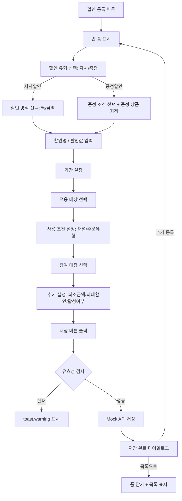
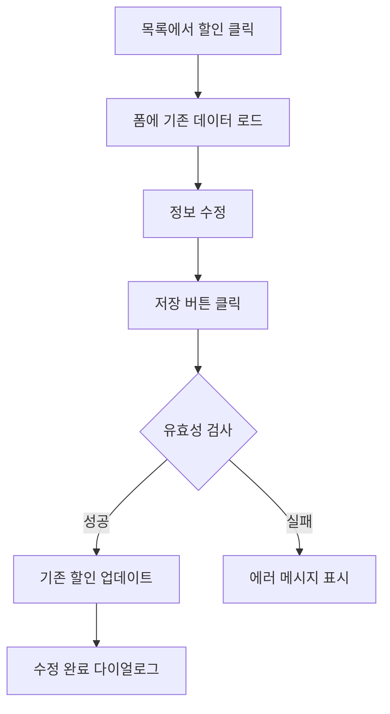
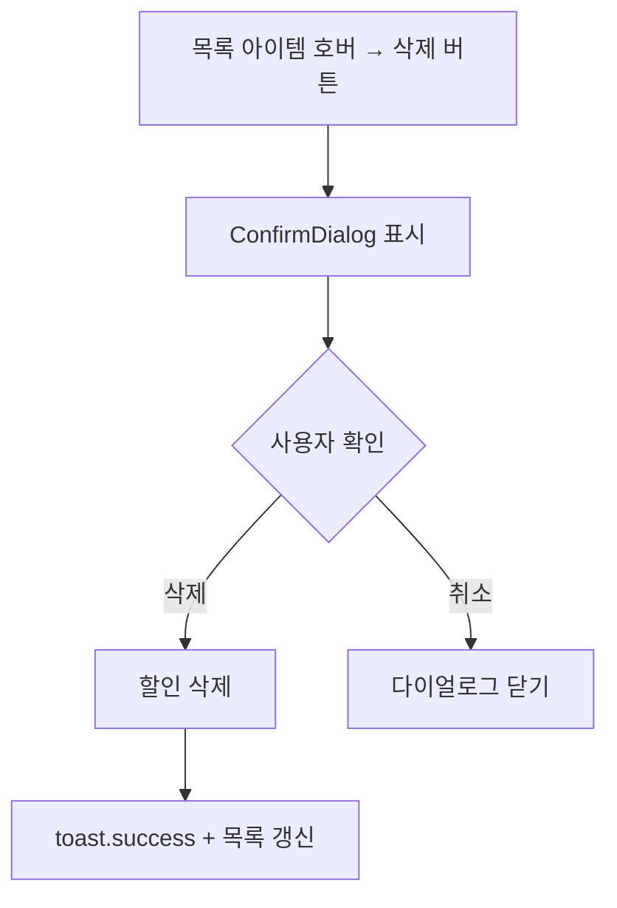

# 할인 관리 페이지 기획서

## 📋 개요

**페이지 경로**: `/marketing/discounts`
**접근 권한**: 인증된 사용자
**주요 목적**: 할인 정책 등록 및 통합 관리 (자사할인 + 증정할인)

---

## 🎯 주요 기능

### 1. 할인 유형 관리
- **자사할인 (company)**: 정률(%) 또는 정액(원) 할인
- **증정할인 (gift)**: 조건 충족 시 상품 증정

### 2. 할인 방식 설정 (자사할인)
- **정률 할인 (percentage)**: % 기반 할인
- **정액 할인 (fixed)**: 고정 금액 할인
- 할인 금액 단위설정 (반올림/올림/내림, 1원/10원/100원 단위)

### 3. 증정할인 조건 설정
- **특정 상품 구매 시 (product_purchase)**: 지정 상품 구매 시 증정
- **N+1 증정 (n_plus_one)**: N개 구매 시 1개 추가 증정
- **최소 주문 금액 충족 시 (min_order)**: 금액 조건 충족 시 증정
- 증정 상품 선택 및 수량 설정
- 주문당 최대 증정 횟수 제한

### 4. 기간 설정
- **상시 (always)**: 기간 제한 없음
- **기간 (period)**: 시작일 ~ 종료일 설정
- **시간/요일 (schedule)**: 특정 요일 + 시간대 설정

### 5. 적용 대상
- **전체 상품 (all)**: 모든 상품에 적용
- **카테고리 (category)**: 특정 카테고리 상품만
- **특정 상품 (product)**: 개별 상품 지정
- 다른 활성 할인에서 사용 중인 상품은 중복 선택 불가 (ExcludedProduct)

### 6. 사용 조건
- **채널**: 전체, APP, PC웹, 모바일웹
- **주문 유형**: 전체, 배달, 포장
- **최소 주문 금액** 설정
- **최대 할인 금액** 설정 (정률 할인 시)

### 7. 참여 매장 설정
- **전체 매장 적용**: 모든 매장에 일괄 적용
- **선택 매장 적용**: 특정 매장만 선택하여 적용 (StoreSelector)

### 8. 활성/비활성 토글
- Switch 컴포넌트로 할인 활성 여부 즉시 전환

### 9. CRUD + 검색
- 할인 생성, 조회, 수정, 삭제
- 할인명 검색 (SearchInput)
- 삭제 확인 다이얼로그 (ConfirmDialog)
- 저장 완료 다이얼로그 (추가 등록 / 목록으로 선택)

---

## 🖼️ 화면 구성

```
┌──────────────────────────────────────────────────────────────┐
│  할인 관리                                                     │
│  할인 정책을 등록하고 관리합니다                                  │
├──────────────────────────────────────────────────────────────┤
│  ┌──────────────┐ ┌──────────────┐                           │
│  │ 전체 할인      │ │ 활성 할인      │                           │
│  │     4         │ │     3         │                           │
│  └──────────────┘ └──────────────┘                           │
├──────────────────────────────────────────────────────────────┤
│  ┌────────────────────┐ ┌────────────────────────────────┐   │
│  │ 할인 목록 (400px)   │ │ 할인 등록/수정 폼 (1fr)         │   │
│  ├────────────────────┤ ├────────────────────────────────┤   │
│  │ [등록취소] [저장]   │ │ [기본 정보]                     │   │
│  │ [🔍 할인명 검색...] │ │  할인 유형: [자사할인] [증정할인] │   │
│  │                    │ │  할인명: [____________]         │   │
│  │ 📊 신규가입 할인    │ │  할인 방식: [%할인] [금액할인]   │   │
│  │   활성 · 자사       │ │  할인값: [10] %                │   │
│  │   📅 상시           │ │  ☑ 할인 금액 단위설정           │   │
│  │                    │ │                                │   │
│  │ 📊 점심 특가        │ │ [기간 설정]                     │   │
│  │   활성 · 자사       │ │  기간 타입: [상시][기간][시간/요일]│   │
│  │   ⏰ 월,화,수,목,금  │ │  적용 요일: ●월 ●화 ●수 ...    │   │
│  │                    │ │  적용 시간: [11:00] ~ [14:00]   │   │
│  │ 🎁 콜라 1+1 증정   │ │                                │   │
│  │   활성 · 증정       │ │ [적용 대상]                     │   │
│  │   📅 상시           │ │  [전체상품][카테고리][특정상품]    │   │
│  │                    │ │                                │   │
│  │                    │ │ [사용 조건]                     │   │
│  │                    │ │  채널: ◉전체 ○APP ○PC웹 ○모바일웹│   │
│  │                    │ │  주문유형: ◉전체 ○배달 ○포장      │   │
│  │                    │ │                                │   │
│  │                    │ │ [참여 매장]                     │   │
│  │                    │ │  ◉ 전체 매장  ○ 선택 매장        │   │
│  │                    │ │                                │   │
│  │                    │ │ [추가 설정]                     │   │
│  │                    │ │  최소 주문 금액: [15000] 원      │   │
│  │                    │ │  최대 할인 금액: [5000] 원       │   │
│  │                    │ │  활성 상태: [🔘 ON]             │   │
│  └────────────────────┘ └────────────────────────────────┘   │
└──────────────────────────────────────────────────────────────┘
```

---

## 🔄 사용자 플로우

### 할인 등록 플로우


### 할인 수정 플로우


### 할인 삭제 플로우


---

## 📦 데이터 구조

### 할인 타입
```typescript
interface Discount {
  id: string;
  name: string;
  discountType: DiscountType;         // 'company' | 'gift'
  method: DiscountMethod;             // 'percentage' | 'fixed'
  value: number;

  // 증정 설정 (discountType === 'gift')
  giftCondition?: GiftCondition;
  giftReward?: GiftReward;

  // 기간 설정
  periodType: DiscountPeriodType;     // 'always' | 'period' | 'schedule'
  startDate?: string;
  endDate?: string;
  schedule?: DiscountSchedule;

  // 적용 대상
  target: DiscountTarget;

  // 참여 매장
  applyToAll: boolean;
  storeIds: string[];

  // 사용 조건
  channel: DiscountChannel;           // 'all' | 'app' | 'pc_web' | 'mobile_web'
  orderType: OrderType;               // 'all' | 'delivery' | 'pickup'

  // 제한 설정
  minOrderAmount?: number;
  maxDiscountAmount?: number;
  rounding?: RoundingSetting;

  // 상태
  isActive: boolean;
  usageCount: number;

  // 메타
  description?: string;
  createdAt: Date;
  updatedAt: Date;
}
```

### 증정 관련 타입
```typescript
type GiftConditionType = 'product_purchase' | 'n_plus_one' | 'min_order';

interface GiftCondition {
  type: GiftConditionType;
  purchaseProductIds?: string[];
  purchaseQuantity?: number;
  buyQuantity?: number;        // N+1의 N
  getQuantity?: number;        // N+1의 증정 수량
  minAmount?: number;          // 최소 주문 금액
}

interface GiftReward {
  productIds: string[];
  quantity: number;
  maxPerOrder?: number;
}
```

### 기간/스케줄 타입
```typescript
type DiscountPeriodType = 'always' | 'period' | 'schedule';
type DayOfWeek = 0 | 1 | 2 | 3 | 4 | 5 | 6;

interface DiscountSchedule {
  days: DayOfWeek[];
  timeSlots: TimeSlot[];
  startDate?: string;
  endDate?: string;
}

interface TimeSlot {
  startTime: string;  // HH:mm
  endTime: string;    // HH:mm
}
```

### 단위 설정 타입
```typescript
type RoundingUnit = 1 | 10 | 100;
type RoundingType = 'round' | 'ceil' | 'floor';

interface RoundingSetting {
  enabled: boolean;
  unit: RoundingUnit;
  type: RoundingType;
}
```

### 폼 데이터
```typescript
interface DiscountFormData {
  name: string;
  discountType: DiscountType;
  method: DiscountMethod;
  value: number;
  giftCondition?: GiftCondition;
  giftReward?: GiftReward;
  periodType: DiscountPeriodType;
  startDate?: string;
  endDate?: string;
  schedule?: DiscountSchedule;
  target: DiscountTarget;
  applyToAll: boolean;
  storeIds: string[];
  channel: DiscountChannel;
  orderType: OrderType;
  minOrderAmount?: number;
  maxDiscountAmount?: number;
  rounding?: RoundingSetting;
  isActive: boolean;
  description?: string;
}
```

---

## 🔌 API 엔드포인트

### 1. 할인 목록 조회
```
GET /api/marketing/discounts
Authorization: Bearer {token}
Query: ?search=할인명&status=active&page=1&limit=20

Response:
{
  "data": [
    {
      "id": "1",
      "name": "신규가입 할인",
      "discountType": "company",
      "method": "percentage",
      "value": 10,
      "periodType": "always",
      "isActive": true,
      "usageCount": 152
    }
  ],
  "pagination": {
    "page": 1,
    "limit": 20,
    "total": 4
  }
}
```

### 2. 할인 상세 조회
```
GET /api/marketing/discounts/:id
Authorization: Bearer {token}

Response:
{
  "data": {
    "id": "1",
    "name": "신규가입 할인",
    "discountType": "company",
    "method": "percentage",
    "value": 10,
    "periodType": "always",
    "target": { "type": "all" },
    "applyToAll": true,
    "storeIds": [],
    "channel": "all",
    "orderType": "all",
    "minOrderAmount": 15000,
    "maxDiscountAmount": 5000,
    "isActive": true,
    "usageCount": 152,
    "description": "신규 가입 고객 대상 10% 할인"
  }
}
```

### 3. 할인 생성
```
POST /api/marketing/discounts
Content-Type: application/json
Authorization: Bearer {token}

{
  "name": "점심 특가",
  "discountType": "company",
  "method": "fixed",
  "value": 3000,
  "periodType": "schedule",
  "schedule": {
    "days": [1, 2, 3, 4, 5],
    "timeSlots": [{ "startTime": "11:00", "endTime": "14:00" }]
  },
  "target": { "type": "all" },
  "applyToAll": true,
  "channel": "app",
  "orderType": "delivery",
  "minOrderAmount": 20000,
  "isActive": true
}

Response:
{
  "data": {
    "id": "discount-1234567890",
    ...
  }
}
```

### 4. 할인 수정
```
PATCH /api/marketing/discounts/:id
Content-Type: application/json
Authorization: Bearer {token}

{
  "value": 15,
  "maxDiscountAmount": 7500,
  "isActive": false
}
```

### 5. 할인 삭제
```
DELETE /api/marketing/discounts/:id
Authorization: Bearer {token}

Response:
{
  "message": "할인이 삭제되었습니다"
}
```

---

## 🔒 보안 고려사항

### 권한 관리
| 역할 | 조회 | 생성 | 수정 | 삭제 |
| --- | --- | --- | --- | --- |
| Admin | ✅ | ✅ | ✅ | ✅ |
| Manager | ✅ | ✅ | ✅ | ❌ |
| Viewer | ✅ | ❌ | ❌ | ❌ |


### 데이터 검증
- ✅ 할인명 필수 입력 검사
- ✅ 자사할인 시 할인값 > 0 검증
- ✅ 선택 매장 적용 시 최소 1개 매장 선택 검증
- ✅ 상품 중복 할인 방지 (ExcludedProduct 로직)
- ✅ 증정할인과 자사할인 간 상품 중복 교차 검증
- ✅ XSS 방지: 입력값 이스케이프

### 비즈니스 룰
```typescript
// 유효성 검사
if (!formData.name.trim()) → '할인명을 입력해주세요'
if (formData.discountType === 'company' && formData.value <= 0) → '할인값을 입력해주세요'
if (!formData.applyToAll && formData.storeIds.length === 0) → '최소 1개 매장을 선택해주세요'
```

---

## 🎨 UI 컴포넌트

### 사용된 컴포넌트
- `Card`, `CardHeader`, `CardContent` - 카드 레이아웃
- `Button` - 액션 버튼 (등록, 저장, 취소, 삭제)
- `Input` - 텍스트/숫자 입력
- `Label` - 필드 라벨 (required 지원)
- `Badge` - 상태 표시 (활성/비활성, 자사/증정)
- `Switch` - 활성 상태 토글
- `ConfirmDialog` - 삭제 확인 / 저장 완료 다이얼로그
- `SearchInput` - 할인명 검색
- `StoreSelector` - 가맹점 전체/선택 적용
- `ProductSelector` - 적용 상품/증정 상품 선택 (ExcludedProduct 지원)

### Ant Design Icons
- `PlusOutlined` - 등록 버튼
- `DeleteOutlined` - 삭제 버튼
- `SaveOutlined` - 저장 버튼
- `CloseOutlined` - 취소 버튼
- `PercentageOutlined` - 자사할인 아이콘
- `GiftOutlined` - 증정할인 아이콘
- `ClockCircleOutlined` - 스케줄 아이콘
- `CalendarOutlined` - 기간 아이콘

### 레이아웃
- 2컬럼 그리드: `grid-cols-1 lg:grid-cols-[400px,1fr]`
- 좌측: 할인 목록 (고정 400px)
- 우측: 할인 등록/수정 폼 (1fr, max-height 스크롤)
- 섹션별 배경 구분: `bg-hover rounded-lg border border-border`

---

## 🧪 테스트 시나리오

### 기능 테스트
- [ ] 할인 목록 조회 및 검색
- [ ] 자사할인 등록 (정률/정액)
- [ ] 증정할인 등록 (N+1, 특정상품구매, 최소금액)
- [ ] 할인 수정
- [ ] 할인 삭제 (ConfirmDialog)
- [ ] 기간 설정 (상시/기간/스케줄)
- [ ] 요일 선택 토글
- [ ] 시간대 설정
- [ ] 적용 대상 선택 (전체/카테고리/상품)
- [ ] 채널/주문유형 선택
- [ ] 매장 선택 (전체/선택)
- [ ] 활성/비활성 토글
- [ ] 단위설정 (반올림/올림/내림)
- [ ] 저장 완료 → 추가 등록
- [ ] 저장 완료 → 목록으로

### 유효성 검사 테스트
- [ ] 할인명 빈값 시 toast.warning
- [ ] 자사할인 할인값 <= 0 시 toast.warning
- [ ] 선택 매장 0개 시 toast.warning
- [ ] 중복 상품 선택 차단 (ExcludedProduct)

### UI/UX 테스트
- [ ] 할인 유형 변경 시 폼 UI 전환 (자사 ↔ 증정)
- [ ] 할인 목록 아이템 선택 하이라이트
- [ ] 호버 시 삭제 버튼 표시
- [ ] 기간 타입 변경 시 조건부 필드 표시/숨김
- [ ] 폼 스크롤 동작

---

## 📌 TODO

### 단기 (1-2주)
- [ ] Mock 데이터를 실제 API로 교체
- [ ] 할인 적용 이력 조회 기능
- [ ] 할인 활성/비활성 실시간 반영
- [ ] 폼 유효성 검사 강화 (정률 100% 초과 방지 등)

### 중기 (1-2개월)
- [ ] 할인 복제 기능
- [ ] 할인 일괄 등록/수정
- [ ] 할인 적용 시뮬레이션 (예상 할인액)
- [ ] 할인 사용 통계 대시보드
- [ ] 할인 우선순위 설정

### 장기 (3개월+)
- [ ] 할인 자동 종료 스케줄러
- [ ] 할인 효과 분석 리포트
- [ ] A/B 테스트 기반 할인 최적화
- [ ] 할인 변경 이력 (Audit Log)
- [ ] 엑셀 가져오기/내보내기

---

**작성일**: 2026-02-11
**최종 수정일**: 2026-02-11
**작성자**: Claude Code
