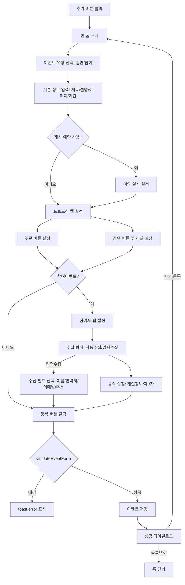
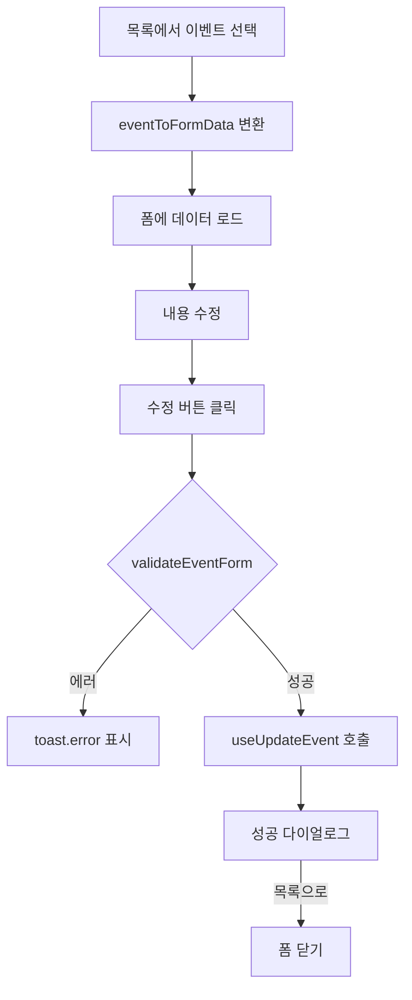
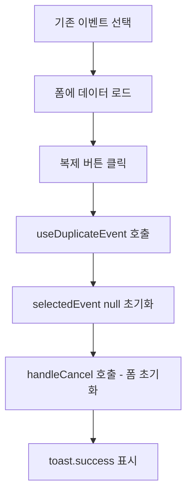
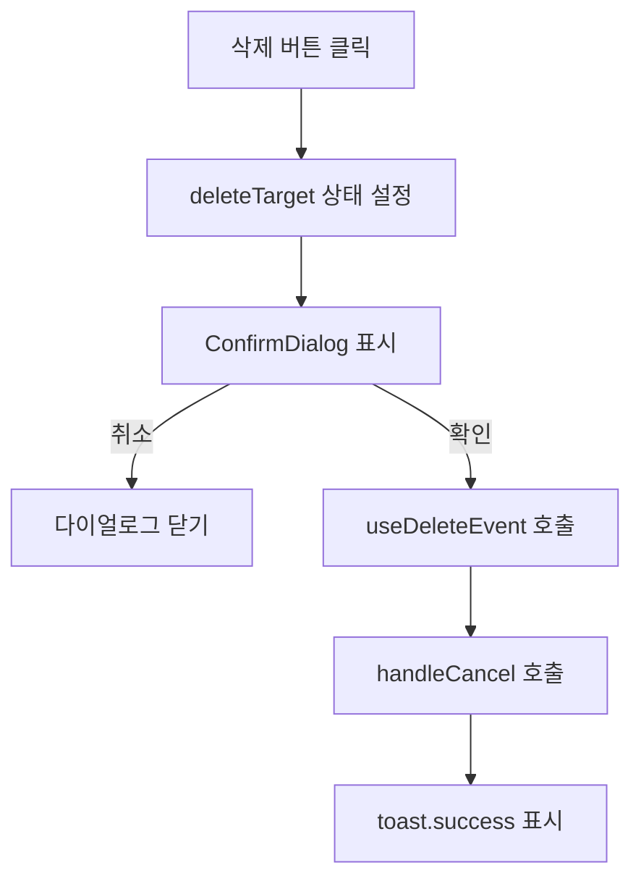

# 이벤트 관리 페이지 기획서

## 개요

**페이지 경로**: `/events`
**접근 권한**: 인증된 사용자
**주요 목적**: 일반이벤트(공지/프로모션 소개) 및 참여이벤트(참여자 수집 + 동의 관리) 등록 및 관리

---

## 주요 기능

### 1. 이벤트 유형 (2종)

| 유형 | 라벨 | 설명 |
| --- | --- | --- |
| `general` | 일반이벤트 | 정보 제공 목적. 공지/프로모션 소개 |
| `participation` | 참여이벤트 | 참여자 정보 수집 목적. 참여자 수집 + 동의 관리 포함 |


### 2. 이벤트 상태 관리

| 상태 | 라벨 | Badge Variant |
| --- | --- | --- |
| `scheduled` | 예약됨 | info |
| `active` | 진행중 | success |
| `ended` | 종료 | default |


### 3. 목록 관리

- 유형 필터: 전체 / 일반이벤트 / 참여이벤트 (`ToggleButtonGroup`)
- 상태 필터: 전체 / 예약됨 / 진행중 / 종료 (`ToggleButtonGroup`)
- 이벤트 제목/설명 키워드 검색 (`SearchInput`)
- 이벤트 카드 클릭 시 수정 모드 전환 (제목, 상태 Badge, 유형 Badge, 이벤트 기간 표시)

### 4. 이벤트 CRUD

- **등록**: 추가 버튼 클릭 → 빈 폼 표시 → 내용 입력 → 등록
- **조회**: 목록에서 이벤트 선택 → 폼에 데이터 로드
- **수정**: 이벤트 선택 후 내용 변경 → 수정
- **삭제**: 삭제 버튼 클릭 → `ConfirmDialog` 확인 → 삭제
- 저장(등록/수정) 완료 시 성공 다이얼로그 표시 (추가 등록 / 목록으로 선택)

### 5. 이벤트 복제

- 기존 이벤트 선택 후 복제 버튼 클릭
- 복제 완료 후 `selectedEvent` null 초기화 (신규 이벤트로 등록 가능한 상태)
- 복제는 서버 API 호출 (`useDuplicateEvent`)

### 6. 3탭 폼 구조

| 탭 | 표시 조건 | 설명 |
| --- | --- | --- |
| 기본 정보 | 항상 표시 | 이벤트 유형, 제목, 이미지, 기간, 딥링크 등 |
| 프로모션 | 항상 표시 | 주문 버튼, 공유 버튼, 공유 채널 설정 |
| 참여자 설정 | 참여이벤트만 표시 | 수집 방식, 동의 설정, 통계, 참여자 목록 |


---

## 화면 구성

```
┌──────────────────────────────────────────────────────────────┐
│  이벤트 관리 페이지                                             │
├──────────────────────────────────────────────────────────────┤
│  ┌────────────────────┐ ┌────────────────────────────────┐   │
│  │ 이벤트 목록 (400px) │ │ 이벤트 등록/수정 폼 (1fr)       │   │
│  ├────────────────────┤ ├────────────────────────────────┤   │
│  │         [추가]      │ │ [기본 정보] [프로모션] [참여자]  │   │
│  │ [전체][일반][참여]  │ │ ─────── (활성 탭 내용) ──────  │   │
│  │ [전체][예약][진행중]│ │                                │   │
│  │ [종료]             │ │ < 기본 정보 탭 >                │   │
│  │ [🔍 이벤트 검색...] │ │  이벤트 유형: [일반] [참여]     │   │
│  │                    │ │  이벤트 제목: [_____________]  │   │
│  │ 📅 신규 가입 이벤트 │ │  간단 설명: [______________]   │   │
│  │   진행중 · 일반이벤트│ │  배너 이미지: [이미지 업로드]   │   │
│  │   1.1 ~ 1.31       │ │  상세 이미지: [이미지 업로드]   │   │
│  │                    │ │  본문 내용: [리치 텍스트 에디터] │   │
│  │ 📅 봄맞이 참여 이벤트│ │  시작일: [____] 종료일: [____]  │   │
│  │   예약됨 · 참여이벤트│ │  게시 예약: [OFF] (토글 시 일시) │   │
│  │   3.1 ~ 3.31       │ │  딥링크 URL: [____________]    │   │
│  │                    │ │  프로모션 링크: [자동생성 - 읽기전용]│   │
│  │ 📅 종료된 이벤트    │ │                                │   │
│  │   종료 · 일반이벤트 │ │ < 프로모션 탭 >                 │   │
│  │   12.1 ~ 12.31     │ │  주문 버튼: [ON] 텍스트/링크 입력│   │
│  │                    │ │  공유 버튼: [ON] 채널/제목/설명  │   │
│  │                    │ │                                │   │
│  │                    │ │ < 참여자 설정 탭 (참여이벤트만)> │   │
│  │                    │ │  수집 방식: [자동수집] [입력수집] │   │
│  │                    │ │  동의 설정: 개인정보/제3자 동의  │   │
│  │                    │ │  통계: 조회/방문/클릭/공유/참여  │   │
│  │                    │ │  참여자 목록 (표)               │   │
│  │                    │ │                                │   │
│  │                    │ │  [복제]  [삭제] [취소] [등록/수정]│   │
│  └────────────────────┘ └────────────────────────────────┘   │
└──────────────────────────────────────────────────────────────┘
```

---

## 사용자 플로우

### 이벤트 등록 플로우



### 이벤트 수정 플로우



### 이벤트 복제 플로우



### 이벤트 삭제 플로우



---

## 데이터 구조

### 이벤트 엔티티

```typescript
interface Event {
  id: string;

  // 이벤트 유형
  eventType: EventType;           // 'general' | 'participation'

  // 기본 정보
  title: string;
  description: string;
  content: string;
  bannerImageUrl: string;
  detailImageUrl: string;

  // 일정 및 게시 예약
  status: EventStatus;            // 'scheduled' | 'active' | 'ended'
  eventStartDate: string;
  eventEndDate: string;
  publishDate: string | null;     // null이면 게시 예약 미사용

  // 딥링크 및 프로모션
  deepLink: string;
  promoLink: string;              // 자동 생성된 웹 프로모션 링크 (읽기 전용)

  // 버튼 설정
  orderButtonEnabled: boolean;
  orderButtonLabel: string;
  orderButtonLink: string;
  shareButtonEnabled: boolean;

  // 공유 설정
  shareChannels: ShareChannel[];  // 'kakao' | 'facebook' | 'twitter' | 'link_copy'
  shareTitle: string;
  shareDescription: string;
  shareImageUrl: string;

  // 참여자 설정 (참여이벤트 전용)
  collectionMode: ParticipantCollectionMode;  // 'auto' | 'form_input'
  formFields: ParticipantFormField[];         // 'name' | 'phone' | 'email' | 'address'
  consentRequired: boolean;
  thirdPartyConsentRequired: boolean;
  consentText: string;
  thirdPartyConsentText: string;

  // 통계
  stats: EventStats;

  // 메타
  createdAt: string;
  updatedAt: string;
  createdBy: string;
}
```

### 통계 타입

```typescript
interface EventStats {
  pageViews: number;          // 페이지 조회 수
  uniqueVisitors: number;     // 순 방문자 수
  orderButtonClicks: number;  // 주문 버튼 클릭 수
  shareCount: number;         // 공유 횟수
  participantCount: number;   // 참여자 수
  conversionRate: number;     // 전환율 (%)
}
```

### 참여자 타입

```typescript
interface EventParticipant {
  id: string;
  eventId: string;
  memberId: string | null;        // 회원 자동수집 시 사용
  memberName: string;
  memberPhone: string;
  memberEmail: string;
  memberAddress: string;          // 입력수집 시 추가 필드
  collectionMode: ParticipantCollectionMode;
  participatedAt: string;
  hasConsented: boolean;
  hasThirdPartyConsented: boolean;
  actionType: ParticipantActionType;  // 'page_view' | 'order_click' | 'share'
}
```

### 폼 데이터

```typescript
interface EventFormData {
  // 이벤트 유형
  eventType: EventType;

  // 기본 정보
  title: string;
  description: string;
  content: string;
  bannerImageUrl: string;
  detailImageUrl: string;

  // 일정
  eventStartDate: string;
  eventEndDate: string;
  usePublishSchedule: boolean;
  publishDate: string;

  // 딥링크
  deepLink: string;

  // 버튼
  orderButtonEnabled: boolean;
  orderButtonLabel: string;
  orderButtonLink: string;
  shareButtonEnabled: boolean;

  // 공유
  shareChannels: ShareChannel[];
  shareTitle: string;
  shareDescription: string;
  shareImageUrl: string;

  // 참여자 (참여이벤트 전용)
  collectionMode: ParticipantCollectionMode;
  formFields: ParticipantFormField[];
  consentRequired: boolean;
  thirdPartyConsentRequired: boolean;
  consentText: string;
  thirdPartyConsentText: string;
}
```

### 폼 기본값 (DEFAULT_EVENT_FORM)

```typescript
const DEFAULT_EVENT_FORM: EventFormData = {
  eventType: 'general',
  title: '',
  description: '',
  content: '',
  bannerImageUrl: '',
  detailImageUrl: '',
  eventStartDate: '',
  eventEndDate: '',
  usePublishSchedule: false,
  publishDate: '',
  deepLink: '',
  orderButtonEnabled: true,
  orderButtonLabel: '주문하러 가기',
  orderButtonLink: '',
  shareButtonEnabled: true,
  shareChannels: ['kakao', 'link_copy'],
  shareTitle: '',
  shareDescription: '',
  shareImageUrl: '',
  collectionMode: 'auto',
  formFields: ['name', 'phone'],
  consentRequired: false,
  thirdPartyConsentRequired: false,
  consentText: '개인정보 수집 및 이용에 동의합니다.',
  thirdPartyConsentText: '개인정보 제3자 제공에 동의합니다.',
};
```

### 전체 현황 통계 (EventStatsOverview)

```typescript
interface EventStatsOverview {
  total: number;         // 전체 이벤트 수
  active: number;        // 진행중 이벤트 수
  scheduled: number;     // 예약된 이벤트 수
  totalParticipants: number;  // 전체 참여자 수
}
```

---

## API 엔드포인트

### 1. 이벤트 목록 조회

```
GET /api/events
Authorization: Bearer {token}
Query: ?keyword=검색어&status=active&eventType=participation&page=1&limit=20

Response:
{
  "data": [
    {
      "id": "ev-1",
      "eventType": "participation",
      "title": "봄맞이 참여 이벤트",
      "description": "봄을 맞아 다양한 혜택을 드립니다.",
      "status": "scheduled",
      "eventStartDate": "2026-03-01T00:00:00",
      "eventEndDate": "2026-03-31T23:59:59",
      "stats": {
        "pageViews": 0,
        "uniqueVisitors": 0,
        "orderButtonClicks": 0,
        "shareCount": 0,
        "participantCount": 0,
        "conversionRate": 0
      }
    }
  ],
  "pagination": {
    "page": 1,
    "limit": 20,
    "total": 3
  }
}
```

### 2. 이벤트 상세 조회

```
GET /api/events/:id
Authorization: Bearer {token}

Response:
{
  "data": {
    "id": "ev-1",
    "eventType": "participation",
    "title": "봄맞이 참여 이벤트",
    "description": "봄을 맞아 다양한 혜택을 드립니다.",
    "content": "<p>이벤트 본문 HTML</p>",
    "bannerImageUrl": "https://cdn.example.com/events/banner.jpg",
    "detailImageUrl": "https://cdn.example.com/events/detail.jpg",
    "status": "scheduled",
    "eventStartDate": "2026-03-01T00:00:00",
    "eventEndDate": "2026-03-31T23:59:59",
    "publishDate": "2026-02-28T10:00:00",
    "deepLink": "myapp://events/ev-1",
    "promoLink": "https://promo.example.com/events/ev-1",
    "orderButtonEnabled": true,
    "orderButtonLabel": "주문하러 가기",
    "orderButtonLink": "myapp://menu",
    "shareButtonEnabled": true,
    "shareChannels": ["kakao", "link_copy"],
    "shareTitle": "봄맞이 이벤트",
    "shareDescription": "참여하고 혜택 받아가세요!",
    "shareImageUrl": "https://cdn.example.com/events/share.jpg",
    "collectionMode": "form_input",
    "formFields": ["name", "phone", "email"],
    "consentRequired": true,
    "thirdPartyConsentRequired": false,
    "consentText": "개인정보 수집 및 이용에 동의합니다.",
    "thirdPartyConsentText": "개인정보 제3자 제공에 동의합니다.",
    "stats": {
      "pageViews": 1250,
      "uniqueVisitors": 980,
      "orderButtonClicks": 340,
      "shareCount": 120,
      "participantCount": 215,
      "conversionRate": 21.9
    }
  }
}
```

### 3. 이벤트 생성

```
POST /api/events
Content-Type: application/json
Authorization: Bearer {token}

{
  "eventType": "participation",
  "title": "봄맞이 참여 이벤트",
  "description": "봄을 맞아 다양한 혜택을 드립니다.",
  "content": "<p>이벤트 본문 HTML</p>",
  "bannerImageUrl": "https://cdn.example.com/events/banner.jpg",
  "detailImageUrl": "https://cdn.example.com/events/detail.jpg",
  "eventStartDate": "2026-03-01T00:00:00",
  "eventEndDate": "2026-03-31T23:59:59",
  "publishDate": "2026-02-28T10:00:00",
  "deepLink": "",
  "orderButtonEnabled": true,
  "orderButtonLabel": "주문하러 가기",
  "orderButtonLink": "myapp://menu",
  "shareButtonEnabled": true,
  "shareChannels": ["kakao", "link_copy"],
  "shareTitle": "봄맞이 이벤트",
  "shareDescription": "참여하고 혜택 받아가세요!",
  "shareImageUrl": "",
  "collectionMode": "form_input",
  "formFields": ["name", "phone", "email"],
  "consentRequired": true,
  "thirdPartyConsentRequired": false,
  "consentText": "개인정보 수집 및 이용에 동의합니다.",
  "thirdPartyConsentText": "개인정보 제3자 제공에 동의합니다."
}

Response:
{
  "data": {
    "id": "ev-2",
    "status": "scheduled",
    ...
  }
}
```

### 4. 이벤트 수정

```
PATCH /api/events/:id
Content-Type: application/json
Authorization: Bearer {token}

{
  "title": "봄맞이 참여 이벤트 (수정)",
  "eventEndDate": "2026-04-07T23:59:59",
  "shareChannels": ["kakao", "facebook", "link_copy"]
}

Response:
{
  "data": {
    "id": "ev-2",
    "updatedAt": "2026-02-20T10:00:00"
  }
}
```

### 5. 이벤트 삭제

```
DELETE /api/events/:id
Authorization: Bearer {token}

Response:
{
  "message": "이벤트가 삭제되었습니다."
}
```

### 6. 이벤트 복제

```
POST /api/events/:id/duplicate
Authorization: Bearer {token}

Response:
{
  "data": {
    "id": "ev-3",
    "title": "봄맞이 참여 이벤트 (복사본)",
    "status": "scheduled",
    ...
  }
}
```

### 7. 참여자 목록 조회

```
GET /api/events/:id/participants
Authorization: Bearer {token}
Query: ?page=1&limit=20

Response:
{
  "data": [
    {
      "id": "ep-1",
      "eventId": "ev-1",
      "memberId": "mem-001",
      "memberName": "홍길동",
      "memberPhone": "010-1234-5678",
      "memberEmail": "hong@example.com",
      "memberAddress": "",
      "collectionMode": "auto",
      "participatedAt": "2026-03-05T14:30:00",
      "hasConsented": true,
      "hasThirdPartyConsented": false,
      "actionType": "page_view"
    }
  ],
  "pagination": {
    "page": 1,
    "limit": 20,
    "total": 215
  }
}
```

---

## 보안 고려사항

### 권한 관리

| 역할 | 조회 | 생성 | 수정 | 삭제 | 복제 | 참여자 조회 |
| --- | --- | --- | --- | --- | --- | --- |
| Admin | O | O | O | O | O | O |
| Manager | O | O | O | X | O | O |
| Viewer | O | X | X | X | X | O |


### 데이터 검증 (validateEventForm)

```typescript
// 기본 정보 검증
if (!data.title.trim()) → '이벤트 제목을 입력해주세요.'
if (!data.bannerImageUrl) → '배너 이미지를 등록해주세요.'

// 일정 검증
if (!data.eventStartDate) → '이벤트 시작일을 설정해주세요.'
if (!data.eventEndDate) → '이벤트 종료일을 설정해주세요.'
if (data.eventStartDate >= data.eventEndDate) → '종료일은 시작일 이후여야 합니다.'

// 게시 예약 검증
if (data.usePublishSchedule && !data.publishDate) → '게시 예약 일시를 설정해주세요.'
if (data.usePublishSchedule && new Date(data.publishDate) <= new Date()) → '게시 예약 일시는 현재 시간 이후여야 합니다.'

// 주문 버튼 검증 (활성화 시)
if (data.orderButtonEnabled && !data.orderButtonLabel.trim()) → '주문 버튼 텍스트를 입력해주세요.'
if (data.orderButtonEnabled && !data.orderButtonLink.trim()) → '주문 버튼 링크를 입력해주세요.'

// 공유 버튼 검증 (활성화 시)
if (data.shareButtonEnabled && data.shareChannels.length === 0) → '공유 채널을 1개 이상 선택해주세요.'

// 참여이벤트 전용 검증
if (eventType === 'participation') {
  if (collectionMode === 'form_input' && formFields.length === 0) → '입력수집 필드를 1개 이상 선택해주세요.'
  if (consentRequired && !consentText.trim()) → '개인정보 동의 문구를 입력해주세요.'
  if (thirdPartyConsentRequired && !thirdPartyConsentText.trim()) → '제3자 제공 동의 문구를 입력해주세요.'
}
```

### 이미지 업로드 보안

- 허용 형식: JPEG, PNG, WebP
- 최대 파일 크기: 별도 정책 필요 (TODO 참조)
- CDN 업로드 후 URL만 저장 (바이너리 직접 저장 금지)

### 개인정보 보호

- 참여자 목록 조회 시 권한 검증 필수
- 참여자 데이터 내보내기 기능은 Admin 권한만 허용
- 동의 여부(`hasConsented`, `hasThirdPartyConsented`) 기록 유지 필수

---

## UI 컴포넌트

### EventManagement.tsx 사용 컴포넌트

- `Card`, `CardHeader`, `CardContent` - 카드 레이아웃
- `Button` - 액션 버튼 (추가, 등록, 수정, 취소, 복제, 삭제)
- `Badge` - 상태 표시 (이벤트 상태, 이벤트 유형)
- `SearchInput` - 이벤트 검색
- `ToggleButtonGroup` - 유형/상태 필터 (단일 선택)
- `ConfirmDialog` - 삭제 확인 다이얼로그
- `Spinner` - 로딩 상태

### EventForm.tsx 사용 컴포넌트

- `Input` - 텍스트 입력 (제목, 설명, 딥링크, 버튼 텍스트/링크, 공유 제목/설명)
- `Label` - 필드 라벨 (required 지원)
- `Switch` - 토글 (게시 예약, 주문 버튼, 공유 버튼, 동의 설정)
- `Textarea` - 동의 문구 입력
- `ImageUpload` - 이미지 업로드 (배너, 상세, 공유 썸네일)
- `DateTimePicker` - 날짜/시간 선택 (시작일, 종료일, 예약 일시)
- `RichTextEditor` - 본문 내용 입력 (HTML 편집기)

### Ant Design Icons

- `PlusOutlined` (추가 버튼)
- `DeleteOutlined` (삭제 버튼)
- `CopyOutlined` (복제 버튼)
- `SaveOutlined` (저장 버튼)
- `CalendarOutlined` (이벤트 카드 아이콘, 빈 상태 아이콘)
- `CheckOutlined` (성공 다이얼로그)
- `EyeOutlined` (통계 - 페이지 조회)
- `BarChartOutlined` (통계 섹션 헤더)
- `TeamOutlined` (참여이벤트 유형 아이콘, 자동수집 모드)
- `FormOutlined` (일반이벤트 유형 아이콘, 입력수집 모드)

### 레이아웃

- 2컬럼 그리드: `grid grid-cols-1 lg:grid-cols-[400px,1fr] gap-6`
- 이벤트 목록: `max-h-[600px] overflow-y-auto`
- 이벤트 카드 선택 강조: `border-primary bg-primary/5 ring-2 ring-primary/20`
- 폼 탭: `flex border-b border-border` / 활성 탭: `border-primary text-primary`
- 통계 카드: `grid grid-cols-3 gap-2`
- 액션 버튼 영역: `flex justify-between pt-4 border-t border-border`

### React Query 훅

| 훅 | 역할 |
| --- | --- |
| `useEventList(params)` | 이벤트 목록 조회 (검색/필터 포함) |
| `useCreateEvent()` | 이벤트 생성 |
| `useUpdateEvent()` | 이벤트 수정 |
| `useDeleteEvent()` | 이벤트 삭제 |
| `useDuplicateEvent()` | 이벤트 복제 |


---

## 테스트 시나리오

### 기능 테스트

- [ ] 이벤트 목록 조회 및 검색
- [ ] 유형 필터 (전체/일반/참여)
- [ ] 상태 필터 (전체/예약됨/진행중/종료)
- [ ] 일반이벤트 등록 (기본 정보 + 프로모션)
- [ ] 참여이벤트 등록 (기본 정보 + 프로모션 + 참여자 설정)
- [ ] 수집 방식 자동수집으로 참여이벤트 등록
- [ ] 수집 방식 입력수집으로 참여이벤트 등록 (필드 선택)
- [ ] 개인정보 동의 필수 설정 및 문구 입력
- [ ] 제3자 제공 동의 필수 설정 및 문구 입력
- [ ] 게시 예약 설정 및 예약 일시 입력
- [ ] 주문 버튼 활성화/비활성화 및 텍스트/링크 설정
- [ ] 공유 버튼 활성화/비활성화 및 채널 선택
- [ ] 이벤트 수정
- [ ] 이벤트 삭제
- [ ] 이벤트 복제
- [ ] 저장 완료 다이얼로그 (추가 등록/목록으로)

### 유효성 검사 테스트

- [ ] 이벤트 제목 빈값
- [ ] 배너 이미지 미등록
- [ ] 시작일 미입력
- [ ] 종료일 미입력
- [ ] 종료일이 시작일과 동일하거나 이전인 경우
- [ ] 게시 예약 활성화 후 예약 일시 미입력
- [ ] 게시 예약 일시가 현재 시간 이전인 경우
- [ ] 주문 버튼 활성화 후 버튼 텍스트 빈값
- [ ] 주문 버튼 활성화 후 버튼 링크 빈값
- [ ] 공유 버튼 활성화 후 공유 채널 0개 선택
- [ ] 참여이벤트 - 입력수집 모드에서 수집 필드 0개 선택
- [ ] 참여이벤트 - 개인정보 동의 필수 활성화 후 동의 문구 빈값
- [ ] 참여이벤트 - 제3자 제공 동의 필수 활성화 후 동의 문구 빈값

### UI/UX 테스트

- [ ] 참여이벤트 선택 시 참여자 탭 표시 여부
- [ ] 일반이벤트 선택 시 참여자 탭 미표시 여부
- [ ] 이벤트 선택 시 폼에 데이터 올바르게 로드
- [ ] 탭 전환 시 입력 데이터 유지
- [ ] 게시 예약 토글 시 예약 일시 입력 필드 표시/숨김
- [ ] 주문 버튼 토글 시 텍스트/링크 필드 표시/숨김
- [ ] 공유 버튼 토글 시 채널/제목/설명/썸네일 표시/숨김
- [ ] 입력수집 모드 선택 시 수집 필드 선택 UI 표시
- [ ] 동의 설정 토글 시 동의 문구 텍스트 영역 표시/숨김
- [ ] 이벤트 수정 모드에서 프로모션 링크 표시 (읽기 전용)
- [ ] 빈 목록 상태 메시지 표시 (검색 결과 없음 / 등록된 이벤트 없음 구분)
- [ ] 이벤트 카드 선택 강조 표시 (ring 스타일)
- [ ] 참여이벤트 수정 시 통계 카드 표시
- [ ] 참여이벤트 수정 시 참여자 목록 표시
- [ ] 로딩 중 Spinner 표시

---

## TODO

### 단기 (1-2주)

- [ ] Mock 데이터를 실제 API로 교체 (`useEventList`, `useCreateEvent` 등)
- [ ] 이미지 업로드 API 연동 (현재 `URL.createObjectURL` 사용 중)
- [ ] 이미지 파일 크기 및 형식 클라이언트 사이드 검증 추가
- [ ] 참여자 목록 API 연동 (`EventParticipantList` 컴포넌트)
- [ ] 딥링크 자동 생성 규칙 정의 및 서버 연동

### 중기 (1-2개월)

- [ ] 이벤트 상태 수동 변경 기능 (`scheduled` → `active` → `ended`)
- [ ] 참여자 데이터 CSV 내보내기
- [ ] 이벤트 미리보기 기능 (앱 화면 시뮬레이션)
- [ ] 실시간 통계 갱신 (WebSocket 또는 주기적 폴링)
- [ ] 이벤트 목록 페이지네이션 또는 무한 스크롤
- [ ] 배너/상세 이미지 크롭 및 리사이즈 기능
- [ ] 공유 채널별 미리보기 (카카오톡 공유 썸네일 등)

### 장기 (3개월+)

- [ ] 이벤트 A/B 테스트 기능
- [ ] 이벤트 참여 조건 설정 (특정 회원 등급만 참여 가능 등)
- [ ] 이벤트 알림 발송 연동 (푸시/SMS/이메일)
- [ ] 이벤트 변경 이력 관리 (Audit Log)
- [ ] 이벤트 템플릿 기능
- [ ] 이벤트 효과 분석 대시보드 (참여율 추이, 유입 경로 분석)

---

**작성일**: 2026-02-20
**최종 수정일**: 2026-02-20
**작성자**: Claude Code
