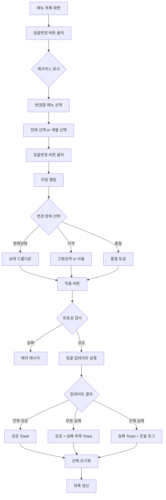

# 메뉴 일괄변경 기능 설계서

## 📋 메타 정보

| 항목 | 내용 |
| --- | --- |
| **기능명** | 메뉴 일괄변경 (Bulk Edit) |
| **작성일** | 2026-02-03 |
| **작성자** | Claude Code |
| **버전** | 1.0.0 |
| **상태** | ✅ 구현 완료 |
| **우선순위** | High |
| **관련 페이지** | `/menu/products` |


---

## 🎯 개요

### 목적
관리자가 여러 메뉴의 속성을 한 번에 변경할 수 있도록 하여 운영 효율성을 높입니다.

### 배경
- 시즌별 프로모션 시 다수 메뉴의 가격을 일괄 조정 필요
- 판매 중지/재개 시 여러 메뉴의 상태를 동시에 변경 필요
- 품절 처리 시 다수 메뉴를 한 번에 관리 필요

### 범위
- **포함**: 판매상태, 가격, 품절여부 일괄변경
- **제외**: 메뉴명, 설명, 이미지 등 개별 속성 변경

---

## 📐 아키텍처

### Clean Architecture 레이어

```
┌─────────────────────────────────────────┐
│  Presentation Layer                     │
│  - BulkEditModal.tsx (UI)              │
│  - Products.tsx (orchestration)         │
└─────────────────┬───────────────────────┘
                  │
┌─────────────────▼───────────────────────┐
│  Application Layer                      │
│  - handleBulkUpdate() (비즈니스 로직)   │
└─────────────────┬───────────────────────┘
                  │
┌─────────────────▼───────────────────────┐
│  Domain Layer                           │
│  - BulkEditUpdate (타입)                │
│  - BulkUpdateResult (타입)              │
└─────────────────┬───────────────────────┘
                  │
┌─────────────────▼───────────────────────┐
│  Infrastructure Layer                   │
│  - useProducts.updateProduct() (API)    │
└─────────────────────────────────────────┘
```

### 컴포넌트 구조

```
Products.tsx (Container)
  │
  ├── BulkEditModal.tsx (Presentation)
  │     └── 변경 타입 선택 UI
  │     └── 입력 폼
  │     └── 유효성 검사
  │
  └── ProductList (Presentation)
        └── 체크박스
        └── 전체 선택
        └── 선택 카운트
```

---

## 🔄 사용자 플로우



---

## 📦 데이터 구조

### 타입 정의

```typescript
// src/types/product.ts

/**
 * 일괄변경 타입
 */
export type BulkEditType = 'status' | 'price' | 'stock';

/**
 * 가격 변경 데이터
 */
export interface BulkPriceUpdate {
  changeType: 'fixed' | 'percentage';  // 고정 금액 or 비율
  value: number;                        // 금액 or 비율 값
}

/**
 * 상태 변경 데이터
 */
export interface BulkStatusUpdate {
  status: ProductStatus;  // 'active' | 'inactive' | 'pending'
}

/**
 * 품절 변경 데이터
 */
export interface BulkStockUpdate {
  isVisible: boolean;  // true: 판매 가능, false: 품절
}

/**
 * 일괄변경 요청 (Tagged Union)
 */
export type BulkEditUpdate =
  | { type: 'status'; data: BulkStatusUpdate }
  | { type: 'price'; data: BulkPriceUpdate }
  | { type: 'stock'; data: BulkStockUpdate };

/**
 * 일괄변경 결과
 */
export interface BulkUpdateResult {
  success: string[];                    // 성공한 product IDs
  failed: Array<{                       // 실패한 항목들
    id: string;
    name: string;
    reason: string;
  }>;
  successCount: number;
  failCount: number;
}
```

### 상태 흐름

```
Initial State:
├── selectedProductIds: []
├── isBulkEditMode: false
└── isBulkEditModalOpen: false

↓ [일괄변경 버튼 클릭]

Bulk Edit Mode:
├── selectedProductIds: []
├── isBulkEditMode: true
└── isBulkEditModalOpen: false

↓ [메뉴 선택]

Selection Active:
├── selectedProductIds: ['prod-1', 'prod-2', ...]
├── isBulkEditMode: true
└── isBulkEditModalOpen: false

↓ [일괄변경 버튼 클릭]

Modal Open:
├── selectedProductIds: ['prod-1', 'prod-2', ...]
├── isBulkEditMode: true
└── isBulkEditModalOpen: true

↓ [적용]

Processing:
├── BulkUpdateResult 생성
└── 순차적으로 각 메뉴 업데이트

↓ [완료]

Reset State:
├── selectedProductIds: []
├── isBulkEditMode: false
└── isBulkEditModalOpen: false
```

---

## 🎨 UI/UX 설계

### 1. 일괄변경 모드 진입

**위치**: 메뉴 목록 헤더 우측 상단

```
┌──────────────────────────────────────┐
│  메뉴 목록            [일괄변경] [등록] │
│  총 50개                              │
└──────────────────────────────────────┘
```

**클릭 시:**
```
┌──────────────────────────────────────┐
│  메뉴 목록              [취소] [일괄변경]│
│  총 50개 (3개 선택)                   │
├──────────────────────────────────────┤
│  ☐ 전체 선택                          │
├──────────────────────────────────────┤
│  ☑ [이미지] 뿌링클 15,000원           │
│  ☐ [이미지] 맛초킹 15,000원           │
│  ☑ [이미지] 순살 18,000원             │
└──────────────────────────────────────┘
```

### 2. 일괄변경 모달

```
┌───────────────────────────────────────┐
│  일괄 변경                     [X]     │
├───────────────────────────────────────┤
│  3개의 메뉴가 선택되었습니다           │
├───────────────────────────────────────┤
│  변경할 항목                           │
│  [판매상태] [판매가] [품절여부]       │
├───────────────────────────────────────┤
│  ┌─────────────────────────────────┐ │
│  │ 판매 상태                        │ │
│  │ [판매중 ▼]                      │ │
│  │   - 판매중                       │ │
│  │   - 판매중지                     │ │
│  │   - 게시예약                     │ │
│  └─────────────────────────────────┘ │
├───────────────────────────────────────┤
│                    [취소] [적용]       │
└───────────────────────────────────────┘
```

### 3. 가격 변경 모달

```
┌───────────────────────────────────────┐
│  변경 방식                             │
│  [고정 금액] [비율(%)]                │
├───────────────────────────────────────┤
│  변경할 금액 (원)                      │
│  ┌─────────────────────────────────┐ │
│  │ 18000                           │ │
│  └─────────────────────────────────┘ │
│  예: 1000 (1000원으로 변경)          │
└───────────────────────────────────────┘

또는

┌───────────────────────────────────────┐
│  변경 방식                             │
│  [고정 금액] [비율(%)]                │
├───────────────────────────────────────┤
│  변경 비율 (%)                         │
│  ┌─────────────────────────────────┐ │
│  │ 10                              │ │
│  └─────────────────────────────────┘ │
│  팁: 양수는 인상, 음수는 인하입니다    │
│  (예: 10 = 10% 인상, -10 = 10% 인하)  │
└───────────────────────────────────────┘
```

---

## ⚙️ 비즈니스 로직

### 1. 판매상태 변경

```typescript
// Input
{
  type: 'status',
  data: { status: 'inactive' }
}

// Process
selectedProductIds.forEach(id => {
  updateProduct(id, { status: 'inactive' });
});

// Output
- 성공한 메뉴: status = 'inactive'
- 실패한 메뉴: 기존 상태 유지 + 에러 로그
```

### 2. 가격 변경 (고정 금액)

```typescript
// Input
{
  type: 'price',
  data: { changeType: 'fixed', value: 18000 }
}

// Process
selectedProductIds.forEach(id => {
  updateProduct(id, { price: 18000 });
});

// Output
- 모든 선택 메뉴: price = 18000
```

### 3. 가격 변경 (비율)

```typescript
// Input
{
  type: 'price',
  data: { changeType: 'percentage', value: 10 }  // 10% 인상
}

// Process
selectedProductIds.forEach(id => {
  const product = products.find(p => p.id === id);
  const newPrice = Math.max(0, Math.round(product.price * 1.10));
  updateProduct(id, { price: newPrice });
});

// Example
- 기존 가격: 15,000원 → 새 가격: 16,500원
- 기존 가격: 18,000원 → 새 가격: 19,800원

// Edge Case: 음수 방지
- Math.max(0, calculated) 로 0원 이하 방지
```

### 4. 품절 변경

```typescript
// Input
{
  type: 'stock',
  data: { isVisible: false }  // 품절 처리
}

// Process
selectedProductIds.forEach(id => {
  updateProduct(id, { isVisible: false });
});

// Output
- 선택 메뉴들이 앱에서 숨김 처리
```

---

## 🔒 유효성 검사

### 1. 선택 검증

```typescript
if (selectedProductIds.length === 0) {
  toast.warning('변경할 메뉴를 선택해주세요');
  return;
}
```

### 2. 가격 검증

```typescript
// 입력값 검증
const value = parseFloat(priceValue);
if (isNaN(value) || value <= 0) {
  toast.error('가격은 0보다 큰 숫자여야 합니다');
  return;
}

// 결과 가격 검증 (비율 변경 시)
const newPrice = Math.max(0, Math.round(product.price * (1 + value / 100)));
if (newPrice <= 0) {
  throw new Error('가격은 0원보다 커야 합니다');
}
```

### 3. 상태 검증

```typescript
// ProductStatus 타입으로 제한
const validStatuses: ProductStatus[] = ['active', 'inactive', 'pending'];
if (!validStatuses.includes(status)) {
  throw new Error('유효하지 않은 판매 상태입니다');
}
```

---

## 🚨 에러 처리

### 1. 에러 수집 구조

```typescript
const result: BulkUpdateResult = {
  success: [],
  failed: [],
  successCount: 0,
  failCount: 0,
};

// 각 메뉴 업데이트 시도
try {
  await updateProduct(productId, updateData);
  result.success.push(productId);
  result.successCount++;
} catch (error) {
  result.failed.push({
    id: productId,
    name: product.name,
    reason: error.message,
  });
  result.failCount++;
}
```

### 2. 사용자 피드백

```typescript
// 전체 성공
if (result.failCount === 0) {
  toast.success(`${result.successCount}개 메뉴가 변경되었습니다`);
}

// 부분 실패
if (result.successCount > 0 && result.failCount > 0) {
  toast.success(`${result.successCount}개 메뉴가 변경되었습니다 (${result.failCount}개 실패)`);

  // 실패 항목 상세 정보 (1초 후)
  setTimeout(() => {
    const failedNames = result.failed.slice(0, 3).map(i => i.name).join(', ');
    toast.warning(`실패: ${failedNames}...`);
  }, 1000);
}

// 전체 실패
if (result.successCount === 0) {
  toast.error('모든 메뉴 변경에 실패했습니다');
}
```

### 3. 개발자 디버깅

```typescript
// 콘솔 그룹 로그
console.group('일괄변경 실패 항목');
result.failed.forEach((item) => {
  console.error(`- ${item.name} (${item.id}): ${item.reason}`);
});
console.groupEnd();
```

### 4. 에러 시나리오

| 시나리오 | 처리 방법 |
| --- | --- |
| 메뉴를 찾을 수 없음 | failed 배열에 추가, 다음 메뉴 진행 |
| 가격 0원 이하 | 에러 throw, failed에 추가 |
| 네트워크 오류 | catch에서 포착, failed에 추가 |
| API 타임아웃 | catch에서 포착, failed에 추가 |
| 권한 부족 | 전체 중단, 에러 Toast |


---

## 🧪 테스트 시나리오

### 기능 테스트

| 번호 | 시나리오 | 예상 결과 |
| --- | --- | --- |
| 1 | 일괄변경 모드 진입 | 체크박스 표시, 버튼 변경 |
| 2 | 전체 선택 | 모든 메뉴 선택됨 |
| 3 | 개별 선택 | 클릭한 메뉴만 선택됨 |
| 4 | 선택 없이 일괄변경 | 경고 Toast 표시 |
| 5 | 판매상태 변경 | 선택 메뉴의 상태 변경됨 |
| 6 | 가격 고정 변경 | 모든 메뉴가 지정 가격으로 변경 |
| 7 | 가격 비율 변경 (10%) | 각 메뉴 가격이 10% 인상 |
| 8 | 가격 비율 변경 (-10%) | 각 메뉴 가격이 10% 인하 |
| 9 | 품절 처리 | isVisible = false |
| 10 | 부분 실패 | 성공/실패 Toast 모두 표시 |


### 엣지 케이스

| 케이스 | 입력 | 예상 결과 |
| --- | --- | --- |
| 가격 0원 | value: 0 | 유효성 검사 실패 |
| 가격 음수 | value: -1000 | 유효성 검사 실패 |
| 비율 -100% | value: -100 | newPrice = 0 (최소값) |
| 비율 -200% | value: -200 | newPrice = 0 (Math.max 방지) |
| 존재하지 않는 메뉴 | id: 'invalid' | failed 배열에 추가 |
| 빈 선택 | selectedIds: [] | 경고 Toast |
| 대량 선택 (100개) | 100개 선택 | 순차 처리, 진행률 표시 (향후) |


### 타입 안전성 테스트

```typescript
// ✅ 올바른 사용
const update: BulkEditUpdate = {
  type: 'price',
  data: { changeType: 'fixed', value: 18000 }
};

// ❌ 컴파일 에러 - 타입 불일치
const update: BulkEditUpdate = {
  type: 'price',
  data: { status: 'active' }  // Error: Property 'status' does not exist
};

// ❌ 컴파일 에러 - 필수 필드 누락
const update: BulkEditUpdate = {
  type: 'price',
  data: { changeType: 'fixed' }  // Error: Property 'value' is missing
};
```

---

## 📊 성능 고려사항

### 1. 순차 처리 vs 병렬 처리

**현재 (순차):**
```typescript
for (const productId of selectedProductIds) {
  await updateProduct(productId, updateData);
}
```

**장점:**
- 구현 단순
- 에러 추적 용이
- API 부하 분산

**단점:**
- 느린 처리 속도 (100개 = 100초 가정)

**향후 개선 (병렬):**
```typescript
const updatePromises = selectedProductIds.map(id =>
  updateProduct(id, updateData).catch(err => ({ id, error: err }))
);
const results = await Promise.allSettled(updatePromises);
```

### 2. 대량 선택 시나리오

| 선택 수 | 예상 시간 (순차) | 예상 시간 (병렬) | 권장 처리 |
| --- | --- | --- | --- |
| ~10개 | 1초 | 1초 | 현재 방식 |
| ~50개 | 5초 | 2초 | 현재 방식 + 로딩 |
| ~100개 | 10초 | 3초 | 병렬 처리 + 진행률 |
| 100개+ | 20초+ | 5초+ | Bulk API + 배치 |


### 3. 향후 최적화

**백엔드 Bulk API:**
```typescript
// Frontend
await productService.bulkUpdate(selectedProductIds, updates);

// Backend (1번 트랜잭션)
POST /api/menu/products/bulk-update
{
  "productIds": ["prod-1", "prod-2", ...],
  "updates": { "status": "inactive" }
}
```

**진행률 표시:**
```typescript
const [progress, setProgress] = useState(0);

for (let i = 0; i < selectedProductIds.length; i++) {
  await updateProduct(selectedProductIds[i], updateData);
  setProgress((i + 1) / selectedProductIds.length * 100);
}
```

---

## 🔄 PDCA 사이클

### Plan (계획)
- ✅ 요구사항 정의: 판매상태, 가격, 품절 일괄변경
- ✅ 타입 설계: BulkEditUpdate, BulkUpdateResult
- ✅ UI/UX 설계: 체크박스, 모달, 피드백

### Do (실행)
- ✅ BulkEditModal 컴포넌트 구현
- ✅ Products.tsx 일괄변경 로직 구현
- ✅ 타입 정의 및 적용
- ✅ 에러 처리 강화

### Check (검증)
- ✅ 타입 안전성 확인 (no @ts-ignore)
- ✅ 에러 처리 확인 (부분 실패 시나리오)
- ⚠️ 접근성 미흡 (키보드, ARIA)
- ⚠️ 테스트 코드 부재

### Act (개선)
**단기 (1-2주):**
- [ ] 접근성 개선 (ARIA, 키보드)
- [ ] 유닛 테스트 작성
- [ ] 하드코딩 상수 분리

**중기 (1개월):**
- [ ] 병렬 처리 구현
- [ ] 진행률 표시
- [ ] Bulk API 구현 (백엔드)

**장기 (3개월+):**
- [ ] 되돌리기 기능
- [ ] 변경 이력 조회
- [ ] 예약 변경 (특정 시간에 자동 적용)

---

## 📝 변경 이력

| 버전 | 날짜 | 변경 내용 |
| --- | --- | --- |
| 1.0.0 | 2026-02-03 | 초안 작성, 핵심 기능 구현 완료 |


---

## 🔗 관련 문서

- [메뉴 관리 기획서](../products.md)
- [타입 정의](../../src/types/product.ts)
- [BulkEditModal 컴포넌트](../../src/components/ui/BulkEditModal.tsx)
- [Products 페이지](../../src/pages/Menu/Products.tsx)

---

**문서 작성자**: Claude Code
**문서 상태**: ✅ 완료
**마지막 업데이트**: 2026-02-03
