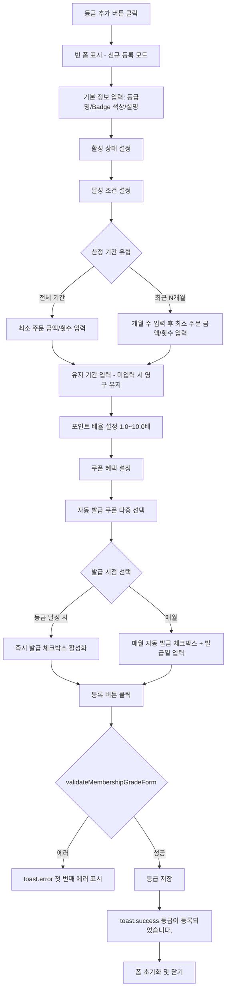
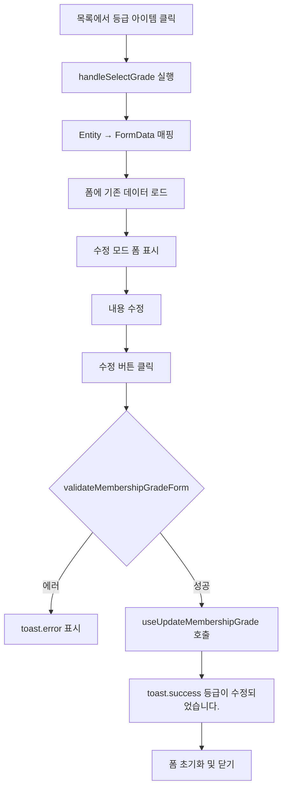
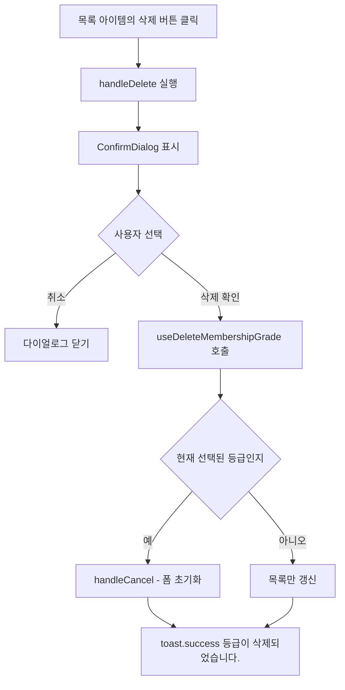
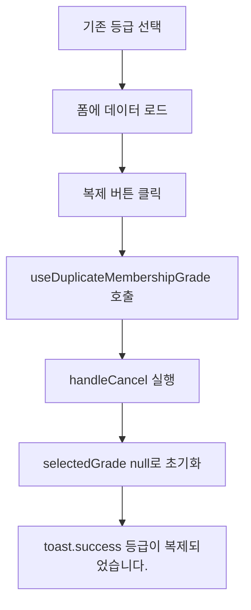
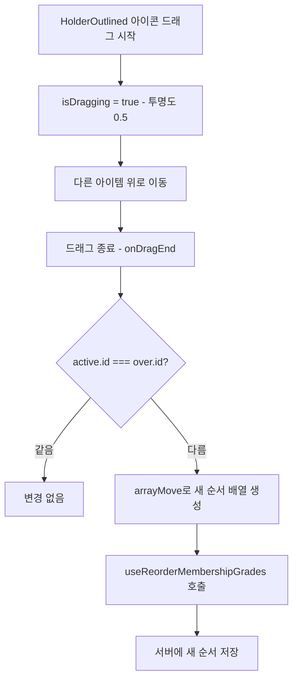

# 회원 등급 관리 페이지 기획서

## 개요

**페이지 경로**: `/app-members/grades`
**접근 권한**: 인증된 사용자
**주요 목적**: 멤버십 등급 생성 및 관리, 달성 조건과 혜택 설정

---

## 주요 기능

### 1. 등급 CRUD (4종)
| 기능 | 설명 |
| --- | --- |
| 생성 | 새 멤버십 등급 등록 (등급명, 배지 색상, 달성 조건, 혜택 설정) |
| 조회 | 등급 목록 조회 및 등급 상세 정보 확인 |
| 수정 | 기존 등급의 정보, 조건, 혜택 변경 |
| 삭제 | 등급 삭제 (삭제 확인 다이얼로그 포함) |


### 2. 등급 복제
- 기존 등급 선택 후 복제 버튼 클릭 시 동일한 설정의 새 등급 생성
- 복제 후 `selectedGrade`가 null로 초기화되어 신규 등록 모드로 전환됨

### 3. 드래그 앤 드롭 정렬
- `@dnd-kit/core`, `@dnd-kit/sortable` 라이브러리 사용
- 목록에서 드래그하여 등급 우선순위 변경
- **위에 위치할수록 높은 등급**으로 간주
- 드래그 완료 시 즉시 `useReorderMembershipGrades` 훅을 통해 서버에 순서 반영

### 4. 통계 카드 (3종)
| 카드 | 데이터 | 아이콘 |
| --- | --- | --- |
| 전체 등급 | 등록된 전체 등급 수 | TrophyOutlined (primary) |
| 활성 등급 | 현재 활성 상태인 등급 수 | TrophyOutlined (success) |
| 전체 회원 | 등급을 보유한 전체 회원 수 | TeamOutlined (info) |


### 5. 달성 조건 설정
| 항목 | 설명 | 제약 조건 |
| --- | --- | --- |
| 최소 주문 금액 | 등급 달성에 필요한 누적 주문 금액 | 0원 이상, null 허용 (미설정) |
| 최소 주문 횟수 | 등급 달성에 필요한 최소 주문 횟수 | 1회 이상, null 허용 (미설정) |
| 산정 기간 | 조건 달성 여부를 판단하는 기간 | 전체 기간(lifetime) / 최근 N개월(recent_months, 1~60개월) |
| 유지 기간 | 등급을 유지하는 기간 | 1~120개월, null 허용 (영구 유지) |


> 달성 조건을 모두 미설정(null)로 두면 신규 가입 시 자동 부여되는 기본 등급으로 간주됩니다.

### 6. 포인트 혜택 설정
- 적립 배율: 1.0~10.0배 (0.1 단위 조정)
- 1.0배는 기본 적립, 그 이상은 배율에 따라 추가 적립

### 7. 쿠폰 혜택 설정
| 항목 | 설명 |
| --- | --- |
| 자동 발급 쿠폰 선택 | 사용 가능한 쿠폰 목록에서 다중 선택 |
| 등급 달성 시 즉시 발급 | 등급 달성 이벤트 발생 시 선택된 쿠폰 즉시 발급 |
| 매월 자동 발급 | 매월 지정일에 선택된 쿠폰 자동 발급 (발급일: 1~28일) |


---

## 화면 구성

```
┌──────────────────────────────────────────────────────────────┐
│  등급 관리                                                     │
│  멤버십 등급을 생성하고 달성 조건과 혜택을 설정합니다              │
├──────────────────────────────────────────────────────────────┤
│  ┌──────────┐ ┌──────────┐ ┌──────────┐                      │
│  │ 전체 등급  │ │ 활성 등급  │ │ 전체 회원  │                      │
│  │   5개    │ │   4개    │ │  1,234명  │                      │
│  └──────────┘ └──────────┘ └──────────┘                      │
├──────────────────────────────────────────────────────────────┤
│  ┌──────────────────────┐ ┌──────────────────────────────┐   │
│  │  등급 목록 (360px)    │ │  등급 정보 / 등록 / 수정 (1fr) │   │
│  ├──────────────────────┤ ├──────────────────────────────┤   │
│  │              [등급추가]│ │                              │   │
│  │                      │ │  [기본 정보]                  │   │
│  │  ⣿ [VIP] 기본        │ │  등급명(필수), Badge 색상     │   │
│  │    1,200명 · x3.0배  │ │  설명, 활성 상태 체크박스      │   │
│  │                      │ │                              │   │
│  │  ⣿ [Gold]            │ │  [달성 조건]                  │   │
│  │    800명 · x2.0배    │ │  최소 주문 금액(원)            │   │
│  │                      │ │  최소 주문 횟수(회)            │   │
│  │  ⣿ [Silver]          │ │  산정 기간: [전체][최근N개월]  │   │
│  │    600명 · x1.5배    │ │  유지 기간(개월)              │   │
│  │                      │ │                              │   │
│  │  ⣿ [Bronze]          │ │  [포인트 혜택]                │   │
│  │    400명 · x1.2배    │ │  적립 배율(1.0~10.0배)        │   │
│  │                      │ │                              │   │
│  │  ⣿ [일반] 비활성      │ │  [쿠폰 혜택]                  │   │
│  │    234명 · x1.0배    │ │  자동 발급 쿠폰 선택           │   │
│  │                      │ │  ☑ 등급 달성 시 즉시 발급      │   │
│  │ i 드래그하여 등급 순서 │ │  ☐ 매월 자동 발급             │   │
│  │   를 변경하세요        │ │                              │   │
│  │   (위일수록 높은 등급) │ │   [복제]   [취소] [등록/수정]  │   │
│  └──────────────────────┘ └──────────────────────────────┘   │
└──────────────────────────────────────────────────────────────┘
```

---

## 사용자 플로우

### 등급 등록 플로우


### 등급 수정 플로우


### 등급 삭제 플로우


### 등급 복제 플로우


### 드래그 앤 드롭 정렬 플로우


---

## 데이터 구조

### MembershipGrade (엔티티)
```typescript
interface MembershipGrade {
  id: string;                              // 고유 식별자
  name: string;                            // 등급명 (예: VIP, Gold)
  description: string;                     // 등급 설명
  badgeVariant: BadgeVariant;              // 배지 색상 변형
  order: number;                           // 정렬 순서 (낮을수록 높은 등급)
  achievementCondition: GradeAchievementCondition; // 달성 조건
  benefits: GradeBenefits;                 // 등급 혜택
  isActive: boolean;                       // 활성 상태
  isDefault: boolean;                      // 기본 등급 여부 (신규 가입 자동 부여)
  memberCount: number;                     // 해당 등급 보유 회원 수
  createdAt: Date;                         // 생성 일시
  updatedAt: Date;                         // 수정 일시
  createdBy: string;                       // 생성자
}
```

### GradeAchievementCondition (달성 조건)
```typescript
interface GradeAchievementCondition {
  minTotalOrderAmount: number | null;      // 최소 누적 주문 금액 (null = 미설정)
  minOrderCount: number | null;            // 최소 주문 횟수 (null = 미설정)
  calculationPeriod: {
    type: CalculationPeriodType;           // 'lifetime' | 'recent_months'
    months: number | null;                 // recent_months 선택 시 개월 수
  };
  retentionMonths: number | null;          // 등급 유지 기간 (null = 영구 유지)
}

type CalculationPeriodType = 'lifetime' | 'recent_months';
```

### GradeBenefits (등급 혜택)
```typescript
interface GradeBenefits {
  point: GradePointBenefit;
  coupon: GradeCouponBenefit;
}

interface GradePointBenefit {
  earnMultiplier: number;                  // 포인트 적립 배율 (1.0~10.0)
}

interface GradeCouponBenefit {
  autoIssueCouponIds: string[];            // 자동 발급 쿠폰 ID 목록
  issueOnUpgrade: boolean;                 // 등급 달성 시 즉시 발급 여부
  issueMonthly: boolean;                   // 매월 자동 발급 여부
  monthlyIssueDay: number | null;          // 매월 발급일 (1~28, null = 미설정)
}
```

### MembershipGradeFormData (폼 데이터 - 평면화)
```typescript
interface MembershipGradeFormData {
  // 기본 정보
  name: string;
  description: string;
  badgeVariant: BadgeVariant;

  // 달성 조건
  minTotalOrderAmount: number | null;
  minOrderCount: number | null;
  calculationPeriodType: CalculationPeriodType;
  calculationPeriodMonths: number | null;
  retentionMonths: number | null;

  // 포인트 혜택
  pointEarnMultiplier: number;

  // 쿠폰 혜택
  autoIssueCouponIds: string[];
  couponIssueOnUpgrade: boolean;
  couponIssueMonthly: boolean;
  couponMonthlyIssueDay: number | null;

  isActive: boolean;
}
```

### 기본값 (DEFAULT_MEMBERSHIP_GRADE_FORM)
```typescript
const DEFAULT_MEMBERSHIP_GRADE_FORM: MembershipGradeFormData = {
  name: '',
  description: '',
  badgeVariant: 'secondary',

  minTotalOrderAmount: null,
  minOrderCount: null,
  calculationPeriodType: 'lifetime',
  calculationPeriodMonths: null,
  retentionMonths: null,

  pointEarnMultiplier: 1.0,

  autoIssueCouponIds: [],
  couponIssueOnUpgrade: true,    // 기본값: 달성 시 즉시 발급 활성화
  couponIssueMonthly: false,
  couponMonthlyIssueDay: null,

  isActive: true,
};
```

### Badge 색상 옵션
| variant | 색상 | 용도 예시 |
| --- | --- | --- |
| `critical` | 빨강 | 최상위 등급 (예: VIP) |
| `warning` | 주황 | 상위 등급 (예: Gold) |
| `success` | 초록 | 중간 등급 (예: Silver) |
| `info` | 파랑 | 일반 등급 (예: Bronze) |
| `default` | 회색 | 기본 등급 |
| `secondary` | 연회색 | 신규 폼 기본값 |


---

## API 엔드포인트

### 1. 등급 목록 조회
```
GET /api/app-members/grades
Authorization: Bearer {token}

Response:
{
  "data": [
    {
      "id": "grade-1",
      "name": "VIP",
      "description": "최상위 회원 등급",
      "badgeVariant": "critical",
      "order": 1,
      "achievementCondition": {
        "minTotalOrderAmount": 1000000,
        "minOrderCount": 10,
        "calculationPeriod": { "type": "recent_months", "months": 12 },
        "retentionMonths": 6
      },
      "benefits": {
        "point": { "earnMultiplier": 3.0 },
        "coupon": {
          "autoIssueCouponIds": ["coupon-1"],
          "issueOnUpgrade": true,
          "issueMonthly": true,
          "monthlyIssueDay": 1
        }
      },
      "isActive": true,
      "isDefault": false,
      "memberCount": 1200,
      "createdAt": "2026-01-01T00:00:00.000Z",
      "updatedAt": "2026-02-01T00:00:00.000Z",
      "createdBy": "admin"
    }
  ]
}
```

### 2. 등급 통계 조회
```
GET /api/app-members/grades/stats
Authorization: Bearer {token}

Response:
{
  "data": {
    "total": 5,
    "active": 4,
    "totalMembers": 3234
  }
}
```

### 3. 등급 생성
```
POST /api/app-members/grades
Content-Type: application/json
Authorization: Bearer {token}

{
  "name": "Gold",
  "description": "Gold 등급 회원",
  "badgeVariant": "warning",
  "achievementCondition": {
    "minTotalOrderAmount": 500000,
    "minOrderCount": 5,
    "calculationPeriod": { "type": "recent_months", "months": 6 },
    "retentionMonths": 3
  },
  "benefits": {
    "point": { "earnMultiplier": 2.0 },
    "coupon": {
      "autoIssueCouponIds": ["coupon-2"],
      "issueOnUpgrade": true,
      "issueMonthly": false,
      "monthlyIssueDay": null
    }
  },
  "isActive": true
}

Response:
{
  "data": {
    "id": "grade-new",
    ...
  }
}
```

### 4. 등급 수정
```
PATCH /api/app-members/grades/:id
Content-Type: application/json
Authorization: Bearer {token}

{
  "name": "Gold",
  "benefits": {
    "point": { "earnMultiplier": 2.5 }
  }
}
```

### 5. 등급 삭제
```
DELETE /api/app-members/grades/:id
Authorization: Bearer {token}

Response:
{
  "message": "등급이 삭제되었습니다"
}
```

### 6. 등급 복제
```
POST /api/app-members/grades/:id/duplicate
Authorization: Bearer {token}

Response:
{
  "data": {
    "id": "grade-copy",
    "name": "Gold (복사본)",
    ...
  }
}
```

### 7. 등급 순서 변경
```
PATCH /api/app-members/grades/reorder
Content-Type: application/json
Authorization: Bearer {token}

{
  "gradeIds": ["grade-1", "grade-3", "grade-2", "grade-4", "grade-5"]
}

Response:
{
  "message": "등급 순서가 변경되었습니다"
}
```

### 8. 사용 가능한 쿠폰 목록 조회
```
GET /api/app-members/grades/available-coupons
Authorization: Bearer {token}

Response:
{
  "data": [
    { "id": "coupon-1", "name": "VIP 전용 10% 할인 쿠폰" },
    { "id": "coupon-2", "name": "Gold 전용 5% 할인 쿠폰" }
  ]
}
```

---

## 보안 고려사항

### 권한 관리
| 역할 | 조회 | 생성 | 수정 | 삭제 | 복제 | 순서 변경 |
| --- | --- | --- | --- | --- | --- | --- |
| Admin | O | O | O | O | O | O |
| Manager | O | O | O | X | O | O |
| Viewer | O | X | X | X | X | X |


### 데이터 검증 (validateMembershipGradeForm)
```typescript
// 필수 항목
if (!data.name.trim())
  → '등급명을 입력해주세요.'

// 주문 금액
if (data.minTotalOrderAmount !== null && data.minTotalOrderAmount < 0)
  → '최소 주문 금액은 0원 이상이어야 합니다.'

// 주문 횟수
if (data.minOrderCount !== null && data.minOrderCount < 1)
  → '최소 주문 횟수는 1회 이상이어야 합니다.'

// 산정 기간 (recent_months 선택 시)
if (data.calculationPeriodMonths === null || data.calculationPeriodMonths < 1)
  → '산정 기간은 1개월 이상이어야 합니다.'
if (data.calculationPeriodMonths > 60)
  → '산정 기간은 60개월을 초과할 수 없습니다.'

// 유지 기간
if (data.retentionMonths !== null && data.retentionMonths < 1)
  → '유지 기간은 1개월 이상이어야 합니다.'
if (data.retentionMonths !== null && data.retentionMonths > 120)
  → '유지 기간은 120개월을 초과할 수 없습니다.'

// 포인트 배율
if (data.pointEarnMultiplier < 1.0)
  → '포인트 적립 배율은 1.0배 이상이어야 합니다.'
if (data.pointEarnMultiplier > 10.0)
  → '포인트 적립 배율은 10.0배를 초과할 수 없습니다.'

// 쿠폰 발급일
if (data.couponIssueMonthly && !data.couponMonthlyIssueDay)
  → '매월 자동 발급을 선택한 경우 발급일을 지정해주세요.'
if (data.couponMonthlyIssueDay !== null && (data.couponMonthlyIssueDay < 1 || data.couponMonthlyIssueDay > 28))
  → '매월 발급일은 1~28일 사이여야 합니다.'
```

### 기타 보안 사항
- 모든 API 요청에 Authorization Bearer 토큰 필수
- 기본 등급(`isDefault: true`) 삭제 시 서버에서 차단 처리 필요
- 드래그 앤 드롭 순서 변경은 전체 배열 ID를 전송하므로, 서버에서 배열 완전성 검증 필요

---

## UI 컴포넌트

### 공통 UI 컴포넌트
| 컴포넌트 | 용도 |
| --- | --- |
| `Card`, `CardHeader`, `CardContent` | 등급 목록 및 폼 영역 카드 레이아웃 |
| `Button` | 추가, 등록, 수정, 취소, 복제 액션 버튼 |
| `Input` | 등급명, 설명, 숫자 입력 (주문 금액/횟수/배율/기간) |
| `Label` | 필드 라벨 (required 속성 지원) |
| `Badge` | 등급 배지 색상 표시 |
| `ToggleButtonGroup` | 산정 기간 유형 단일 선택 (전체 기간 / 최근 N개월) |
| `ConfirmDialog` | 등급 삭제 전 확인 다이얼로그 (type="warning") |


### Ant Design 아이콘
| 아이콘 | 사용 위치 |
| --- | --- |
| `PlusOutlined` | 등급 추가 버튼 |
| `TrophyOutlined` | 통계 카드 (전체 등급, 활성 등급), 목록 빈 상태, 폼 빈 상태 |
| `TeamOutlined` | 통계 카드 (전체 회원) |
| `CopyOutlined` | 복제 버튼 |
| `DeleteOutlined` | 목록 아이템 삭제 버튼 |
| `HolderOutlined` | 드래그 핸들 아이콘 |
| `InfoCircleOutlined` | 드래그 순서 안내 문구 |


### 드래그 앤 드롭 구현 (SortableGradeItem)
```typescript
// @dnd-kit/sortable useSortable 훅 활용
const { attributes, listeners, setNodeRef, transform, transition, isDragging } = useSortable({ id: grade.id });

// 드래그 중 스타일
const style = {
  transform: CSS.Transform.toString(transform),
  transition,
  opacity: isDragging ? 0.5 : 1,   // 드래그 중 반투명
};

// 드래그 핸들 (HolderOutlined)에만 listeners 적용
// 아이템 클릭(onSelect)과 드래그 동작 분리를 위해 e.stopPropagation() 사용
```

### 레이아웃 구조
- 통계 카드: `grid-cols-1 md:grid-cols-3`
- 2컬럼 레이아웃: `grid-cols-1 lg:grid-cols-[360px,1fr]`
- 폼 내부 2열 그리드: `grid-cols-1 md:grid-cols-2`
- 폼 섹션 구분선: `border-b border-border pb-2` 적용된 h3
- 드래그 핸들 커서: `cursor-grab`, 드래그 중: `active:cursor-grabbing`

### React Query 훅 목록
| 훅 | 용도 |
| --- | --- |
| `useMembershipGrades` | 등급 목록 조회 |
| `useMembershipGradeStats` | 통계 카드 데이터 조회 |
| `useCreateMembershipGrade` | 등급 생성 뮤테이션 |
| `useUpdateMembershipGrade` | 등급 수정 뮤테이션 |
| `useDeleteMembershipGrade` | 등급 삭제 뮤테이션 |
| `useDuplicateMembershipGrade` | 등급 복제 뮤테이션 |
| `useReorderMembershipGrades` | 등급 순서 변경 뮤테이션 |
| `useAvailableCoupons` | 자동 발급 가능한 쿠폰 목록 조회 |
| `useToast` | 성공/에러 알림 토스트 |


---

## 테스트 시나리오

### 기능 테스트
- [ ] 통계 카드 (전체 등급, 활성 등급, 전체 회원) 정상 표시
- [ ] 등급 목록 조회 및 정렬 순서 표시
- [ ] 등급 추가 버튼 클릭 시 빈 폼 표시 (신규 등록 모드)
- [ ] 목록 아이템 클릭 시 폼에 기존 데이터 로드 (수정 모드)
- [ ] 등급 등록 (기본 정보 + 달성 조건 + 포인트 배율 + 쿠폰 설정)
- [ ] 등급 수정 후 목록 반영
- [ ] 등급 삭제 - ConfirmDialog 표시 후 삭제 확인
- [ ] 삭제 취소 시 아무 변경 없음
- [ ] 현재 선택된 등급 삭제 시 폼 초기화 처리
- [ ] 등급 복제 - 동일 설정의 새 등급 생성 및 신규 모드 전환
- [ ] 드래그 앤 드롭으로 등급 순서 변경
- [ ] 드래그 중 아이콘 반투명(opacity 0.5) 처리
- [ ] 쿠폰 다중 선택/해제 토글
- [ ] 매월 자동 발급 체크 시 발급일 입력 필드 표시
- [ ] 매월 자동 발급 해제 시 발급일 null 초기화

### 유효성 검사 테스트
- [ ] 등급명 빈값으로 저장 시도 → 에러 토스트
- [ ] 최소 주문 금액 음수 입력 → 에러 토스트
- [ ] 최소 주문 횟수 0 이하 입력 → 에러 토스트
- [ ] 산정 기간 '최근 N개월' 선택 후 개월 수 미입력 → 에러 토스트
- [ ] 산정 기간 개월 수 61 이상 입력 → 에러 토스트
- [ ] 유지 기간 0 이하 입력 → 에러 토스트
- [ ] 유지 기간 121 이상 입력 → 에러 토스트
- [ ] 포인트 배율 1.0 미만 입력 → 에러 토스트
- [ ] 포인트 배율 10.0 초과 입력 → 에러 토스트
- [ ] 매월 자동 발급 선택 후 발급일 미입력 → 에러 토스트
- [ ] 매월 발급일 0 이하 또는 29 이상 입력 → 에러 토스트

### UI/UX 테스트
- [ ] 등급 목록 빈 상태 표시 (TrophyOutlined 아이콘 + 안내 문구)
- [ ] 폼 비활성 상태 빈 화면 (등급 선택 안내 문구)
- [ ] 기본 등급(`isDefault: true`) 배지에 '기본' 라벨 표시
- [ ] 비활성 등급(`isActive: false`) 배지에 '비활성' 라벨 표시
- [ ] 수정 모드에서만 복제 버튼 표시 (신규 등록 시 비표시)
- [ ] Badge 색상 선택 시 실시간 미리보기 반영
- [ ] 포인트 배율 1.0배 표시 시 "기본 적립" 레이블
- [ ] 포인트 배율 1.0배 초과 시 "기본 대비 N배 적립" 레이블
- [ ] 저장/수정 성공 후 폼 초기화 및 닫힘 처리
- [ ] 등급 캐시 초기화 (`initGradeCache`) - 목록 로드 후 실행

### 드래그 앤 드롭 테스트
- [ ] 드래그 핸들(HolderOutlined)로만 드래그 가능
- [ ] 아이템 본문 클릭 시 드래그 동작 아님 (onSelect 실행)
- [ ] 8px 이상 이동 시 드래그 활성화 (activationConstraint.distance)
- [ ] 키보드로 드래그 정렬 가능 (KeyboardSensor)
- [ ] 드래그 완료 후 서버에 새 순서 자동 저장

---

## TODO

### 단기 (1~2주)
- [ ] Mock 데이터를 실제 API로 교체
- [ ] 사용 가능한 쿠폰 목록 API 연동 (현재 하드코딩 또는 미연동)
- [ ] 등급 통계 API 연동

### 중기 (1~2개월)
- [ ] 기본 등급 지정 기능 (isDefault 플래그 UI 제어)
- [ ] 등급별 회원 목록 조회 연동 (memberCount 클릭 시 필터링)
- [ ] 달성 조건 OR/AND 조합 설정 지원
- [ ] 등급 변경 이력 조회 (Audit Log)
- [ ] 등급 미달성 시 등급 강등 로직 설정

### 장기 (3개월+)
- [ ] 등급별 혜택 효과 분석 대시보드
- [ ] 등급 달성/강등 알림 자동화 (이메일, 푸시)
- [ ] 등급 조건 시뮬레이터 (특정 회원이 어떤 등급에 해당하는지 확인)
- [ ] 등급 템플릿 (업종별 기본 템플릿 제공)
- [ ] 등급 A/B 테스트 지원

---

**작성일**: 2026-02-20
**최종 수정일**: 2026-02-20
**작성자**: Claude Code
