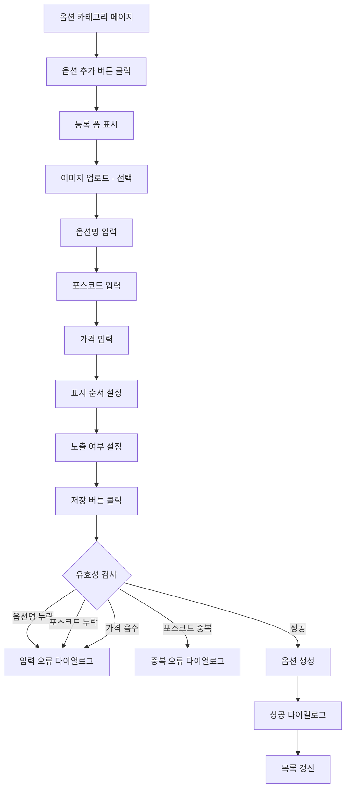
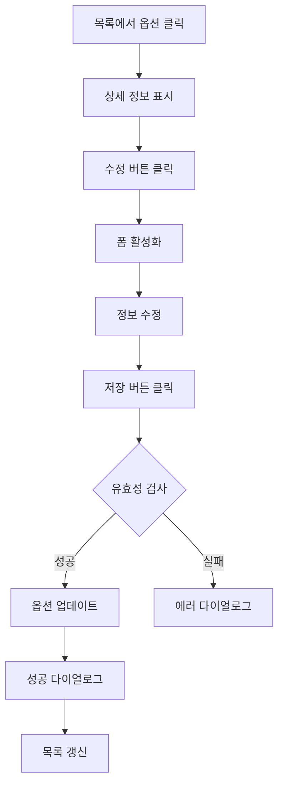
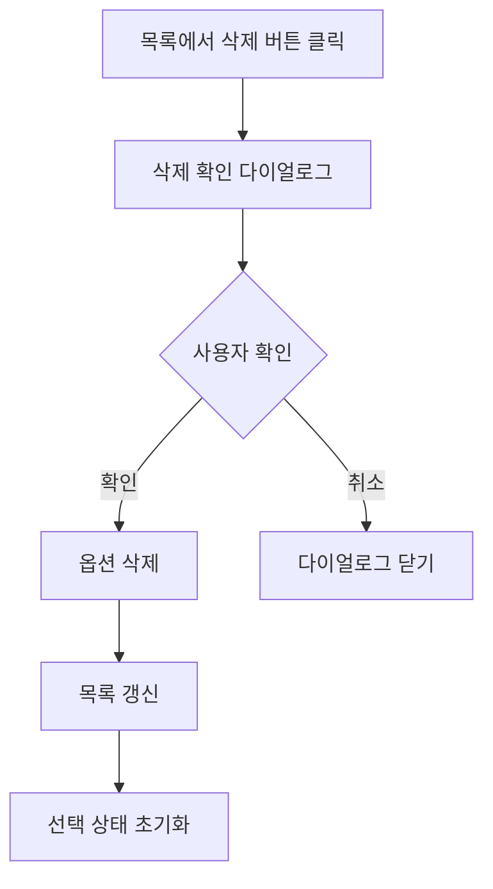

# 옵션 카테고리 관리 페이지 기획서

## 📋 개요

**페이지 경로**: `/menu/options`
**접근 권한**: 인증된 사용자 (모든 역할)
**주요 목적**: 개별 옵션 메뉴(옵션 카테고리) 등록 및 관리
**소스 파일**: `src/pages/Menu/OptionCategories.tsx`

---

## 🎯 주요 기능

### 1. CRUD 기능
- **생성**: 신규 옵션 카테고리 추가 (옵션명, 포스코드, 가격, 이미지, 노출 여부)
- **조회**: 옵션 목록 조회 (이미지 미리보기, 포스코드, 가격, 노출 배지)
- **수정**: 옵션 카테고리 정보 변경
- **삭제**: ConfirmDialog를 통한 삭제 확인 후 제거

### 2. 검색 기능
- 옵션명 기준 실시간 검색
- 포스코드 기준 실시간 검색
- 대소문자 구분 없는 검색

### 3. 통계 대시보드
- 전체 옵션 수
- 노출 중인 옵션 수
- 숨김 처리된 옵션 수

### 4. 이미지 관리
- 이미지 업로드 (파일 선택)
- 이미지 미리보기
- 이미지 삭제
- 권장 사이즈: 200x200px, 최대 2MB

### 5. 다이얼로그 시스템
- `DialogState` 타입 기반 멀티 타입 다이얼로그
- 지원 타입: `confirm`, `warning`, `info`, `success`
- 삭제 확인, 입력 오류 알림, 성공 알림 등

---

## 🖼️ 화면 구성

```
┌──────────────────────────────────────────────────────────┐
│  옵션 카테고리                          [옵션 추가]       │
│  옵션 메뉴를 관리합니다.                                  │
├──────────────────────────────────────────────────────────┤
│  ┌──────────┐ ┌──────────┐ ┌──────────┐                  │
│  │ 전체 옵션 │ │ 노출 중   │ │ 숨김      │                  │
│  │    4     │ │    3     │ │    1     │                  │
│  └──────────┘ └──────────┘ └──────────┘                  │
├──────────────────────────────────────────────────────────┤
│  ┌─────────────────────┐ ┌──────────────────────────┐    │
│  │ 옵션 목록            │ │ 옵션 상세/등록            │    │
│  ├─────────────────────┤ ├──────────────────────────┤    │
│  │ [🔍 옵션명, 포스코드] │ │                          │    │
│  │                     │ │ 옵션 이미지 (선택)         │    │
│  │ 🖼 치즈추가   [노출] │ │ [📷] [이미지 선택]        │    │
│  │   POS: OPT001       │ │                          │    │
│  │   2,000원            │ │ 옵션명*: [치즈추가]       │    │
│  │                     │ │                          │    │
│  │ 🖼 양념소스   [노출] │ │ 포스코드*: [OPT001]      │    │
│  │   POS: OPT002       │ │ 가격*: [2,000] 원         │    │
│  │   500원              │ │                          │    │
│  │                     │ │ 표시 순서: [1]            │    │
│  │ 🖼 콜라 500ml [노출] │ │                          │    │
│  │   POS: OPT003       │ │ ☑ 노출 여부              │    │
│  │   2,500원            │ │ "고객에게 노출됩니다"     │    │
│  │                     │ │                          │    │
│  │ 🖼 사이다 500ml[숨김]│ │ [저장]    [취소]          │    │
│  │   POS: OPT004       │ │                          │    │
│  │   2,500원            │ │                          │    │
│  └─────────────────────┘ └──────────────────────────┘    │
└──────────────────────────────────────────────────────────┘
```

---

## 🔄 사용자 플로우

### 옵션 생성


### 옵션 수정


### 옵션 삭제


---

## 📦 데이터 구조

### OptionCategory 타입
```typescript
interface OptionCategory {
  id: string;
  name: string;              // 옵션명
  posCode: string;           // 포스코드
  price: number;             // 가격
  imageUrl?: string;         // 옵션 이미지 (선택사항)
  isVisible: boolean;        // 노출 여부
  displayOrder: number;      // 표시 순서
  createdAt: Date;
  updatedAt: Date;
}
```

### 폼 데이터
```typescript
interface OptionCategoryFormData {
  name: string;
  posCode: string;
  price: number;
  imageFile?: File;
  imageUrl?: string;
  isVisible: boolean;
  displayOrder: number;
}
```

### 다이얼로그 상태 타입
```typescript
interface DialogState {
  isOpen: boolean;
  type: 'confirm' | 'warning' | 'info' | 'success';
  title: string;
  message: string;
  onConfirm?: () => void;
  showCancel?: boolean;
}
```

### 샘플 데이터
| 옵션명 | 포스코드 | 가격 | 노출 |
| --- | --- | --- | --- |
| 치즈추가 | OPT001 | 2,000원 | ✅ |
| 양념소스 | OPT002 | 500원 | ✅ |
| 콜라 500ml | OPT003 | 2,500원 | ✅ |
| 사이다 500ml | OPT004 | 2,500원 | ❌ |


---

## 🔌 API 엔드포인트

### 1. 옵션 카테고리 목록 조회
```
GET /api/menu/options
Authorization: Bearer {token}
Query: ?search=치즈&page=1&limit=20

Response:
{
  "data": [
    {
      "id": "1",
      "name": "치즈추가",
      "posCode": "OPT001",
      "price": 2000,
      "imageUrl": "",
      "isVisible": true,
      "displayOrder": 1,
      "createdAt": "2026-02-01T00:00:00Z",
      "updatedAt": "2026-02-01T00:00:00Z"
    }
  ],
  "pagination": {
    "page": 1,
    "limit": 20,
    "total": 10
  }
}
```

### 2. 옵션 카테고리 생성
```
POST /api/menu/options
Content-Type: multipart/form-data
Authorization: Bearer {token}

{
  "name": "모짜렐라 추가",
  "posCode": "OPT010",
  "price": 3000,
  "image": [파일],
  "isVisible": true,
  "displayOrder": 5
}

Response:
{
  "data": {
    "id": "opt-new",
    "name": "모짜렐라 추가",
    "posCode": "OPT010",
    "price": 3000,
    "imageUrl": "https://cdn.example.com/options/opt-new.jpg",
    "isVisible": true,
    "displayOrder": 5,
    "createdAt": "2026-02-11T00:00:00Z",
    "updatedAt": "2026-02-11T00:00:00Z"
  }
}
```

### 3. 옵션 카테고리 수정
```
PATCH /api/menu/options/:id
Content-Type: application/json
Authorization: Bearer {token}

{
  "name": "치즈추가 (더블)",
  "price": 3500,
  "isVisible": false
}
```

### 4. 옵션 카테고리 삭제
```
DELETE /api/menu/options/:id
Authorization: Bearer {token}

Response:
{
  "message": "옵션이 삭제되었습니다"
}
```

### 5. 옵션 이미지 업로드
```
POST /api/menu/options/upload-image
Content-Type: multipart/form-data
Authorization: Bearer {token}

{
  "image": [파일]
}

Response:
{
  "data": {
    "imageUrl": "https://cdn.example.com/options/12345.jpg"
  }
}
```

---

## 🔒 보안 고려사항

### 권한 관리
| 역할 | 조회 | 생성 | 수정 | 삭제 |
| --- | --- | --- | --- | --- |
| Admin | ✅ | ✅ | ✅ | ✅ |
| Manager | ✅ | ✅ | ✅ | ❌ |
| Viewer | ✅ | ❌ | ❌ | ❌ |


### 데이터 검증
- 옵션명 필수 입력 (공백 불가)
- 포스코드 필수 입력 (공백 불가)
- 포스코드 중복 검증 (수정 시 자기 자신 제외)
- 가격 0 이상 검증
- 이미지 파일 확장자 검증 (jpg, png, webp)
- 이미지 파일 크기 제한 (2MB)
- XSS 방지: 입력값 이스케이프 처리

### 유효성 검사 로직
```typescript
const validateOptionForm = (formData: OptionCategoryFormData): boolean => {
  if (!formData.name.trim()) return false;     // 옵션명 필수
  if (!formData.posCode.trim()) return false;  // 포스코드 필수
  if (formData.price < 0) return false;        // 가격 0 이상
  return true;
};
```

---

## 🎨 UI 컴포넌트

### 사용된 컴포넌트
- `Card`, `CardHeader`, `CardContent` - 카드 레이아웃
- `Button` - 액션 버튼 (추가, 저장, 취소, 수정, 이미지 선택/삭제)
- `Input` - 텍스트/숫자 입력 (옵션명, 포스코드, 가격, 표시 순서)
- `Label` - 폼 라벨 (required 속성 지원)
- `Switch` - 노출 여부 토글
- `Separator` - 영역 구분선
- `Badge` - 노출/숨김 상태 표시 (`success` / `secondary` variant)
- `ConfirmDialog` - 삭제 확인 및 알림 다이얼로그

### Ant Design Icons
- `PlusOutlined` - 옵션 추가 버튼
- `DeleteOutlined` - 삭제 버튼
- `EditOutlined` - 수정 버튼
- `SaveOutlined` - 저장 버튼
- `CloseOutlined` - 취소 버튼
- `SearchOutlined` - 검색 아이콘
- `PictureOutlined` - 이미지 플레이스홀더

### 레이아웃 구조
- **2-column 레이아웃**: 좌측 옵션 목록 + 우측 상세/등록 폼
- **통계 카드**: 3열 그리드 (전체/노출/숨김)
- **목록 카드**: 검색 입력 + 스크롤 가능 리스트 (최대 500px)
- **상세 카드**: 이미지 업로드 + 폼 필드 + 액션 버튼

### 목록 아이템 스타일
- **선택됨**: `bg-bg-hover` 배경 + `border-primary/20` 테두리
- **호버**: `bg-bg-hover` 배경
- **이미지**: 48x48 라운드 사각형, 이미지 없으면 PictureOutlined 아이콘
- **삭제 버튼**: 호버 시에만 표시 (opacity-0 → group-hover:opacity-100)

---

## 🧪 테스트 시나리오

### 기능 테스트
- [ ] 옵션 목록 조회 (초기 로드)
- [ ] 옵션 신규 등록 (전체 필드)
- [ ] 옵션 수정 (부분 필드)
- [ ] 옵션 삭제 (확인 다이얼로그)
- [ ] 이미지 업로드 및 미리보기
- [ ] 이미지 삭제
- [ ] 노출 여부 토글
- [ ] 검색 기능 (옵션명)
- [ ] 검색 기능 (포스코드)

### 유효성 검사 테스트
- [ ] 옵션명 미입력 시 에러 다이얼로그
- [ ] 포스코드 미입력 시 에러 다이얼로그
- [ ] 가격 음수 입력 시 에러 다이얼로그
- [ ] 포스코드 중복 시 에러 다이얼로그 (신규 등록)
- [ ] 포스코드 중복 시 에러 다이얼로그 (수정, 자기 자신 제외)

### UI/UX 테스트
- [ ] 옵션 선택 시 하이라이트 표시
- [ ] 폼 활성화/비활성화 상태 전환
- [ ] 이미지 업로드 미리보기
- [ ] 삭제 버튼 호버 시 표시
- [ ] 성공/에러 다이얼로그 표시
- [ ] 빈 목록 메시지 표시 (검색 결과 없음 / 등록된 옵션 없음)
- [ ] 통계 카드 실시간 업데이트

### 반응형 테스트
- [ ] Desktop: 2단 레이아웃
- [ ] Tablet: 1단 스택 레이아웃
- [ ] Mobile: 1단 스택 레이아웃

---

## 📌 TODO

### 단기 (1-2주)
- [ ] API 연동 (Mock → 실제 API)
- [ ] 이미지 업로드 서버 연동
- [ ] 포스코드 자동 생성 기능
- [ ] 옵션 목록 페이지네이션
- [ ] 로딩 상태 표시 (스켈레톤 UI)

### 중기 (1-2개월)
- [ ] 드래그 앤 드롭 정렬 (displayOrder)
- [ ] 일괄 노출/숨김 토글
- [ ] 옵션 복제 기능
- [ ] 옵션 카테고리 분류 (토핑/소스/음료 등)
- [ ] 이미지 크롭 기능
- [ ] 옵션 사용 현황 표시 (어떤 옵션 그룹에 연결되어 있는지)

### 장기 (3개월+)
- [ ] 옵션 가져오기/내보내기 (Excel)
- [ ] 옵션 변경 이력 조회
- [ ] 옵션별 판매 통계
- [ ] 옵션 추천 시스템
- [ ] 다국어 옵션명 지원
- [ ] 옵션 템플릿 (빠른 등록)

---

**작성일**: 2026-02-11
**최종 수정일**: 2026-02-11
**작성자**: Claude Code
