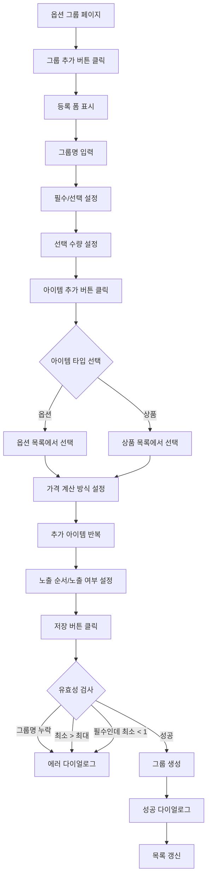
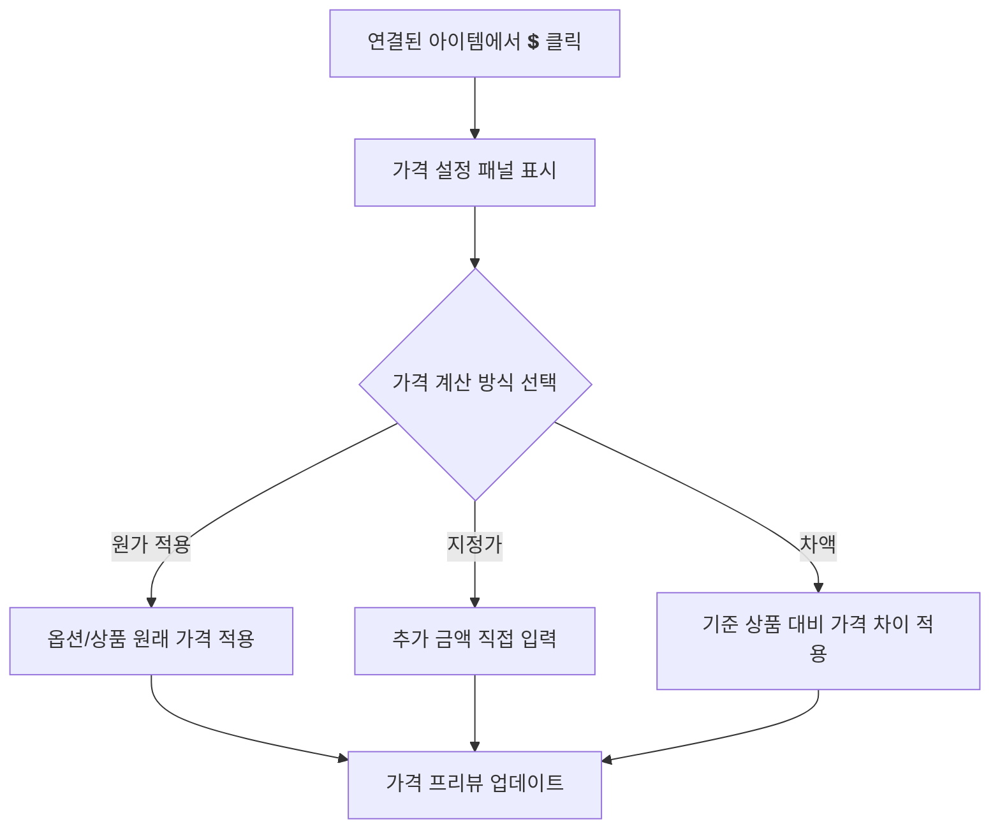
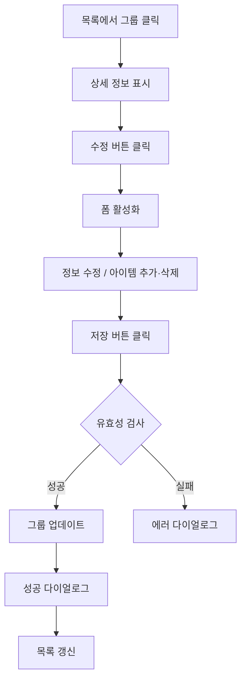
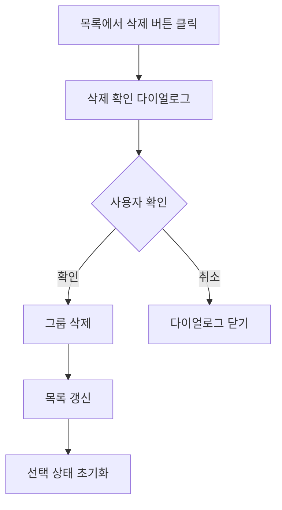

# 옵션 그룹 관리 페이지 기획서

## 📋 개요

**페이지 경로**: `/menu/option-groups`
**접근 권한**: 인증된 사용자 (모든 역할)
**주요 목적**: 옵션 및 상품을 성격에 맞게 묶은 옵션 그룹 관리
**소스 파일**: `src/pages/Menu/OptionGroups.tsx`

---

## 🎯 주요 기능

### 1. CRUD 기능
- **생성**: 신규 옵션 그룹 추가 (그룹명, 필수/선택, 선택 수량 규칙, 아이템 연결)
- **조회**: 옵션 그룹 목록 조회 (필수/선택 배지, 노출 상태, 아이템 수)
- **수정**: 옵션 그룹 정보 및 연결 아이템 변경
- **삭제**: ConfirmDialog를 통한 삭제 확인 후 제거

### 2. 아이템 관리 (옵션/상품 연결)
- **옵션 추가**: OptionCategory에서 옵션 선택하여 그룹에 연결
- **상품 추가**: Product에서 상품 선택하여 그룹에 연결 (반반피자 등)
- **아이템 삭제**: 연결된 아이템 개별 제거
- **가격 계산 방식 설정**: 원가 적용(original) / 지정가(override) / 차액(differential)
- **추가 금액 설정**: 지정가 방식에서 추가 금액 입력
- **옵션/상품 탭 전환**: 추가 시 옵션과 상품을 탭으로 구분
- **중복 추가 방지**: 이미 연결된 아이템은 선택 목록에서 제외

### 3. 선택 규칙 설정
- **필수/선택 여부**: Switch 토글 (필수 시 최소 선택 1개 이상 강제)
- **최소 선택 수량**: 필수 그룹은 최소 1개
- **최대 선택 수량**: 고객이 선택 가능한 최대 개수
- **선택 규칙 미리보기**: 설정된 규칙을 자연어로 표시

### 4. 통계 대시보드
- 전체 그룹 수
- 필수 그룹 수
- 선택 그룹 수
- 노출 중인 그룹 수

### 5. 가격 계산 프리뷰
- 연결된 아이템별 가격 계산 결과 실시간 표시
- 옵션/상품 구분 시각화 (색상 아이콘)
- 상품을 옵션으로 사용 시 POS 연동 안내

### 6. 검색 기능
- 그룹명 기준 실시간 검색 (목록)
- 아이템 추가 시 옵션명/상품명 검색

---

## 🖼️ 화면 구성

```
┌──────────────────────────────────────────────────────────┐
│  옵션 그룹                              [그룹 추가]       │
│  옵션 및 상품을 성격에 맞게 묶은 바구니를 관리합니다.       │
├──────────────────────────────────────────────────────────┤
│  ┌────────┐ ┌────────┐ ┌────────┐ ┌────────┐            │
│  │전체 그룹│ │필수 그룹│ │선택 그룹│ │노출 중  │            │
│  │   4    │ │   2    │ │   2    │ │   4    │            │
│  └────────┘ └────────┘ └────────┘ └────────┘            │
├──────────────────────────────────────────────────────────┤
│  ┌─────────────────────┐ ┌──────────────────────────┐    │
│  │ 그룹 목록            │ │ 그룹 상세/등록            │    │
│  ├─────────────────────┤ ├──────────────────────────┤    │
│  │ [🔍 그룹명 검색]     │ │                          │    │
│  │                     │ │ 그룹명*: [도우 변경]       │    │
│  │ ⚪ 도우 변경  [선택] │ │                          │    │
│  │   선택: 0~1개       │ │ ☐ 필수 선택  [선택]       │    │
│  │   아이템 2개         │ │ "고객이 선택하지 않아도..."│    │
│  │                     │ │                          │    │
│  │ ⚪ 소스 추가  [선택] │ │ 최소 선택*: [0]           │    │
│  │   선택: 0~3개       │ │ 최대 선택*: [1]           │    │
│  │   아이템 3개         │ │                          │    │
│  │                     │ │ 선택 규칙 미리보기:        │    │
│  │ ✅ 음료 선택  [필수] │ │ "선택 사항 · 최대 1개"    │    │
│  │   선택: 1~2개       │ │                          │    │
│  │   아이템 2개         │ │ 💰 가격 계산 프리뷰       │    │
│  │                     │ │ ● 씬 도우       무료      │    │
│  │ ✅ 반반피자  [필수]  │ │ ● 치즈크러스트  +3,000원  │    │
│  │   선택: 2~2개       │ │                          │    │
│  │   아이템 4개         │ │ 연결된 아이템    [추가]    │    │
│  │                     │ │ ┌──────────────────────┐ │    │
│  │                     │ │ │ 🏷 씬 도우    [💲][🗑]│ │    │
│  │                     │ │ │   POS:OPT005 원가:0원│ │    │
│  │                     │ │ │ 🏷 치즈크러스트[💲][🗑]│ │    │
│  │                     │ │ │   POS:OPT006        │ │    │
│  │                     │ │ └──────────────────────┘ │    │
│  │                     │ │                          │    │
│  │                     │ │ 노출 순서: [1]            │    │
│  │                     │ │ ☑ 노출 여부              │    │
│  │                     │ │                          │    │
│  │                     │ │ [저장]    [취소]          │    │
│  └─────────────────────┘ └──────────────────────────┘    │
└──────────────────────────────────────────────────────────┘
```

### 아이템 추가 셀렉터 (펼침 상태)
```
┌──────────────────────────────────┐
│ [옵션]        [상품]              │
├──────────────────────────────────┤
│ [🔍 옵션 검색...]                │
├──────────────────────────────────┤
│ 🏷 치즈추가           +2,000원   │
│ 🏷 양념소스             +500원   │
│ 🏷 콜라 500ml         +2,500원   │
└──────────────────────────────────┘
```

### 가격 설정 패널 (펼침 상태)
```
┌──────────────────────────────────┐
│ 가격 계산 방식                    │
│ [원가 적용] [지정가] [차액]       │
│                                  │
│ 추가 금액: + [0] 원               │
│ (0원 입력 시 추가금액 없이 선택)   │
│                                  │
│ ℹ️ 지정한 금액이 추가 금액으로    │
│    적용됩니다.                    │
└──────────────────────────────────┘
```

---

## 🔄 사용자 플로우

### 옵션 그룹 생성


### 아이템 가격 설정


### 옵션 그룹 수정


### 옵션 그룹 삭제


---

## 📦 데이터 구조

### OptionGroup 타입
```typescript
interface OptionGroup {
  id: string;
  name: string;              // 그룹명
  isRequired: boolean;       // 필수/선택 여부
  minSelection: number;      // 최소 선택 수량
  maxSelection: number;      // 최대 선택 수량
  displayOrder: number;      // 노출 순서
  isVisible: boolean;        // 노출 여부
  items: OptionGroupItem[];  // 연결된 옵션/상품 목록
  optionIds: string[];       // [Legacy] 연결된 옵션 ID 목록
  createdAt: Date;
  updatedAt: Date;
}
```

### OptionGroupItem 타입
```typescript
type OptionItemType = 'option' | 'product';

type OptionPriceType = 'original' | 'override' | 'differential';

interface OptionGroupItem {
  id: string;                        // 아이템 고유 ID
  type: OptionItemType;              // 'option' | 'product'
  referenceId: string;               // OptionCategory.id 또는 Product.id
  priceType: OptionPriceType;        // 가격 계산 방식
  overridePrice: number;             // priceType이 'override'일 때 적용 가격
  differentialBaseId?: string;       // priceType이 'differential'일 때 기준 상품 ID
  displayOrder: number;              // 그룹 내 표시 순서
}
```

### 폼 데이터
```typescript
interface OptionGroupFormData {
  name: string;
  isRequired: boolean;
  minSelection: number;
  maxSelection: number;
  displayOrder: number;
  isVisible: boolean;
  items: OptionGroupItem[];
  optionIds: string[];       // [Legacy] 하위 호환
}
```

### 가격 계산 방식
| 방식 | 설명 | 사용 예시 |
| --- | --- | --- |
| `original` | 옵션/상품의 원래 가격 적용 | 기본 옵션 (치즈추가 +2,000원) |
| `override` | 지정한 금액을 추가 금액으로 적용 | 반반피자 선택 (기본 +0원, 프리미엄 +3,000원) |
| `differential` | 기준 상품 대비 가격 차이 적용 | 업그레이드 옵션 |


### 샘플 데이터
| 그룹명 | 필수 | 선택 범위 | 아이템 |
| --- | --- | --- | --- |
| 도우 변경 | 선택 | 0~1개 | 씬 도우, 치즈크러스트 |
| 소스 추가 | 선택 | 0~3개 | 양념소스, 핫소스, 갈릭소스 |
| 음료 선택 | 필수 | 1~2개 | 콜라 500ml, 사이다 500ml |
| 반반피자 선택 | 필수 | 2~2개 | 페페로니, 불고기, 치즈, 슈프림(+3,000원) |


---

## 🔌 API 엔드포인트

### 1. 옵션 그룹 목록 조회
```
GET /api/menu/option-groups
Authorization: Bearer {token}
Query: ?search=도우&page=1&limit=20

Response:
{
  "data": [
    {
      "id": "1",
      "name": "도우 변경",
      "isRequired": false,
      "minSelection": 0,
      "maxSelection": 1,
      "displayOrder": 1,
      "isVisible": true,
      "items": [
        {
          "id": "item-1",
          "type": "option",
          "referenceId": "5",
          "priceType": "original",
          "overridePrice": 0,
          "displayOrder": 1
        }
      ],
      "createdAt": "2026-02-01T00:00:00Z",
      "updatedAt": "2026-02-01T00:00:00Z"
    }
  ],
  "pagination": {
    "page": 1,
    "limit": 20,
    "total": 5
  }
}
```

### 2. 옵션 그룹 상세 조회
```
GET /api/menu/option-groups/:id
Authorization: Bearer {token}

Response:
{
  "data": {
    "id": "4",
    "name": "반반피자 선택",
    "isRequired": true,
    "minSelection": 2,
    "maxSelection": 2,
    "displayOrder": 4,
    "isVisible": true,
    "items": [
      {
        "id": "item-8",
        "type": "product",
        "referenceId": "prod-1",
        "priceType": "override",
        "overridePrice": 0,
        "displayOrder": 1
      },
      {
        "id": "item-11",
        "type": "product",
        "referenceId": "prod-5",
        "priceType": "override",
        "overridePrice": 3000,
        "displayOrder": 4
      }
    ]
  }
}
```

### 3. 옵션 그룹 생성
```
POST /api/menu/option-groups
Content-Type: application/json
Authorization: Bearer {token}

{
  "name": "토핑 추가",
  "isRequired": false,
  "minSelection": 0,
  "maxSelection": 5,
  "displayOrder": 5,
  "isVisible": true,
  "items": [
    {
      "type": "option",
      "referenceId": "1",
      "priceType": "original",
      "overridePrice": 0,
      "displayOrder": 1
    }
  ]
}

Response:
{
  "data": {
    "id": "group-new",
    "name": "토핑 추가",
    ...
  }
}
```

### 4. 옵션 그룹 수정
```
PATCH /api/menu/option-groups/:id
Content-Type: application/json
Authorization: Bearer {token}

{
  "name": "도우 변경 (프리미엄)",
  "maxSelection": 2,
  "items": [...]
}
```

### 5. 옵션 그룹 삭제
```
DELETE /api/menu/option-groups/:id
Authorization: Bearer {token}

Response:
{
  "message": "옵션 그룹이 삭제되었습니다"
}
```

### 6. 사용 가능한 옵션 목록 조회
```
GET /api/menu/options
Authorization: Bearer {token}

Response:
{
  "data": [
    {
      "id": "1",
      "name": "치즈추가",
      "posCode": "OPT001",
      "price": 2000,
      "isVisible": true
    }
  ]
}
```

### 7. 사용 가능한 상품 목록 조회
```
GET /api/menu/products
Authorization: Bearer {token}
Query: ?status=active

Response:
{
  "data": [
    {
      "id": "prod-1",
      "name": "페페로니 피자",
      "price": 18000,
      "posCode": "PIZZA001"
    }
  ]
}
```

---

## 🔒 보안 고려사항

### 권한 관리
| 역할 | 조회 | 생성 | 수정 | 삭제 |
| --- | --- | --- | --- | --- |
| Admin | ✅ | ✅ | ✅ | ✅ |
| Manager | ✅ | ✅ | ✅ | ❌ |
| Viewer | ✅ | ❌ | ❌ | ❌ |


### 데이터 검증
- 그룹명 필수 입력 (공백 불가)
- 최소 선택 수량 <= 최대 선택 수량 검증
- 필수 그룹일 때 최소 선택 수량 >= 1 검증
- 아이템 중복 추가 방지 (같은 타입 + 같은 referenceId)
- 가격 음수 방지 (overridePrice >= 0)

### 유효성 검사 로직
```typescript
const validateOptionGroupForm = (formData: OptionGroupFormData): boolean => {
  if (!formData.name.trim()) return false;
  if (formData.minSelection > formData.maxSelection) return false;
  if (formData.isRequired && formData.minSelection < 1) return false;
  return true;
};
```

### 삭제 제약
- 상품(Product)에 연결된 옵션 그룹은 삭제 시 경고 필요
- 삭제 전 연결된 상품 목록 확인 후 사용자에게 안내

---

## 🎨 UI 컴포넌트

### 사용된 컴포넌트
- `Card`, `CardHeader`, `CardContent` - 카드 레이아웃
- `Button` - 액션 버튼 (추가, 저장, 취소, 수정, 아이템 추가)
- `Input` - 텍스트/숫자 입력 (그룹명, 선택 수량, 노출 순서, 추가 금액)
- `Label` - 폼 라벨 (required 속성 지원)
- `Switch` - 필수 여부 / 노출 여부 토글
- `Separator` - 영역 구분선
- `Badge` - 상태 표시
  - `warning` variant: 필수
  - `secondary` variant: 선택, 숨김
  - `success` variant: 노출
  - `info` variant: 옵션 아이템 타입
- `ConfirmDialog` - 삭제 확인 및 알림 다이얼로그

### Ant Design Icons
- `PlusOutlined` - 그룹/아이템 추가 버튼
- `DeleteOutlined` - 삭제 버튼
- `EditOutlined` - 수정 버튼
- `SaveOutlined` - 저장 버튼
- `CloseOutlined` - 취소 버튼
- `SearchOutlined` - 검색 아이콘
- `CheckCircleOutlined` - 필수 그룹 아이콘
- `MinusCircleOutlined` - 선택 그룹 아이콘
- `TagsOutlined` - 옵션 아이템 아이콘
- `ShoppingOutlined` - 상품 아이템 아이콘
- `DollarOutlined` - 가격 설정 버튼

### 레이아웃 구조
- **2-column 레이아웃**: 좌측 그룹 목록 + 우측 상세/등록 폼
- **통계 카드**: 4열 그리드 (전체/필수/선택/노출)
- **목록 카드**: 검색 입력 + 스크롤 가능 리스트 (최대 500px)
- **상세 카드**: 폼 필드 + 선택 규칙 프리뷰 + 가격 프리뷰 + 아이템 목록 + 액션 버튼

### 그룹 목록 아이템 스타일
- **선택됨**: `bg-bg-hover` 배경 + `border-primary/20` 테두리
- **호버**: `bg-bg-hover` 배경
- **필수 아이콘**: `bg-warning-light` 배경 + `CheckCircleOutlined` (warning 색상)
- **선택 아이콘**: `bg-secondary-light` 배경 + `MinusCircleOutlined` (secondary 색상)
- **삭제 버튼**: 호버 시에만 표시

### 아이템 추가 셀렉터
- **옵션/상품 탭**: 선택된 탭은 `bg-primary text-white`
- **검색**: 옵션명/상품명 실시간 필터
- **가격 표시**: 옵션은 `text-primary`, 상품은 `text-txt-muted`
- **상품 안내**: 상품 사용 시 가격 계산 방식 안내 표시

### 성능 최적화
- `useMemo`로 추가된 아이템 ID를 Set으로 관리 (O(n) 성능)
- `useMemo`로 선택 가능한 옵션/상품 목록 필터링 캐싱

---

## 🧪 테스트 시나리오

### 기능 테스트
- [ ] 옵션 그룹 목록 조회 (초기 로드)
- [ ] 옵션 그룹 신규 등록
- [ ] 옵션 그룹 수정
- [ ] 옵션 그룹 삭제 (확인 다이얼로그)
- [ ] 그룹명 검색 기능
- [ ] 옵션 아이템 추가
- [ ] 상품 아이템 추가
- [ ] 아이템 삭제
- [ ] 필수/선택 토글
- [ ] 노출 여부 토글

### 아이템 가격 설정 테스트
- [ ] 원가 적용 방식 설정
- [ ] 지정가 방식 설정 및 금액 입력
- [ ] 차액 방식 설정
- [ ] 가격 프리뷰 표시 확인
- [ ] 지정가 0원 입력 시 "무료" 표시
- [ ] 가격 설정 패널 열기/닫기

### 유효성 검사 테스트
- [ ] 그룹명 미입력 시 에러 다이얼로그
- [ ] 최소 선택 > 최대 선택 시 에러 다이얼로그
- [ ] 필수 그룹에서 최소 선택 < 1 시 에러 다이얼로그
- [ ] 필수 토글 시 최소 선택 자동 조정 (Math.max(1, current))

### 선택 규칙 테스트
- [ ] 선택 사항 + 최대 N개: "선택 사항 · 최대 N개 선택 가능"
- [ ] 필수 + 최소=최대: "필수 선택 · 정확히 N개 선택"
- [ ] 필수 + 최소!=최대: "필수 선택 · M~N개 선택"

### 아이템 관리 테스트
- [ ] 중복 아이템 추가 방지
- [ ] 이미 추가된 아이템은 선택 목록에서 제외
- [ ] 옵션/상품 탭 전환
- [ ] 아이템 추가 시 옵션명/상품명 검색
- [ ] 빈 선택 목록 메시지 표시

### UI/UX 테스트
- [ ] 그룹 선택 시 하이라이트 표시
- [ ] 폼 활성화/비활성화 상태 전환
- [ ] 선택 규칙 미리보기 실시간 업데이트
- [ ] 가격 계산 프리뷰 실시간 업데이트
- [ ] 삭제 버튼 호버 시 표시
- [ ] 성공/에러 다이얼로그 표시
- [ ] 빈 목록 메시지 표시

### 반응형 테스트
- [ ] Desktop: 2단 레이아웃
- [ ] Tablet: 1단 스택 레이아웃
- [ ] Mobile: 1단 스택 레이아웃

---

## 📌 TODO

### 단기 (1-2주)
- [ ] API 연동 (Mock → 실제 API)
- [ ] 옵션 목록/상품 목록 API 연동
- [ ] 로딩 상태 표시 (스켈레톤 UI)
- [ ] 에러 핸들링 (네트워크 오류 등)
- [ ] 그룹 목록 페이지네이션

### 중기 (1-2개월)
- [ ] 드래그 앤 드롭 정렬 (그룹 순서, 아이템 순서)
- [ ] 옵션 그룹 복제 기능
- [ ] 옵션 그룹 ↔ 상품 연결 관리 UI
- [ ] 차액(differential) 방식에서 기준 상품 선택 UI
- [ ] 일괄 노출/숨김 토글
- [ ] 옵션 그룹 사용 현황 표시 (연결된 상품 수)
- [ ] Legacy optionIds 필드 제거 마이그레이션

### 장기 (3개월+)
- [ ] 옵션 그룹 가져오기/내보내기 (Excel)
- [ ] 옵션 그룹 변경 이력 조회
- [ ] 옵션 그룹 템플릿 (빠른 등록)
- [ ] 옵션 그룹별 판매 통계
- [ ] 조건부 옵션 그룹 (특정 상품 선택 시에만 노출)
- [ ] 옵션 간 의존성 규칙 (A 선택 시 B 필수)
- [ ] 다국어 옵션 그룹명 지원

---

**작성일**: 2026-02-11
**최종 수정일**: 2026-02-11
**작성자**: Claude Code
