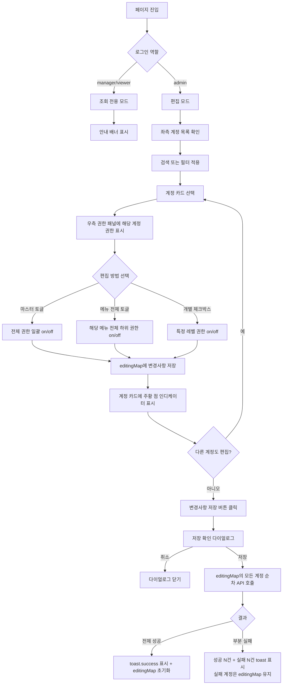
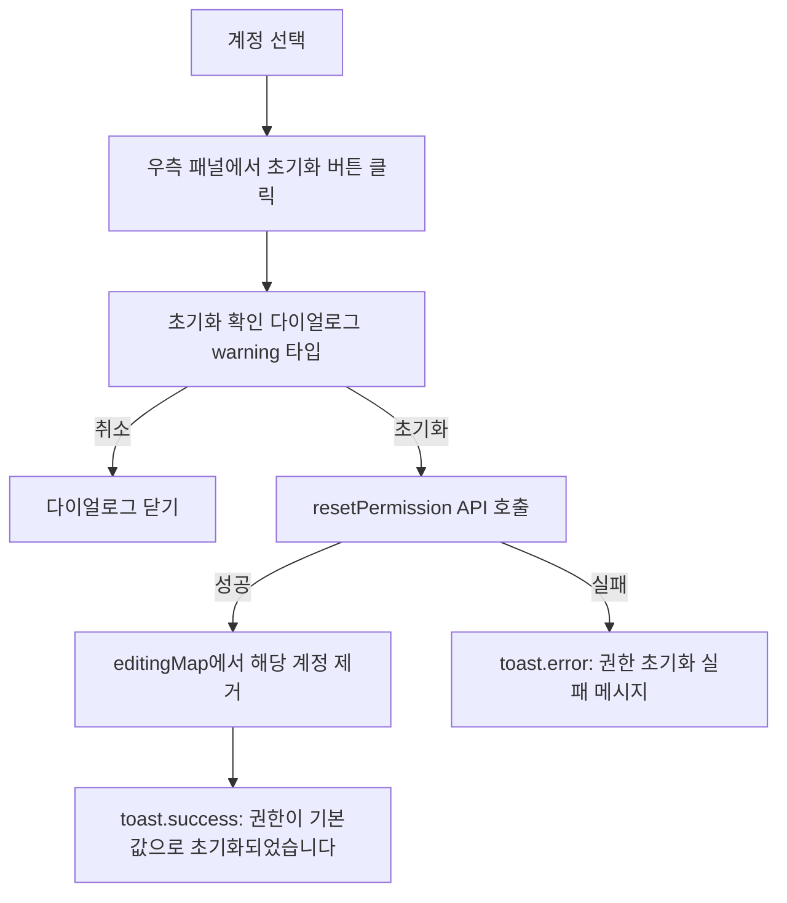
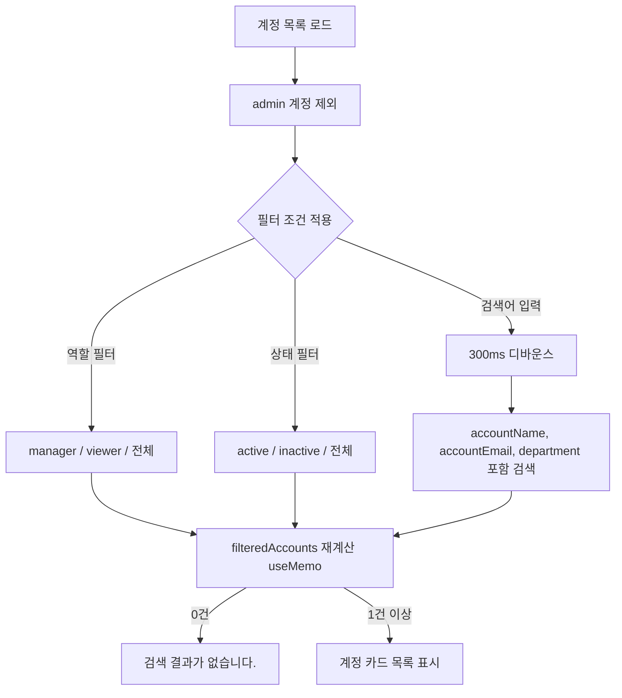

# 권한 관리 페이지 기획서

## 개요

**페이지 경로**: `/permissions`
**접근 권한**: 인증된 사용자 (수정은 admin 역할만 가능)
**주요 목적**: 계정별 메뉴 접근 권한을 설정하여 최소 권한 원칙(Principle of Least Privilege)을 구현

---

## 주요 기능

### 1. 관리 메뉴 (AdminMenu) - 10종

| 메뉴 키 | 라벨 | 아이콘 |
| --- | --- | --- |
| `dashboard` | 대시보드 | DashboardOutlined |
| `menu` | 메뉴관리 | AppstoreOutlined |
| `marketing` | 마케팅관리 | GiftOutlined |
| `events` | 이벤트관리 | CalendarOutlined |
| `orders` | 주문관리 | ShoppingCartOutlined |
| `app-members` | 앱회원관리 | TeamOutlined |
| `staff` | 본사/가맹계정 | BankOutlined |
| `audit-logs` | 감사 로그 | FileTextOutlined |
| `permissions` | 권한 관리 | SafetyOutlined |
| `settings` | 설정 | SettingOutlined |


### 2. 접근 레벨 (AccessLevel) - 3종

| 레벨 | 라벨 | 설명 |
| --- | --- | --- |
| `view` | 조회 | 해당 메뉴 읽기 전용 접근 |
| `write` | 편집 | 해당 메뉴 생성/수정/삭제 가능 |
| `masking` | 마스킹 해제 | 개인정보 마스킹 처리된 데이터 원문 열람 (주문관리, 앱회원관리에만 적용) |


### 3. 메뉴별 하위 권한 구성 (MENU_PERMISSION_CONFIG)

| 메뉴 | view | write | masking |
| --- | --- | --- | --- |
| 대시보드 | 대시보드 조회 | - | - |
| 메뉴관리 | 메뉴 관리 | 메뉴 등록 | - |
| 마케팅관리 | 마케팅 조회 | 마케팅 등록 | - |
| 이벤트관리 | 이벤트 조회 | 이벤트 관리 | - |
| 주문관리 | 주문 조회 | 주문 관리 | 마스킹 적용 |
| 앱회원관리 | 회원 조회 | 회원 관리 | 마스킹 적용 |
| 본사/가맹계정 | 계정 조회 | 계정 등록 | - |
| 감사 로그 | 로그 조회 | - | - |
| 권한 관리 | 권한 조회 | 권한 설정 | - |
| 설정 | 설정 조회 | 설정 변경 | - |


### 4. 목록 조회

- admin 계정은 관리 대상에서 제외 (admin은 항상 전체 권한 보유)
- 계정 카드 형태로 표시 (AccountCard)
- 검색: 이름, 이메일, 부서 (300ms 디바운스)
- 역할 필터: 전체 / 매니저 / 뷰어
- 상태 필터: 전체 / 활성 / 비활성

### 5. 권한 설정 (admin 전용)

- **마스터 토글**: 선택된 계정의 전체 메뉴 권한을 일괄 on/off
  - indeterminate 상태 지원 (일부만 체크된 경우)
- **메뉴별 전체 토글**: 해당 메뉴의 모든 하위 권한을 일괄 on/off
  - indeterminate 상태 지원
- **개별 하위 권한 토글**: view / write / masking 개별 체크박스
- **아코디언 확장**: 하위 권한이 2개 이상인 메뉴만 확장/축소 가능 (단일 하위 권한 메뉴는 아코디언 없음)

### 6. 다중 계정 동시 편집 (editingMap)

- 여러 계정을 순차 선택하며 권한을 변경해도 모든 변경사항이 `editingMap` 에 보존
- 미저장 계정 카드에 주황색 점 인디케이터 표시
- 저장 시 변경된 모든 계정을 일괄 처리

### 7. 저장 확인 다이얼로그

- 저장 버튼 클릭 시 ConfirmDialog로 2차 확인
- 변경 계정 수를 메시지에 포함: `N개 계정의 권한 변경사항을 저장하시겠습니까?`
- 부분 실패 대응: 일부 계정 저장 실패 시 성공한 계정만 editingMap에서 제거, 실패 계정은 재시도 가능

### 8. 권한 초기화

- 선택된 계정의 권한을 역할 기본값으로 복원
- ConfirmDialog로 2차 확인 (warning 타입)
- 초기화 시 해당 계정의 편집 중인 변경사항도 함께 취소
- 비활성 계정 및 admin 계정은 초기화 버튼 비표시

### 9. 미저장 경고 (beforeunload)

- editingMap에 변경사항이 있는 상태에서 페이지 이탈 시도 시 브라우저 기본 이탈 확인 다이얼로그 표시
- 변경사항이 없으면 이벤트 리스너 자동 해제

---

## 화면 구성

```
┌─────────────────────────────────────────────────────────────────────┐
│  권한 관리                              [취소] [변경사항 저장]          │
│  계정별 메뉴 접근 권한을 설정합니다.                                     │
├─────────────────────────────────────────────────────────────────────┤
│  ┌──────────────────────────────────────────────────────────────┐   │
│  │ ⚠ 권한 설정은 관리자만 수정할 수 있습니다. (비admin 로그인 시)  │   │
│  └──────────────────────────────────────────────────────────────┘   │
├──────────────────────────┬──────────────────────────────────────────┤
│  좌측 (380px 고정)        │  우측 (flex-1)                            │
│                          │                                           │
│  [🔍 이름, 이메일, 부서...] │  ┌────────────────────────────────────┐  │
│  [전체][매니저][뷰어] |    │  │  🔒 홍길동 (hong@example.com) 매니저 │  │
│  [전체][활성][비활성]      │  │                          [초기화]    │  │
│                          │  ├────────────────────────────────────┤  │
│  ┌──────────────────────┐ │  │  [■] 권한 설정 (마스터 토글)          │  │
│  │ NO.1 홍길동 개발팀 🟠  │ │  ├────────────────────────────────────┤  │
│  │ hong@example.com     │ │  │  [■] 🏠 대시보드                      │  │
│  │ [매니저][활성] 권한설정│ │  │  [■] ≡  메뉴관리             [>]    │  │
│  │ 최종수정: 2026-02-19  │ │  │  [■] 🎁 마케팅관리           [>]    │  │
│  └──────────────────────┘ │  │  [■] 📅 이벤트관리           [>]    │  │
│                          │  │  [■] 🛒 주문관리             [v]    │  │
│  ┌──────────────────────┐ │  │    ├ [■] 주문 조회                   │  │
│  │ NO.2 김철수 운영팀    │ │  │    ├ [■] 주문 관리                   │  │
│  │ kim@example.com      │ │  │    └ [□] 마스킹 적용                 │  │
│  │ [뷰어][활성] 권한설정  │ │  │  [■] 👥 앱회원관리          [>]    │  │
│  │ 최종수정: 2026-02-18  │ │  │  [■] 🏦 본사/가맹계정        [>]    │  │
│  └──────────────────────┘ │  │  [■] 📄 감사 로그                    │  │
│                          │  │  [■] 🔐 권한 관리           [>]    │  │
│   (계정 없음 시)           │  │  [■] ⚙  설정               [>]    │  │
│   검색 결과가 없습니다.     │  └────────────────────────────────────┘  │
│                          │                                           │
│                          │   (계정 미선택 시)                          │
│                          │   좌측에서 계정을 선택하여 권한을 설정하세요.  │
└──────────────────────────┴──────────────────────────────────────────┘
```

### 레이아웃 상세

- **전체 레이아웃**: `flex gap-6 items-start`
- **좌측 패널**: `w-[380px] shrink-0`, `max-h-[calc(100vh-320px)] overflow-y-auto`
- **우측 패널**: `flex-1 min-w-0`, Card 컴포넌트로 감쌈
- **헤더 영역**: 페이지 제목 + 저장/취소 버튼 (변경사항 있을 때만 표시)
- **마스터 토글 행**: `bg-bg-secondary/50 rounded-lg` 배경으로 시각적 구분
- **메뉴 아코디언**: 확장된 하위 항목은 `pl-9` 들여쓰기 적용

---

## 사용자 플로우

### 권한 편집 및 저장 플로우



### 권한 초기화 플로우



### 검색 및 필터 플로우



---

## 데이터 구조

### 계정 권한 타입

```typescript
// 계정별 권한 정보
interface AccountPermission {
  accountId: string;       // 계정 고유 ID
  accountNo: number;       // 표시용 계정 번호
  accountName: string;     // 계정 이름
  accountEmail: string;    // 계정 이메일
  department: string;      // 소속 부서
  role: UserRole;          // 'admin' | 'manager' | 'viewer'
  status: 'active' | 'inactive';  // 계정 활성 상태
  permissions: MenuPermission[];  // 메뉴별 권한 배열
  updatedAt: string;       // 최종 수정 일시
  updatedBy: string;       // 최종 수정자 이름
}

// 메뉴별 접근 권한
interface MenuPermission {
  menu: AdminMenu;         // 메뉴 키
  view: boolean;           // 조회 권한
  write: boolean;          // 편집 권한
  masking: boolean;        // 마스킹 해제 권한
}

// 권한 수정 요청
interface UpdatePermissionRequest {
  accountId: string;
  permissions: MenuPermission[];
}
```

### 메뉴 권한 설정 구조

```typescript
// 하위 권한 설정 항목
interface SubPermissionConfig {
  level: AccessLevel;      // 'view' | 'write' | 'masking'
  label: string;           // 표시 이름
}

// 메뉴별 권한 설정 구조
interface MenuPermissionConfig {
  menu: AdminMenu;
  label: string;
  subPermissions: SubPermissionConfig[];
}
```

### admin 기본 권한

```typescript
// admin 계정은 전체 메뉴의 모든 하위 권한이 true로 고정
const ADMIN_DEFAULT_PERMISSIONS: MenuPermission[] = ADMIN_MENU_ORDER.map((menu) => ({
  menu,
  view: true,
  write: true,
  masking: true,
}));
```

### 프론트엔드 상태

```typescript
// 다중 계정 편집 맵 (accountId -> 편집 중인 권한 배열)
const [editingMap, setEditingMap] = useState<Record<string, MenuPermission[]>>({});

// 마스터 체크 상태 계산 로직
const masterCheckedCount: number;    // 현재 체크된 하위 권한 총 개수
const totalSubPermissions: number;   // 전체 하위 권한 총 개수 (18개)
const masterAllChecked: boolean;     // checkedCount === totalSubPermissions
const masterSomeChecked: boolean;    // 0 < checkedCount < totalSubPermissions
```

---

## API 엔드포인트

### 1. 계정 권한 목록 조회

```
GET /api/permissions/accounts
Authorization: Bearer {token}

Response:
{
  "data": [
    {
      "accountId": "acc-2",
      "accountNo": 2,
      "accountName": "홍길동",
      "accountEmail": "hong@example.com",
      "department": "개발팀",
      "role": "manager",
      "status": "active",
      "permissions": [
        { "menu": "dashboard", "view": true, "write": false, "masking": false },
        { "menu": "menu", "view": true, "write": true, "masking": false },
        { "menu": "orders", "view": true, "write": false, "masking": false },
        ...
      ],
      "updatedAt": "2026-02-19T10:30:00Z",
      "updatedBy": "admin"
    }
  ]
}
```

> 참고: admin 역할의 계정은 서버에서 응답에 포함되지 않거나, 클라이언트에서 필터링합니다.

### 2. 권한 수정

```
PATCH /api/permissions/accounts/:accountId
Content-Type: application/json
Authorization: Bearer {token}

Request:
{
  "permissions": [
    { "menu": "dashboard", "view": true, "write": false, "masking": false },
    { "menu": "orders", "view": true, "write": true, "masking": true },
    ...
  ],
  "updatedBy": "admin"
}

Response (성공):
{
  "data": {
    "accountId": "acc-2",
    "permissions": [...],
    "updatedAt": "2026-02-20T09:00:00Z",
    "updatedBy": "admin"
  }
}

Response (실패 - 403):
{
  "error": {
    "code": "FORBIDDEN",
    "message": "권한 설정은 관리자만 변경할 수 있습니다."
  }
}

Response (실패 - 400):
{
  "error": {
    "code": "VALIDATION_ERROR",
    "message": "비활성 계정의 권한은 변경할 수 없습니다."
  }
}
```

### 3. 권한 초기화 (역할 기본값으로)

```
POST /api/permissions/accounts/:accountId/reset
Content-Type: application/json
Authorization: Bearer {token}

Request:
{
  "updatedBy": "admin"
}

Response (성공):
{
  "data": {
    "accountId": "acc-2",
    "permissions": [
      // 역할(manager/viewer) 기본값으로 초기화된 권한 배열
    ],
    "updatedAt": "2026-02-20T09:05:00Z",
    "updatedBy": "admin"
  }
}
```

### React Query 훅

```typescript
// useAccountPermissions: 계정 권한 목록 조회
const { data: accounts, isLoading } = useAccountPermissions();

// usePermissionMutations: 권한 수정 및 초기화
const { updatePermission, resetPermission } = usePermissionMutations();

// 권한 수정 호출 예시
await updatePermission.mutateAsync({
  request: { accountId, permissions },
  updatedBy: user.name,
});

// 권한 초기화 호출 예시
await resetPermission.mutateAsync({
  accountId: selectedAccountId,
  updatedBy: user.name,
});
```

---

## 보안 고려사항

### 역할별 접근 제어

| 역할 | 목록 조회 | 권한 설정 변경 | 권한 초기화 |
| --- | --- | --- | --- |
| Admin | 가능 (admin 제외) | 가능 | 가능 |
| Manager | 가능 (admin 제외) | 불가 (조회 전용) | 불가 |
| Viewer | 가능 (admin 제외) | 불가 (조회 전용) | 불가 |


### 서버 사이드 검증 필수 항목

```
1. 요청자가 admin 역할인지 확인 (JWT 기반)
2. 대상 계정이 admin이 아닌지 확인
3. 대상 계정이 active 상태인지 확인
4. 요청 권한 배열에 ADMIN_MENU_ORDER의 모든 10개 메뉴가 포함되는지 확인
5. 각 AccessLevel 값이 boolean 타입인지 확인
```

### 클라이언트 사이드 보호

```typescript
// admin 계정 편집 불가 (UI 레벨 비활성화)
const isSelectedAdmin = selectedAccount?.role === 'admin';

// 비활성 계정 편집 불가
const isSelectedInactive = selectedAccount?.status === 'inactive';

// 현재 로그인 유저가 admin인 경우에만 편집 활성화
const canEdit = isCurrentUserAdmin && !isSelectedAdmin && !isSelectedInactive;
```

### 미저장 경고

```typescript
// 브라우저 이탈 시 미저장 데이터 소실 방지
useEffect(() => {
  if (!hasChanges) return;
  const handleBeforeUnload = (e: BeforeUnloadEvent) => {
    e.preventDefault();  // 브라우저 기본 이탈 확인 다이얼로그 트리거
  };
  window.addEventListener('beforeunload', handleBeforeUnload);
  return () => window.removeEventListener('beforeunload', handleBeforeUnload);
}, [hasChanges]);
```

### 부분 실패 대응

저장 요청 시 계정별로 개별 API를 순차 호출합니다. 일부 계정 저장이 실패하더라도 나머지 계정의 저장 결과는 유지됩니다.

```
저장 성공 계정 → editingMap에서 제거 (변경사항 확정)
저장 실패 계정 → editingMap에 유지 (재시도 가능)
```

---

## UI 컴포넌트

### 커스텀 컴포넌트

#### PermCheckbox

```typescript
interface PermCheckboxProps {
  checked: boolean;
  indeterminate?: boolean;  // 일부만 체크된 상태 (네이티브 input.indeterminate 속성 사용)
  disabled?: boolean;
  onChange: (checked: boolean) => void;
  label?: string;           // aria-label 접근성 지원
}
```

- `useRef<HTMLInputElement>`로 DOM에 직접 `indeterminate` 속성 설정 (`useEffect` 사용)
- 비활성 상태에서 `cursor-not-allowed opacity-50` 스타일 적용
- 마스터 토글, 메뉴 전체 토글에서 indeterminate 상태 활용

#### AccountCard

```typescript
interface AccountCardProps {
  account: AccountPermission;
  isSelected: boolean;     // 선택 시 primary 테두리 + 배경 강조
  hasEdits: boolean;       // true이면 주황 점 인디케이터 표시
  onSelect: () => void;
}
```

- 1행: 계정 번호 + 이름 + 부서 태그 + 미저장 인디케이터 (주황 점)
- 2행: 이메일
- 3행: 역할 Badge + 상태 Badge + '권한설정' 텍스트
- 4행: 최종 수정 일시 (toLocaleDateString('ko-KR')) + 수정자

#### MenuPermissionItem

```typescript
interface MenuPermissionItemProps {
  config: MenuPermissionConfig;    // 메뉴 라벨, 하위 권한 목록
  permission: MenuPermission | undefined;
  disabled: boolean;               // canEdit이 false이면 true
  expanded: boolean;               // 아코디언 펼침 상태
  onToggleExpand: () => void;
  onPermissionChange: (level: AccessLevel, value: boolean) => void;
  onToggleAll: (checked: boolean) => void;  // 해당 메뉴 전체 토글
}
```

- `hasSubItems`: `config.subPermissions.length > 1`인 경우에만 아코디언 토글 버튼 표시
- 헤더 체크박스는 메뉴 전체 토글 역할 (indeterminate 지원)
- 확장 시 하위 권한 항목들이 `pl-9` 들여쓰기로 표시

### 공통 컴포넌트

| 컴포넌트 | 역할 |
| --- | --- |
| `Card`, `CardContent` | 우측 권한 패널 카드 레이아웃 |
| `Badge` | 역할 표시 (critical/info/default), 상태 표시 (success/default) |
| `Button` | 저장, 취소, 초기화 액션 버튼 |
| `ConfirmDialog` | 저장 확인 (confirm 타입), 초기화 확인 (warning 타입) |
| `SearchInput` | 이름/이메일/부서 검색 입력 |
| `Spinner` | 데이터 로딩 중 전체 높이 스피너 |


### Ant Design Icons

| 아이콘 | 사용 위치 |
| --- | --- |
| `SafetyOutlined` | 페이지 헤더, permissions 메뉴 아이콘, 빈 상태 아이콘 |
| `SaveOutlined` | 저장 버튼 |
| `LockOutlined` | admin/비활성 계정 선택 시 잠금 표시 |
| `UndoOutlined` | 초기화 버튼 |
| `FilterOutlined` | 필터 영역 아이콘 |
| `DownOutlined` / `RightOutlined` | 아코디언 확장/축소 |
| `DashboardOutlined` | dashboard 메뉴 아이콘 |
| `AppstoreOutlined` | menu 메뉴 아이콘 |
| `GiftOutlined` | marketing 메뉴 아이콘 |
| `CalendarOutlined` | events 메뉴 아이콘 |
| `ShoppingCartOutlined` | orders 메뉴 아이콘 |
| `TeamOutlined` | app-members 메뉴 아이콘 |
| `BankOutlined` | staff 메뉴 아이콘 |
| `FileTextOutlined` | audit-logs 메뉴 아이콘 |
| `SettingOutlined` | settings 메뉴 아이콘 |


### 역할별 Badge 색상

| 역할 | Badge Variant |
| --- | --- |
| `admin` | critical (빨강) |
| `manager` | info (파랑) |
| `viewer` | default (회색) |


---

## 테스트 시나리오

### 기능 테스트

- [ ] 계정 목록 조회 (admin 계정이 목록에 미포함 확인)
- [ ] 검색: 이름으로 검색
- [ ] 검색: 이메일로 검색
- [ ] 검색: 부서명으로 검색
- [ ] 검색어 입력 후 300ms 디바운스 동작 확인
- [ ] 역할 필터: 매니저만 표시
- [ ] 역할 필터: 뷰어만 표시
- [ ] 상태 필터: 활성만 표시
- [ ] 상태 필터: 비활성만 표시
- [ ] 필터 조합: 역할 + 상태 동시 적용
- [ ] 계정 카드 선택 시 우측 패널 권한 표시
- [ ] 마스터 토글: 전체 체크 on
- [ ] 마스터 토글: 전체 체크 off
- [ ] 마스터 토글: indeterminate 상태 표시 (일부만 체크)
- [ ] 메뉴별 전체 토글: 해당 메뉴 하위 권한 일괄 on/off
- [ ] 메뉴별 indeterminate 상태 표시
- [ ] 개별 하위 권한 체크박스 on/off
- [ ] 아코디언 확장/축소 (하위 권한 2개 이상 메뉴)
- [ ] 단일 하위 권한 메뉴는 아코디언 버튼 미표시 (대시보드, 감사 로그)
- [ ] 다중 계정 편집: 계정 A 수정 후 계정 B 수정, 계정 A 카드에 인디케이터 유지
- [ ] 저장 확인 다이얼로그 표시 (변경 계정 수 포함)
- [ ] 저장 성공 후 editingMap 초기화 및 인디케이터 제거
- [ ] 권한 초기화 확인 다이얼로그 (warning 타입)
- [ ] 초기화 성공 후 역할 기본값 반영
- [ ] 취소 버튼: 모든 editingMap 초기화

### 보안 테스트

- [ ] admin이 아닌 계정 로그인 시 저장/취소 버튼 미표시
- [ ] admin이 아닌 계정 로그인 시 조회 전용 안내 배너 표시
- [ ] admin이 아닌 계정 로그인 시 체크박스 비활성화 (disabled)
- [ ] admin 계정을 계정 목록에서 선택 불가
- [ ] 비활성 계정 선택 시 편집 불가 및 안내 문구 표시
- [ ] 비활성 계정 선택 시 초기화 버튼 미표시
- [ ] 미저장 상태에서 페이지 이탈 시 브라우저 경고 표시
- [ ] 저장 완료 후 페이지 이탈 시 경고 미표시

### 부분 실패 대응 테스트

- [ ] 2개 계정 동시 편집 후 저장 시 1개 실패: 실패 계정 toast 에러 표시
- [ ] 부분 실패 시 성공 계정 editingMap 제거, 실패 계정 유지
- [ ] 부분 실패 후 재시도 저장 성공

### UI/UX 테스트

- [ ] 검색 결과 0건 시 '검색 결과가 없습니다.' 빈 상태 표시
- [ ] 계정 미선택 시 우측 패널 빈 상태 안내 표시
- [ ] 데이터 로딩 중 Spinner 표시
- [ ] 계정 카드 미저장 인디케이터 (주황 점) 정상 표시
- [ ] 역할별 Badge 색상 (admin: 빨강, manager: 파랑, viewer: 회색)
- [ ] 선택된 계정 카드 테두리 강조 (primary 색상)
- [ ] 저장 중 저장 버튼 비활성화 및 '저장 중...' 텍스트 표시

---

## TODO

### 단기 (1-2주)

- [ ] Mock 데이터를 실제 API로 교체 (`useAccountPermissions`, `usePermissionMutations`)
- [ ] 역할별 기본 권한 서버 정의 및 초기화 API 구현
- [ ] 권한 변경 감사 로그 연동 (audit-logs 페이지에서 조회 가능하도록)

### 중기 (1-2개월)

- [ ] 권한 변경 이력 조회 기능 (선택된 계정의 권한 변경 히스토리)
- [ ] 권한 템플릿 기능 (역할별 커스텀 템플릿 저장 및 일괄 적용)
- [ ] 다중 계정 일괄 권한 적용 (체크박스로 여러 계정 선택 후 동일 권한 설정)
- [ ] 권한 비교 뷰 (두 계정의 권한 차이 시각화)

### 장기 (3개월+)

- [ ] 권한 그룹(팀/부서 단위) 관리 기능
- [ ] 시간 기반 권한 (특정 기간에만 유효한 임시 권한)
- [ ] 권한 승인 워크플로우 (상위 관리자 승인 후 권한 적용)
- [ ] 권한 변경 알림 (이메일/슬랙 연동)

---

**작성일**: 2026-02-20
**최종 수정일**: 2026-02-20
**작성자**: Claude Code
