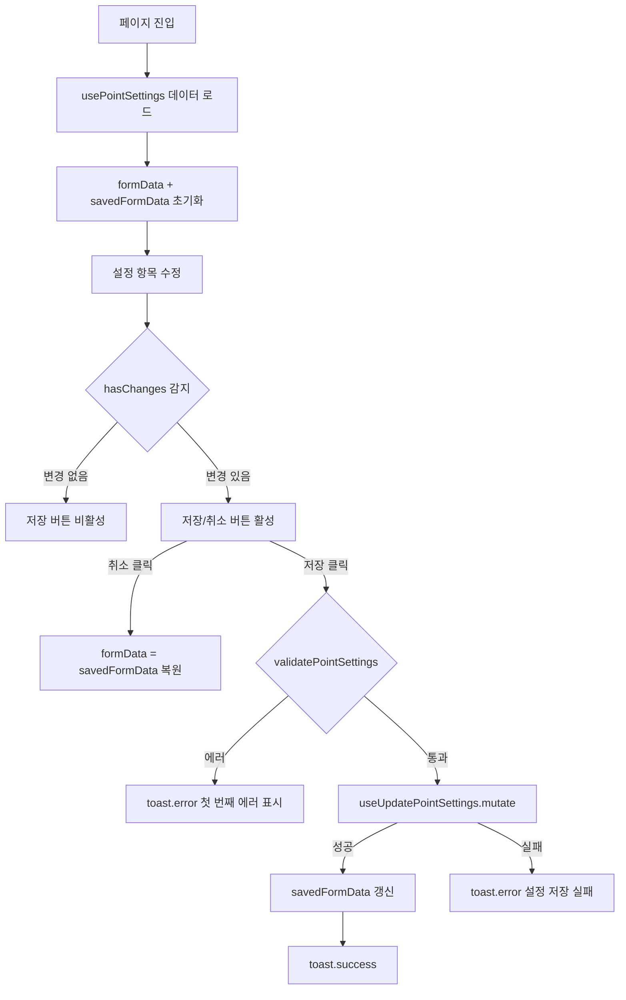
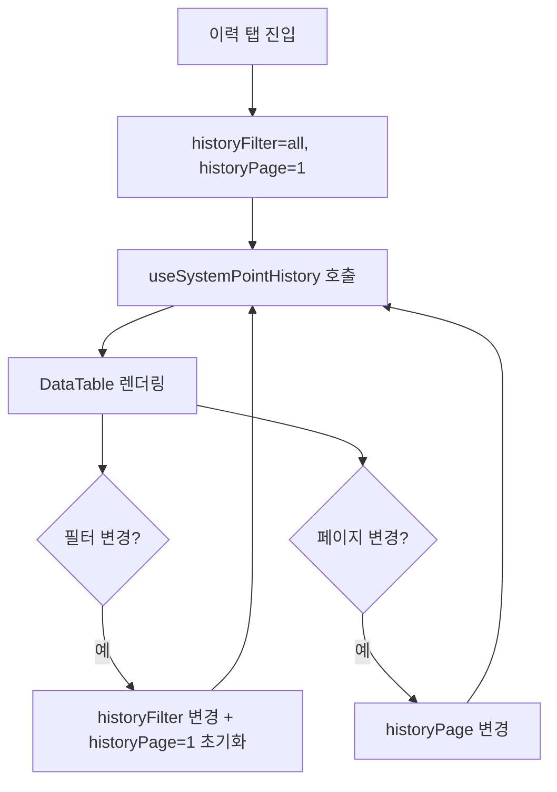
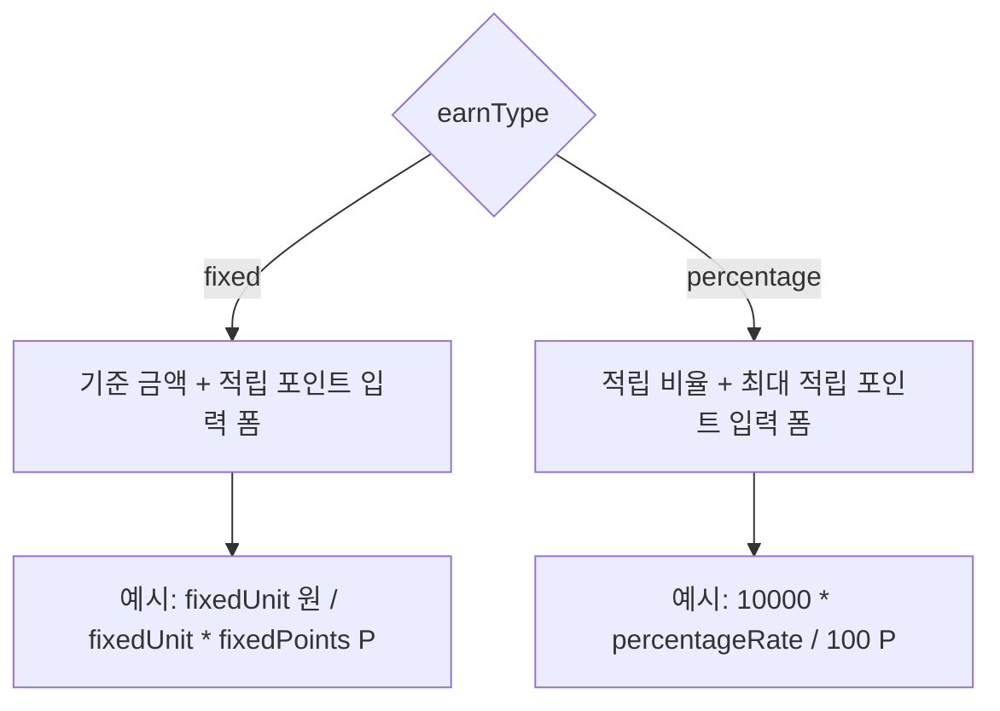

# 포인트 설정 페이지 기획서

## 개요

**페이지 경로**: `/marketing/point-settings`
**접근 권한**: 인증된 사용자
**주요 목적**: 주문 시 포인트 적립/사용/소멸 정책 글로벌 설정 및 시스템 전체 포인트 이력 조회

---

## 주요 기능

### 1. 적립 정책 설정

| 적립 방식 | 설명 |
| --- | --- |
| `fixed` (정액) | N원 주문 시 N포인트 적립 |
| `percentage` (정률) | 주문금액의 N% 적립 |


- **정액 방식**: 기준 금액(원당), 적립 포인트(P) 입력
  - 기준 금액 최소 100원, 적립 포인트 최소 1P
  - 적립 포인트는 기준 금액을 초과 불가
- **정률 방식**: 적립 비율(%), 최대 적립 포인트 설정
  - 적립 비율: 0% 초과 100% 이하
  - 최대 적립 포인트: 미입력 시 무제한
- **최소 주문금액**: 0원 설정 시 모든 주문에 적립
- **실시간 계산 예시**: 10,000원 주문 시 적립 포인트 즉시 계산 표시

### 2. 사용 정책 설정

- **최소 사용 포인트**: 해당 포인트 이상부터 사용 가능 (최소 1P)
- **최대 사용 비율**: 결제금액의 N%까지 포인트 결제 허용 (1~100%)
- **사용 단위**: 1 / 10 / 100 / 500 / 1,000P 중 선택
- **실시간 계산 예시**: 20,000원 주문 시 최대 사용 가능 포인트 즉시 계산 표시

### 3. 유효기간 정책 설정

- **기본 유효기간**: 적립일로부터 소멸까지 일수 (최소 1일, 최대 3,650일)
  - 365일 이상 시 "약 N년" 환산 표시
- **만료 알림**: 만료 N일 전 자동 알림 발송 (최소 1일)
  - 알림 일수는 반드시 유효기간보다 작아야 함
- **유효기간 변경 안내 배너**: 변경 이후 적립 포인트부터 적용됨을 경고

### 4. 통계 카드 (읽기 전용)

| 항목 | 색상 | 설명 |
| --- | --- | --- |
| 전체 적립 | success (초록) | 시스템 누적 적립 포인트 합계 |
| 전체 사용 | primary (파랑) | 시스템 누적 사용 포인트 합계 |
| 전체 소멸 | warning (주황) | 시스템 누적 소멸 포인트 합계 |
| 시스템 총 잔액 | txt-main (기본) | 현재 시스템 전체 잔여 포인트 |


### 5. 포인트 이력 테이블

- **DataTable** 컴포넌트 사용, 페이지당 10건
- **필터 탭** (pill 버튼): 전체 / 적립 / 사용·회수 / 소멸
- **컬럼 구성**: 일시, 회원, 유형(Badge), 금액, 잔액, 사유, 만료일
- **금액 색상**: 양수(success), 음수(critical), 0(txt-muted)
- **페이지네이션**: 이전/현재페이지/다음 버튼, 1페이지일 경우 숨김

### 6. 변경 감지 및 저장

- JSON 직렬화 비교(`JSON.stringify`)로 저장된 값 대비 변경사항 실시간 감지
- **변경 발생 시**: "변경 취소" + "설정 저장" 버튼 모두 활성화
- **변경 없을 때**: "설정 저장" 버튼 비활성화(disabled), "변경 취소" 버튼 숨김
- 저장 성공 시 현재 폼 상태를 savedFormData로 갱신

---

## 화면 구성

```
┌──────────────────────────────────────────────────────────────┐
│  포인트 설정                                                    │
│  주문 시 포인트 적립/사용 정책과 유효기간을 설정합니다.               │
├──────────────────────────────────────────────────────────────┤
│  ┌──────────┐ ┌──────────┐ ┌──────────┐ ┌──────────┐         │
│  │ 전체 적립 │ │ 전체 사용 │ │ 전체 소멸 │ │ 총 잔액  │         │
│  │ 1,234,000P│ │ 890,000P │ │ 45,000P  │ │ 299,000P │         │
│  └──────────┘ └──────────┘ └──────────┘ └──────────┘         │
├──────────────────────────────────────────────────────────────┤
│  ┌──────────────────┐ ┌─────────────────┐ ┌───────────────┐  │
│  │ 적립 정책         │ │ 사용 정책        │ │ 유효기간       │  │
│  │ (ShoppingCart)   │ │ (Wallet)        │ │ (Clock)       │  │
│  │ 적립 방식         │ │ 최소 사용 포인트  │ │ 기본 유효기간  │  │
│  │  [정액] [정률]    │ │  [100] P        │ │  [365] 일     │  │
│  │ 기준 금액         │ │ 최소 100P 이상   │ │ 365일 후 소멸  │  │
│  │  [1,000] 원당    │ │ 최대 사용 비율   │ │               │  │
│  │ 적립 포인트       │ │  [50] %         │ │ 만료 알림      │  │
│  │  [10] P          │ │ 최대 50%까지     │ │  [30] 일 전   │  │
│  │ 예시: 10,000원   │ │ 사용 단위        │ │ 만료 30일 전   │  │
│  │ → 100P 적립      │ │  [100P 단위 ▼]  │ │ 알림 발송      │  │
│  │ 최소 주문금액     │ │ 예시: 20,000원   │ │               │  │
│  │  [0] 원          │ │ 최대 10,000P     │ │ ⚠️ 변경 안내  │  │
│  └──────────────────┘ └─────────────────┘ └───────────────┘  │
├──────────────────────────────────────────────────────────────┤
│                               [변경 취소]  [💾 설정 저장]       │
├──────────────────────────────────────────────────────────────┤
│  포인트 이력 (1,234건)       [전체] [적립] [사용·회수] [소멸]    │
│  ┌───────────────────────────────────────────────────────┐   │
│  │ 일시       │ 회원  │ 유형  │ 금액    │ 잔액  │ 사유 │ 만료일│  │
│  ├──────────────────────────────────────────────────────┤   │
│  │ 2026-02-20 │ 홍길동│ 적립  │ +100P   │ 500P  │ 주문 │ 2027 │  │
│  │ 2026-02-19 │ 김철수│ 사용  │ -200P   │ 300P  │ 결제 │ -    │  │
│  │ 2026-02-18 │ 이영희│ 소멸  │ -50P    │ 0P    │ 만료 │ -    │  │
│  └──────────────────────────────────────────────────────┘   │
│                            [이전]  1 / 10  [다음]              │
└──────────────────────────────────────────────────────────────┘
```

---

## 사용자 플로우

### 설정 저장 플로우



### 포인트 이력 조회 플로우



### 적립 방식 전환 플로우



---

## 데이터 구조

### PointSettingsData (서버 응답 구조)

```typescript
interface PointSettingsData {
  id: string;
  earnPolicy: EarnPolicy;
  usePolicy: UsePolicy;
  expiryPolicy: ExpiryPolicy;
  isActive: boolean;
  updatedAt: Date;
  updatedBy: string;
}
```

### EarnPolicy (적립 정책)

```typescript
interface EarnPolicy {
  type: EarnType;              // 'fixed' | 'percentage'
  fixedUnit: number;           // 정액: 기준 금액 (예: 1,000원)
  fixedPoints: number;         // 정액: 적립 포인트 (예: 10P)
  percentageRate: number;      // 정률: 적립 비율 (예: 1%)
  maxEarnPoints: number | null; // 정률: 최대 적립 한도 (null = 무제한)
  minOrderAmount: number;      // 최소 주문금액
}
```

### UsePolicy (사용 정책)

```typescript
interface UsePolicy {
  minUsePoints: number;  // 최소 사용 포인트
  maxUseRate: number;    // 최대 사용 비율 (결제금액의 N%)
  useUnit: UseUnit;      // 사용 단위: 1 | 10 | 100 | 500 | 1000
}
```

### ExpiryPolicy (유효기간 정책)

```typescript
interface ExpiryPolicy {
  defaultValidityDays: number;    // 기본 유효기간 (일)
  expiryNotificationDays: number; // 만료 알림 (N일 전)
}
```

### PointSettingsFormData (폼 평면화 구조)

```typescript
interface PointSettingsFormData {
  // 적립 정책
  earnType: EarnType;           // 'fixed' | 'percentage'
  fixedUnit: number;            // 기준 금액
  fixedPoints: number;          // 적립 포인트
  percentageRate: number;       // 적립 비율
  maxEarnPoints: number | null; // 최대 적립 한도 (null = 무제한)
  minOrderAmount: number;       // 최소 주문금액

  // 사용 정책
  minUsePoints: number;         // 최소 사용 포인트
  maxUseRate: number;           // 최대 사용 비율 (%)
  useUnit: UseUnit;             // 사용 단위

  // 유효기간
  defaultValidityDays: number;    // 기본 유효기간 (일)
  expiryNotificationDays: number; // 만료 알림 (일 전)
}
```

### 기본값 (DEFAULT_POINT_SETTINGS_FORM)

| 필드 | 기본값 | 설명 |
| --- | --- | --- |
| earnType | `'fixed'` | 정액 방식 |
| fixedUnit | `1000` | 1,000원당 |
| fixedPoints | `10` | 10P 적립 |
| percentageRate | `1` | 1% 적립 |
| maxEarnPoints | `null` | 무제한 |
| minOrderAmount | `0` | 제한 없음 |
| minUsePoints | `100` | 최소 100P |
| maxUseRate | `50` | 최대 50% |
| useUnit | `100` | 100P 단위 |
| defaultValidityDays | `365` | 1년 |
| expiryNotificationDays | `30` | 30일 전 알림 |


### PointSystemStats (시스템 통계)

```typescript
interface PointSystemStats {
  totalEarned: number;    // 전체 적립 합계
  totalUsed: number;      // 전체 사용 합계
  totalExpired: number;   // 전체 소멸 합계
  currentBalance: number; // 시스템 총 잔액
}
```

### SystemPointHistory (포인트 이력)

```typescript
// app-member.ts의 PointHistory 인터페이스 확장
interface SystemPointHistory extends PointHistory {
  memberName: string; // 회원명 (시스템 이력용 추가 필드)
}

// 기반 인터페이스 (PointHistory)
interface PointHistory {
  id: string;
  type: PointType;       // 'earn_order' | 'earn_event' | 'earn_manual' | 'use_order' | 'withdraw_manual' | 'expired'
  amount: number;        // 양수: 적립, 음수: 사용/소멸
  balance: number;       // 변경 후 잔액
  description: string;   // 사유
  expiresAt: Date | null; // 만료일 (null = 해당 없음)
  createdAt: Date;
}
```

### PointType Badge 매핑

| PointType | Badge Variant | 표시 라벨 |
| --- | --- | --- |
| `earn_order` | success | 주문 적립 |
| `earn_event` | success | 이벤트 적립 |
| `earn_manual` | info | 수동 적립 |
| `use_order` | critical | 주문 사용 |
| `withdraw_manual` | warning | 수동 회수 |
| `expired` | secondary | 소멸 |


### 이력 필터 옵션

| 값 | 라벨 | 포함 PointType |
| --- | --- | --- |
| `all` | 전체 | 전체 |
| `earn` | 적립 | earn_order, earn_event, earn_manual |
| `use` | 사용/회수 | use_order, withdraw_manual |
| `expired` | 소멸 | expired |


---

## API 엔드포인트

### 1. 포인트 설정 조회

```
GET /api/marketing/point-settings
Authorization: Bearer {token}

Response:
{
  "data": {
    "id": "ps-1",
    "earnPolicy": {
      "type": "fixed",
      "fixedUnit": 1000,
      "fixedPoints": 10,
      "percentageRate": 1,
      "maxEarnPoints": null,
      "minOrderAmount": 0
    },
    "usePolicy": {
      "minUsePoints": 100,
      "maxUseRate": 50,
      "useUnit": 100
    },
    "expiryPolicy": {
      "defaultValidityDays": 365,
      "expiryNotificationDays": 30
    },
    "isActive": true,
    "updatedAt": "2026-02-20T00:00:00.000Z",
    "updatedBy": "admin"
  },
  "meta": { "timestamp": "2026-02-20T00:00:00.000Z" }
}
```

### 2. 포인트 설정 수정

```
PATCH /api/marketing/point-settings
Content-Type: application/json
Authorization: Bearer {token}

{
  "earnType": "percentage",
  "fixedUnit": 1000,
  "fixedPoints": 10,
  "percentageRate": 2,
  "maxEarnPoints": 5000,
  "minOrderAmount": 10000,
  "minUsePoints": 100,
  "maxUseRate": 50,
  "useUnit": 100,
  "defaultValidityDays": 365,
  "expiryNotificationDays": 30
}

Response:
{
  "data": {
    "id": "ps-1",
    "earnPolicy": {
      "type": "percentage",
      "fixedUnit": 1000,
      "fixedPoints": 10,
      "percentageRate": 2,
      "maxEarnPoints": 5000,
      "minOrderAmount": 10000
    },
    "usePolicy": {
      "minUsePoints": 100,
      "maxUseRate": 50,
      "useUnit": 100
    },
    "expiryPolicy": {
      "defaultValidityDays": 365,
      "expiryNotificationDays": 30
    },
    "isActive": true,
    "updatedAt": "2026-02-20T01:00:00.000Z",
    "updatedBy": "admin"
  },
  "meta": { "timestamp": "2026-02-20T01:00:00.000Z" }
}
```

### 3. 시스템 통계 조회

```
GET /api/marketing/point-settings/stats
Authorization: Bearer {token}

Response:
{
  "data": {
    "totalEarned": 1234000,
    "totalUsed": 890000,
    "totalExpired": 45000,
    "currentBalance": 299000
  },
  "meta": { "timestamp": "2026-02-20T00:00:00.000Z" }
}
```

### 4. 시스템 포인트 이력 조회

```
GET /api/marketing/point-settings/history
Authorization: Bearer {token}
Query: ?filter=all&page=1&limit=10

Response:
{
  "data": [
    {
      "id": "ph-1",
      "memberName": "홍길동",
      "type": "earn_order",
      "amount": 100,
      "balance": 500,
      "description": "주문 포인트 적립",
      "expiresAt": "2027-02-20T00:00:00.000Z",
      "createdAt": "2026-02-20T10:30:00.000Z"
    }
  ],
  "pagination": {
    "page": 1,
    "limit": 10,
    "total": 1234
  }
}
```

---

## 보안 고려사항

### 권한 관리

| 역할 | 설정 조회 | 설정 수정 | 이력 조회 |
| --- | --- | --- | --- |
| Admin | O | O | O |
| Manager | O | O | O |
| Viewer | O | X | O |


### 입력값 검증 (validatePointSettings)

```typescript
// 적립 정책 - 정액 방식
if (data.fixedUnit < 100)
  → '기준 금액은 100원 이상이어야 합니다.'

if (data.fixedPoints < 1)
  → '적립 포인트는 1P 이상이어야 합니다.'

if (data.fixedPoints > data.fixedUnit)
  → '적립 포인트가 기준 금액을 초과할 수 없습니다.'

// 적립 정책 - 정률 방식
if (data.percentageRate <= 0 || data.percentageRate > 100)
  → '적립 비율은 0% 초과 100% 이하여야 합니다.'

if (data.maxEarnPoints !== null && data.maxEarnPoints < 1)
  → '최대 적립 포인트는 1P 이상이어야 합니다.'

// 공통 적립
if (data.minOrderAmount < 0)
  → '최소 주문금액은 0 이상이어야 합니다.'

// 사용 정책
if (data.minUsePoints < 1)
  → '최소 사용 포인트는 1P 이상이어야 합니다.'

if (data.maxUseRate <= 0 || data.maxUseRate > 100)
  → '최대 사용 비율은 0% 초과 100% 이하여야 합니다.'

// 유효기간
if (data.defaultValidityDays < 1)
  → '기본 유효기간은 1일 이상이어야 합니다.'

if (data.expiryNotificationDays < 1)
  → '만료 알림은 1일 전 이상이어야 합니다.'

if (data.expiryNotificationDays >= data.defaultValidityDays)
  → '만료 알림 일수는 유효기간보다 작아야 합니다.'
```

### 중요 정책 변경 보호

- **유효기간 변경**: 기존 적립 포인트 소급 적용 불가. 변경 후 적립분부터 적용
- **정책 변경 이력**: `updatedAt`, `updatedBy` 필드로 최종 변경자 추적
- **HTTPS**: 모든 API 통신은 HTTPS 필수
- **인증 토큰**: Authorization 헤더 Bearer 토큰 방식

---

## UI 컴포넌트

### 사용된 컴포넌트 목록

| 컴포넌트 | 용도 |
| --- | --- |
| `Card`, `CardHeader`, `CardContent` | 정책 설정 카드 레이아웃 |
| `Button` | 설정 저장, 변경 취소, 페이지네이션 이전/다음 |
| `Input` | 숫자 입력 (기준 금액, 포인트, 비율, 일수 등) |
| `Label` | 필드 라벨 (required 속성 지원) |
| `Badge` | 포인트 이력 유형 표시 (earn, use, expired 구분) |
| `DataTable` | 포인트 이력 테이블 |
| `ToggleButtonGroup` | 적립 방식 선택 (정액/정률) |
| `select` (네이티브) | 사용 단위 선택 (1/10/100/500/1,000P) |


### Ant Design Icons

| 아이콘 | 사용 위치 |
| --- | --- |
| `ShoppingCartOutlined` | 적립 정책 카드 헤더 (success 색상) |
| `WalletOutlined` | 사용 정책 카드 헤더 (primary 색상) |
| `ClockCircleOutlined` | 유효기간 카드 헤더 (warning 색상) |
| `DollarOutlined` | 포인트 이력 카드 헤더 |
| `SaveOutlined` | 설정 저장 버튼 내 아이콘 |
| `InfoCircleOutlined` | 적립 방식 설명 텍스트, 유효기간 변경 안내 |


### 레이아웃 구조

- **통계 카드**: `grid-cols-2 md:grid-cols-4 gap-4`
- **설정 카드**: `grid-cols-1 lg:grid-cols-3 gap-6`
- **입력 필드**: 우측 단위 텍스트 절대 위치 (`absolute right-4 top-1/2 -translate-y-1/2`)
- **실시간 예시 박스**: `bg-bg-hover rounded-lg` 패딩 박스
- **유효기간 경고 배너**: `bg-warning/10 rounded-lg` + `InfoCircleOutlined`
- **저장 버튼 영역**: `flex justify-end gap-3`
- **이력 필터**: pill 버튼 (`rounded-full`), 활성 시 `bg-primary text-white`

---

## 테스트 시나리오

### 기능 테스트

- [ ] 페이지 진입 시 서버 설정값 폼에 자동 로드
- [ ] 적립 방식 전환 (정액 ↔ 정률) 시 입력 폼 동적 전환
- [ ] 정액 방식: 기준 금액/적립 포인트 변경 시 예시 즉시 재계산
- [ ] 정률 방식: 적립 비율 변경 시 예시 즉시 재계산
- [ ] 사용 정책: 최대 사용 비율 변경 시 예시 즉시 재계산
- [ ] 유효기간 365일 이상 입력 시 "약 N년" 텍스트 표시
- [ ] 설정 변경 시 저장/취소 버튼 활성화
- [ ] 변경 없을 때 저장 버튼 비활성화, 취소 버튼 숨김
- [ ] 변경 취소 클릭 시 폼이 저장된 값으로 복원
- [ ] 설정 저장 성공 시 savedFormData 갱신 + toast.success 표시
- [ ] 설정 저장 실패 시 toast.error 표시
- [ ] 통계 카드 데이터 정상 조회 및 표시
- [ ] 포인트 이력 전체 조회 (10건/페이지)
- [ ] 이력 필터 전환 (전체/적립/사용·회수/소멸)
- [ ] 필터 변경 시 페이지 1로 초기화
- [ ] 페이지네이션 이전/다음 동작
- [ ] 총 페이지 1일 때 페이지네이션 숨김

### 유효성 검증 테스트

- [ ] 정액: 기준 금액 100 미만 입력 → 에러
- [ ] 정액: 적립 포인트 0 이하 입력 → 에러
- [ ] 정액: 적립 포인트 > 기준 금액 → 에러
- [ ] 정률: 적립 비율 0 이하 또는 100 초과 → 에러
- [ ] 정률: 최대 적립 포인트 0 이하 → 에러
- [ ] 최소 주문금액 음수 → 에러
- [ ] 최소 사용 포인트 0 이하 → 에러
- [ ] 최대 사용 비율 0 이하 또는 100 초과 → 에러
- [ ] 기본 유효기간 0 이하 → 에러
- [ ] 만료 알림 0 이하 → 에러
- [ ] 만료 알림 >= 유효기간 → 에러
- [ ] 복수 에러 발생 시 첫 번째 에러만 toast 표시

### UI/UX 테스트

- [ ] 정액 방식 선택 시 maxEarnPoints 입력 필드 숨김
- [ ] 정률 방식 선택 시 fixedUnit/fixedPoints 입력 필드 숨김
- [ ] 최대 적립 포인트 빈값 → null 처리 (무제한 플레이스홀더 표시)
- [ ] 포인트 이력 0건 시 "포인트 이력이 없습니다." 빈 상태 메시지 표시
- [ ] 금액 양수/음수/0 색상 올바르게 구분 (success/critical/txt-muted)
- [ ] 만료일 null 항목 "-" 표시
- [ ] 숫자 포맷팅: 한국어 천 단위 구분자 적용

### React Query 훅 테스트

- [ ] `usePointSettings`: 설정 데이터 조회 후 폼 자동 초기화
- [ ] `useUpdatePointSettings`: mutate 호출 시 PATCH 요청 전송
- [ ] `usePointStats`: 통계 카드 데이터 렌더링
- [ ] `useSystemPointHistory`: filter, page, limit 쿼리 파라미터 정상 전달

---

## TODO

### 단기 (1~2주)

- [ ] Mock 데이터를 실제 API로 교체 (usePointSettings, usePointStats, useSystemPointHistory)
- [ ] useUpdatePointSettings API 연동 (PATCH /api/marketing/point-settings)
- [ ] 포인트 이력 CSV 내보내기 기능 추가
- [ ] 사용 단위 네이티브 select를 디자인 시스템 Select 컴포넌트로 교체

### 중기 (1~2개월)

- [ ] 설정 변경 이력(Audit Log) 조회 기능
- [ ] 포인트 정책 미리보기 (변경 전/후 시뮬레이션)
- [ ] 특정 회원 그룹 대상 정책 예외 설정 (예: VIP 등급 별도 적립률)
- [ ] 포인트 만료 예정 통계 (N일 내 소멸 예정 포인트 합계)
- [ ] 이력 필터에 기간 조건 추가 (날짜 범위 검색)
- [ ] 회원별 포인트 이력 연결 (이력 클릭 → 해당 회원 상세 이동)

### 장기 (3개월+)

- [ ] 포인트 정책 스케줄링 (특정 기간 한정 적립률 상향 이벤트)
- [ ] 포인트 통계 대시보드 (일별/월별 적립/사용/소멸 추이 차트)
- [ ] 포인트 적립 제외 상품/카테고리 설정
- [ ] 복수 정책 설정 (채널별, 회원 등급별 정책 분리)
- [ ] 포인트 이월/합산 규칙 설정

---

**작성일**: 2026-02-20
**최종 수정일**: 2026-02-20
**작성자**: Claude Code
