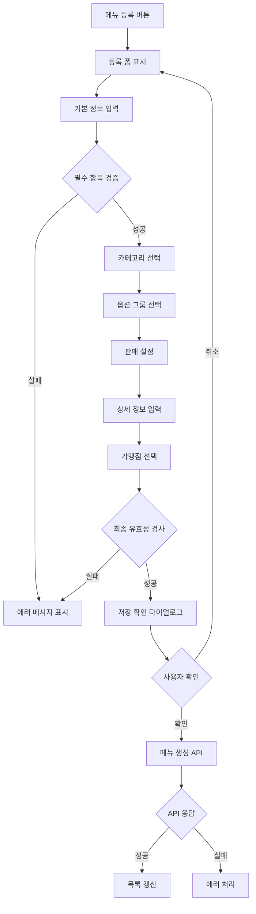
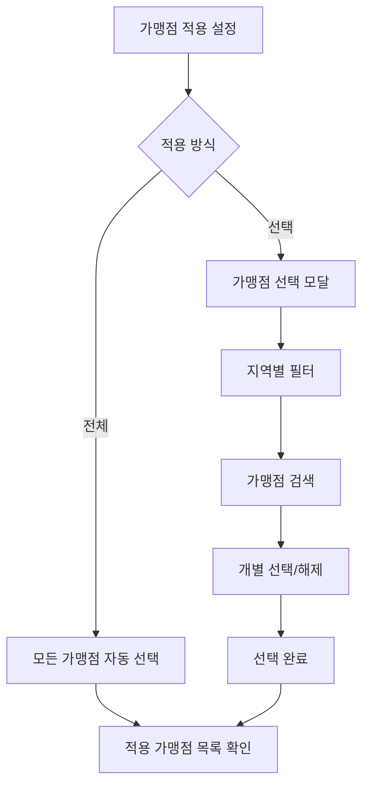
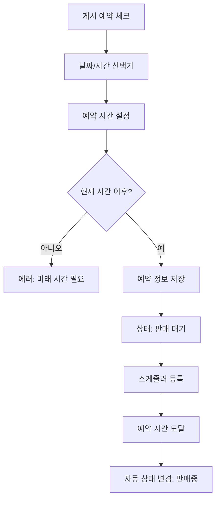

# 메뉴 관리 페이지 기획서

## 📋 개요

**페이지 경로**: `/menu/products`
**접근 권한**: 인증된 사용자 + `menu:write` 권한
**주요 목적**: 가맹점 메뉴 등록 및 통합 관리

---

## 🎯 주요 기능

### 1. 메뉴 기본 정보 관리 (필수 입력)
- 메뉴 이름
- 메뉴 이미지 (업로드)
- 가격 (통화 포맷)
- 메뉴 설명
- 속성 태그 (메인/사이드/음료 등 - 코드 관리 기반)

### 2. 가맹점 적용 관리
- **전체 가맹점 적용**: 모든 가맹점에 일괄 적용
- **선택 가맹점 적용**: 특정 가맹점만 선택하여 적용
- 가맹점별 적용 현황 조회

### 3. 포스 시스템 연동
- 메뉴별 포스 코드 매핑
- 포스 코드 중복 검증
- 가맹점별 포스 코드 관리

### 4. 옵션 그룹 관리
- 옵션 그룹 선택 (다중 선택 가능)
- 옵션 적용/미적용 토글
- 옵션 그룹별 필수/선택 설정

### 5. 멀티 카테고리 설정
- **메인 카테고리**: 1개 필수 선택
- **서브 카테고리**: 다중 선택 가능
- 카테고리 계층 구조 시각화

### 6. 판매 상태 관리
- **앱 노출 여부**: 고객 앱에 표시/숨김
- **판매 상태**:
  - 판매중
  - 판매 중지
  - 판매 대기
- **게시 예약**: 특정 일시에 자동 판매 시작

### 7. 결제 정책 설정
- 쿠폰 사용 여부
- 교환권 사용 여부
- 금액권 사용 여부

### 8. 상세 정보 관리
- **원산지 정보**: 주요 원재료별 원산지
- **영양정보**: 칼로리, 나트륨, 당류, 지방 등
- **알레르기 정보**: 알레르기 유발 성분 체크

### 9. 카테고리 표시 설정
- 카테고리별 노출 여부
- 카테고리 내 표시 순서
- 드래그 앤 드롭 정렬 (향후)

---

## 🖼️ 화면 구성

```
┌──────────────────────────────────────────────────────────┐
│  메뉴 관리              [메뉴 목록] [메뉴 등록]          │
├──────────────────────────────────────────────────────────┤
│  ┌─────────────────────┐ ┌──────────────────────────┐   │
│  │ 메뉴 목록 (좌측)    │ │ 메뉴 등록/수정 폼 (우측)  │   │
│  ├─────────────────────┤ ├──────────────────────────┤   │
│  │ 🍗 뿌링클           │ │ [기본정보] [옵션] [상세] │   │
│  │   15,000원          │ │                          │   │
│  │   판매중 · 노출     │ │ 메뉴명: [뿌링클]         │   │
│  │                     │ │ 가격: [15,000]원         │   │
│  │ 🍗 맛초킹           │ │ 이미지: [📎 업로드]      │   │
│  │   15,000원          │ │ 설명: [텍스트 영역]      │   │
│  │   판매중 · 노출     │ │ 속성: [메인 ▼]          │   │
│  │                     │ │                          │   │
│  │ 🥤 콜라             │ │ 카테고리:                │   │
│  │   2,000원           │ │ ☑ 한마리 (메인)         │   │
│  │   판매 중지         │ │ ☑ 음료 (서브)           │   │
│  │                     │ │                          │   │
│  │                     │ │ 옵션 그룹:               │   │
│  │                     │ │ ☑ 사이즈 선택           │   │
│  │                     │ │ ☐ 토핑 추가             │   │
│  │                     │ │                          │   │
│  │                     │ │ 판매 설정:               │   │
│  │                     │ │ 상태: [판매중 ▼]        │   │
│  │                     │ │ ☑ 앱 노출               │   │
│  │                     │ │ ☐ 게시 예약             │   │
│  │                     │ │                          │   │
│  │                     │ │ 가맹점 적용:             │   │
│  │                     │ │ ◉ 전체 가맹점           │   │
│  │                     │ │ ○ 선택 가맹점           │   │
│  │                     │ │                          │   │
│  │                     │ │ [저장] [취소]           │   │
│  └─────────────────────┘ └──────────────────────────┘   │
└──────────────────────────────────────────────────────────┘
```

---

## 🔄 사용자 플로우

### 메뉴 등록 플로우


### 가맹점 선택 플로우


### 게시 예약 플로우


---

## 📦 데이터 구조

### 메뉴 타입
```typescript
interface Product {
  id: string;
  name: string;
  price: number;
  description: string;
  imageUrl: string;

  // 속성 태그
  tags: ProductTag[];

  // 카테고리
  mainCategoryId: string;
  subCategoryIds: string[];

  // 옵션
  optionGroups: ProductOptionGroup[];

  // 판매 설정
  status: ProductStatus;
  isVisible: boolean;
  scheduledAt?: Date;

  // 가맹점 적용
  applyToAll: boolean;
  storeIds: string[];

  // 포스 연동
  posCode?: string;

  // 결제 정책
  allowCoupon: boolean;
  allowVoucher: boolean;
  allowGiftCard: boolean;

  // 상세 정보
  origin: OriginInfo[];
  nutrition: NutritionInfo;
  allergens: Allergen[];

  // 표시 순서
  displayOrder: number;

  // 메타
  createdAt: Date;
  updatedAt: Date;
  createdBy: string;
}

type ProductStatus = 'active' | 'inactive' | 'pending';

interface ProductTag {
  code: string;
  name: string;
  color?: string;
}

interface ProductOptionGroup {
  id: string;
  name: string;
  isRequired: boolean;
  isApplied: boolean;
  options: ProductOption[];
}

interface ProductOption {
  id: string;
  name: string;
  price: number;
}

interface OriginInfo {
  ingredient: string;
  origin: string;
}

interface NutritionInfo {
  calories: number;
  sodium: number;
  carbs: number;
  sugar: number;
  fat: number;
  protein: number;
  servingSize: string;
}

interface Allergen {
  code: string;
  name: string;
}
```

### 폼 데이터
```typescript
interface ProductFormData {
  // 기본 정보
  name: string;
  price: number;
  description: string;
  imageFile?: File;
  tags: string[];

  // 카테고리
  mainCategoryId: string;
  subCategoryIds: string[];

  // 옵션
  optionGroupIds: string[];

  // 판매 설정
  status: ProductStatus;
  isVisible: boolean;
  scheduledAt?: Date;

  // 가맹점
  applyToAll: boolean;
  storeIds: string[];

  // 포스
  posCode?: string;

  // 결제 정책
  allowCoupon: boolean;
  allowVoucher: boolean;
  allowGiftCard: boolean;

  // 상세 정보
  origin: OriginInfo[];
  nutrition: NutritionInfo;
  allergens: string[];

  // 표시 순서
  displayOrder: number;
}
```

---

## 🔌 API 엔드포인트

### 1. 메뉴 목록 조회
```
GET /api/menu/products
Authorization: Bearer {token}
Query: ?categoryId=1&status=active&page=1&limit=20

Response:
{
  "data": [
    {
      "id": "prod-1",
      "name": "뿌링클",
      "price": 15000,
      "imageUrl": "https://...",
      "status": "active",
      "isVisible": true,
      "mainCategory": { "id": "1", "name": "한마리" },
      "tags": [{ "code": "MAIN", "name": "메인" }]
    }
  ],
  "pagination": {
    "page": 1,
    "limit": 20,
    "total": 50
  }
}
```

### 2. 메뉴 상세 조회
```
GET /api/menu/products/:id
Authorization: Bearer {token}

Response:
{
  "data": {
    "id": "prod-1",
    "name": "뿌링클",
    "price": 15000,
    "description": "BHC 대표 메뉴",
    "imageUrl": "https://...",
    "tags": [{ "code": "MAIN", "name": "메인" }],
    "mainCategoryId": "1",
    "subCategoryIds": [],
    "optionGroups": [...],
    "status": "active",
    "isVisible": true,
    "applyToAll": true,
    "storeIds": [],
    "posCode": "M001",
    "allowCoupon": true,
    "allowVoucher": true,
    "allowGiftCard": false,
    "origin": [...],
    "nutrition": {...},
    "allergens": [...]
  }
}
```

### 3. 메뉴 생성
```
POST /api/menu/products
Content-Type: multipart/form-data

{
  "name": "신메뉴",
  "price": 18000,
  "description": "새로운 메뉴입니다",
  "image": [파일],
  "tags": ["MAIN"],
  "mainCategoryId": "1",
  "subCategoryIds": ["1-1"],
  "optionGroupIds": ["opt-1"],
  "status": "active",
  "isVisible": true,
  "applyToAll": true,
  "allowCoupon": true,
  "allowVoucher": true,
  "allowGiftCard": false
}

Response:
{
  "data": {
    "id": "prod-new",
    ...
  },
  "meta": {
    "appliedStores": 150
  }
}
```

### 4. 메뉴 수정
```
PATCH /api/menu/products/:id
Content-Type: application/json

{
  "price": 16000,
  "status": "inactive"
}
```

### 5. 메뉴 삭제
```
DELETE /api/menu/products/:id
Authorization: Bearer {token}

Response:
{
  "message": "메뉴가 삭제되었습니다",
  "meta": {
    "affectedStores": 150
  }
}
```

### 6. 이미지 업로드
```
POST /api/menu/products/upload-image
Content-Type: multipart/form-data

{
  "image": [파일]
}

Response:
{
  "data": {
    "imageUrl": "https://cdn.example.com/products/12345.jpg"
  }
}
```

### 7. 가맹점 목록 조회
```
GET /api/stores
Authorization: Bearer {token}
Query: ?region=서울&search=강남

Response:
{
  "data": [
    {
      "id": "store-1",
      "name": "강남점",
      "region": "서울",
      "address": "서울시 강남구..."
    }
  ]
}
```

### 8. 옵션 그룹 목록 조회
```
GET /api/menu/option-groups
Authorization: Bearer {token}

Response:
{
  "data": [
    {
      "id": "opt-1",
      "name": "사이즈 선택",
      "options": [
        { "id": "opt-1-1", "name": "레귤러", "price": 0 },
        { "id": "opt-1-2", "name": "라지", "price": 2000 }
      ]
    }
  ]
}
```

---

## 🎯 비즈니스 로직

### 1. 필수 입력 검증
```typescript
const validateProductForm = (data: ProductFormData): ValidationResult => {
  const errors: string[] = [];

  // 필수 필드 검증
  if (!data.name || data.name.trim().length === 0) {
    errors.push('메뉴명은 필수입니다');
  }

  if (!data.price || data.price <= 0) {
    errors.push('가격은 0원보다 커야 합니다');
  }

  if (!data.description || data.description.trim().length === 0) {
    errors.push('메뉴 설명은 필수입니다');
  }

  if (!data.mainCategoryId) {
    errors.push('메인 카테고리는 필수입니다');
  }

  if (!data.imageFile && !data.imageUrl) {
    errors.push('메뉴 이미지는 필수입니다');
  }

  // 가맹점 선택 검증
  if (!data.applyToAll && data.storeIds.length === 0) {
    errors.push('선택 가맹점 적용 시 최소 1개 가맹점을 선택해야 합니다');
  }

  // 게시 예약 검증
  if (data.scheduledAt) {
    const now = new Date();
    if (data.scheduledAt <= now) {
      errors.push('게시 예약 시간은 현재 시간 이후여야 합니다');
    }
  }

  return {
    isValid: errors.length === 0,
    errors
  };
};
```

### 2. 가맹점 적용 로직
```typescript
const applyProductToStores = async (
  productId: string,
  applyToAll: boolean,
  storeIds: string[]
): Promise<ApplyResult> => {
  let targetStores: string[] = [];

  if (applyToAll) {
    // 모든 활성 가맹점 조회
    const allStores = await storeService.getAllActiveStores();
    targetStores = allStores.map(s => s.id);
  } else {
    targetStores = storeIds;
  }

  // 가맹점별 메뉴 매핑 생성
  const mappings = targetStores.map(storeId => ({
    storeId,
    productId,
    appliedAt: new Date()
  }));

  await productStoreMapping.bulkCreate(mappings);

  return {
    success: true,
    appliedCount: targetStores.length
  };
};
```

### 3. 게시 예약 스케줄링
```typescript
const scheduleProductPublish = async (
  productId: string,
  scheduledAt: Date
): Promise<void> => {
  // 상태를 '판매 대기'로 설정
  await productService.updateStatus(productId, 'pending');

  // 스케줄러에 작업 등록
  await scheduler.schedule({
    id: `publish-${productId}`,
    executeAt: scheduledAt,
    task: async () => {
      await productService.updateStatus(productId, 'active');
      await notificationService.notify({
        type: 'PRODUCT_PUBLISHED',
        productId,
        message: `${product.name} 메뉴가 자동으로 판매 시작되었습니다`
      });
    }
  });
};
```

### 4. 포스 코드 중복 검증
```typescript
const validatePosCode = async (
  posCode: string,
  productId?: string
): Promise<boolean> => {
  const existing = await productService.findByPosCode(posCode);

  // 새 메뉴: 중복 검사
  if (!productId) {
    return existing === null;
  }

  // 수정: 자기 자신 제외하고 중복 검사
  return existing === null || existing.id === productId;
};
```

---

## 🔒 보안 고려사항

### 권한 관리
| 역할 | 조회 | 생성 | 수정 | 삭제 | 가맹점 선택 |
| --- | --- | --- | --- | --- | --- |
| Admin | ✅ | ✅ | ✅ | ✅ | ✅ |
| Manager | ✅ | ✅ | ✅ | ❌ | ⚠️ 제한적 |
| Viewer | ✅ | ❌ | ❌ | ❌ | ❌ |


### 데이터 검증
- ✅ 이미지 파일 확장자 검증 (jpg, png, webp)
- ✅ 이미지 파일 크기 제한 (5MB)
- ✅ XSS 방지: 메뉴 설명 HTML 이스케이프
- ✅ SQL Injection 방지: 파라미터 바인딩

### 파일 업로드 보안
```typescript
const validateImageFile = (file: File): ValidationResult => {
  const allowedTypes = ['image/jpeg', 'image/png', 'image/webp'];
  const maxSize = 5 * 1024 * 1024; // 5MB

  if (!allowedTypes.includes(file.type)) {
    return {
      isValid: false,
      error: '지원하지 않는 이미지 형식입니다'
    };
  }

  if (file.size > maxSize) {
    return {
      isValid: false,
      error: '이미지 크기는 5MB 이하여야 합니다'
    };
  }

  return { isValid: true };
};
```

---

## 🎨 UI 컴포넌트

### 사용될 컴포넌트
- `Card`, `CardHeader`, `CardContent` - 카드 레이아웃
- `Button` - 액션 버튼
- `Input`, `Textarea` - 텍스트 입력
- `Select` - 드롭다운 선택
- `Switch` - 토글 스위치
- `ImageUpload` - 이미지 업로드 (신규 필요)
- `CategorySelector` - 카테고리 선택기 (신규 필요)
- `StoreSelector` - 가맹점 선택기 (신규 필요)
- `OptionGroupSelector` - 옵션 그룹 선택기 (신규 필요)
- `DateTimePicker` - 날짜/시간 선택기 (신규 필요)
- `Badge` - 상태 표시
- `Tabs` - 탭 메뉴 (기본정보/옵션/상세)

### 신규 컴포넌트: ImageUpload
```tsx
interface ImageUploadProps {
  value?: string;
  onChange: (file: File) => void;
  maxSize?: number;
  aspectRatio?: number;
}

const ImageUpload: React.FC<ImageUploadProps> = ({
  value,
  onChange,
  maxSize = 5 * 1024 * 1024,
  aspectRatio
}) => {
  // 드래그 앤 드롭 + 클릭 업로드
  // 이미지 미리보기
  // 크기 제한 검증
  // 크롭 기능 (향후)
};
```

### 신규 컴포넌트: StoreSelector
```tsx
interface StoreSelectorProps {
  selectedStores: string[];
  onChange: (storeIds: string[]) => void;
  applyToAll: boolean;
  onApplyToAllChange: (value: boolean) => void;
}

const StoreSelector: React.FC<StoreSelectorProps> = ({
  selectedStores,
  onChange,
  applyToAll,
  onApplyToAllChange
}) => {
  // 전체/선택 라디오
  // 가맹점 검색
  // 지역별 필터
  // 체크박스 리스트
  // 선택된 가맹점 수 표시
};
```

---

## 📱 반응형 디자인

### Desktop (1024px+)
- 좌우 2단 레이아웃 (목록 30% : 폼 70%)
- 탭 기반 폼 구성
- 모든 필드 표시

### Tablet (768px ~ 1023px)
- 1단 스택 레이아웃
- 목록을 접을 수 있는 토글
- 폼 우선 표시

### Mobile (~767px)
- 전체 화면 폼
- 목록은 별도 페이지
- 간소화된 필드 배치
- 모바일 친화적 입력 컨트롤

---

## 🧪 테스트 시나리오

### 기능 테스트
- [ ] 메뉴 목록 조회 (필터, 검색)
- [ ] 메뉴 생성 (전체 필드)
- [ ] 메뉴 수정
- [ ] 메뉴 삭제
- [ ] 이미지 업로드
- [ ] 카테고리 선택 (메인 + 서브)
- [ ] 옵션 그룹 선택
- [ ] 가맹점 선택 (전체/선택)
- [ ] 게시 예약
- [ ] 판매 상태 변경

### 유효성 검사 테스트
- [ ] 필수 필드 누락 시 에러
- [ ] 가격 0원 이하 입력 차단
- [ ] 이미지 파일 형식 검증
- [ ] 이미지 파일 크기 검증 (5MB)
- [ ] 포스 코드 중복 검증
- [ ] 게시 예약 시간 검증 (미래 시간)

### 권한 테스트
- [ ] Viewer 역할 생성/수정 차단
- [ ] Manager 역할 삭제 차단
- [ ] 가맹점 선택 권한 확인

### UI/UX 테스트
- [ ] 폼 입력 반응성
- [ ] 이미지 미리보기
- [ ] 가맹점 선택 모달
- [ ] 로딩 상태 표시
- [ ] 에러 메시지 표시

---

## 📌 TODO

### 단기 (1-2주)
- [ ] 메뉴 목록/상세 조회 UI 구현
- [ ] 메뉴 등록 폼 (기본정보) 구현
- [ ] 이미지 업로드 컴포넌트
- [ ] 카테고리 선택 컴포넌트
- [ ] 필수 필드 유효성 검사
- [ ] Mock API 연동

### 중기 (1-2개월)
- [ ] 옵션 그룹 관리
- [ ] 가맹점 선택 모달
- [ ] 게시 예약 기능
- [ ] 상세 정보 입력 (원산지, 영양정보, 알레르기)
- [ ] 포스 코드 연동
- [ ] 드래그 앤 드롭 정렬
- [ ] 일괄 수정 기능

### 장기 (3개월+)
- [ ] 메뉴 복제 기능
- [ ] 메뉴 템플릿
- [ ] 메뉴 가져오기/내보내기 (Excel)
- [ ] 메뉴 변경 이력 조회
- [ ] 메뉴별 판매 통계
- [ ] 이미지 크롭/편집 기능
- [ ] AI 기반 메뉴 설명 자동 생성

---

## 🎯 사용자 시나리오

### 시나리오 1: 신메뉴 등록 (전체 가맹점)
```
관리자가 신규 시즌 메뉴를 등록하고 전국 모든 가맹점에 적용합니다.

1. [메뉴 등록] 버튼 클릭
2. 메뉴명: "매콤 핫치킨"
3. 가격: 18,000원
4. 이미지 업로드 (드래그 앤 드롭)
5. 설명: "매운맛을 좋아하는 분들을 위한 시즌 메뉴"
6. 속성: "메인" 선택
7. 메인 카테고리: "한마리" 선택
8. 옵션 그룹: "사이즈 선택" 적용
9. 판매 상태: "판매중" 선택
10. 앱 노출: 활성화
11. 가맹점 적용: "전체 가맹점" 선택
12. 쿠폰/교환권/금액권: 모두 허용
13. [저장] 클릭
14. 150개 가맹점에 적용 완료 메시지
```

### 시나리오 2: 지역 한정 메뉴 등록
```
서울 지역 가맹점에만 판매하는 한정 메뉴를 등록합니다.

1. [메뉴 등록] 버튼 클릭
2. 기본 정보 입력 (메뉴명, 가격, 이미지, 설명)
3. 가맹점 적용: "선택 가맹점" 선택
4. [가맹점 선택] 버튼 클릭
5. 지역 필터: "서울" 선택
6. 서울 지역 가맹점 30개 일괄 선택
7. [확인] 클릭
8. 나머지 정보 입력
9. [저장] 클릭
10. 30개 가맹점에 적용 완료
```

### 시나리오 3: 게시 예약 메뉴
```
특정 일시에 자동으로 판매 시작되는 메뉴를 예약합니다.

1. 메뉴 등록 폼에서 기본 정보 입력
2. 판매 상태: "판매 대기" 선택
3. "게시 예약" 체크박스 활성화
4. 날짜 선택: 2026-02-10
5. 시간 선택: 09:00
6. [저장] 클릭
7. "2026-02-10 09:00에 자동 판매 시작됩니다" 메시지
8. 예약 시간에 자동으로 판매 상태로 전환
```

### 시나리오 4: 메뉴 수정
```
기존 메뉴의 가격과 설명을 수정합니다.

1. 메뉴 목록에서 "뿌링클" 클릭
2. 상세 정보 확인
3. [수정] 버튼 클릭
4. 가격: 15,000원 → 16,000원
5. 설명 수정: "BHC 베스트셀러 메뉴"
6. [저장] 클릭
7. 적용된 모든 가맹점에 변경사항 반영
```

---

## 🔄 데이터 흐름도

### 메뉴 생성 플로우
```
사용자 입력
    ↓
폼 유효성 검사
    ↓
이미지 업로드 (별도 API)
    ↓
메뉴 데이터 생성 (POST /api/menu/products)
    ↓
가맹점 매핑 생성 (applyToAll 또는 선택)
    ↓
포스 시스템 연동 (posCode 전송)
    ↓
게시 예약 스케줄링 (optional)
    ↓
성공 응답 + 적용 가맹점 수
    ↓
목록 갱신
```

---

## 💡 고려사항

### 1. 대용량 가맹점 처리
- 전체 가맹점 적용 시 비동기 처리
- 배치 작업으로 분산 처리
- 진행 상황 표시 (Progress Bar)

### 2. 이미지 최적화
- 업로드 시 자동 리사이징
- WebP 포맷 변환
- CDN 캐싱

### 3. 실시간 동기화
- 메뉴 변경 시 가맹점 POS 실시간 반영
- WebSocket 또는 푸시 알림 활용

### 4. 에러 복구
- 가맹점 적용 실패 시 롤백
- 재시도 메커니즘
- 부분 성공 처리 (일부 가맹점만 성공)

---

**작성일**: 2026-02-03
**최종 수정일**: 2026-02-03
**작성자**: Claude Code
