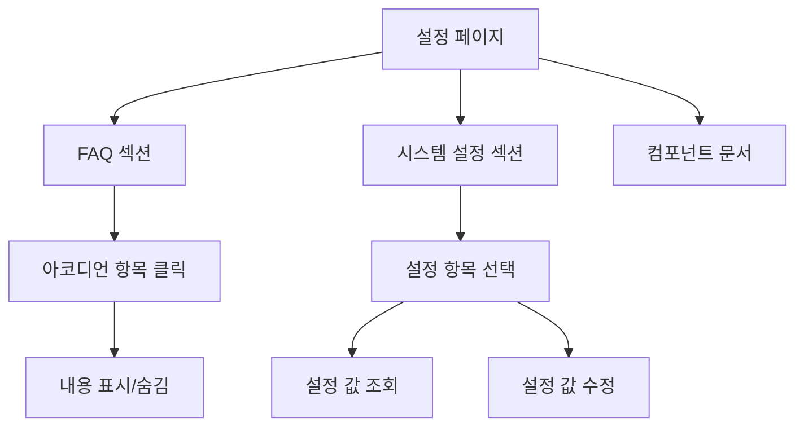

# 설정 페이지 기획서

## 📋 개요

**페이지 경로**: `/settings`
**접근 권한**: 인증된 사용자 (모든 역할)
**주요 목적**: 시스템 설정 관리 및 FAQ 제공

---

## 🎯 주요 기능

### 1. 아코디언 컴포넌트 데모
- FAQ 섹션
- 시스템 설정 섹션
- 단일/다중 항목 열기 지원

### 2. FAQ (자주 묻는 질문)
- 접근성 정보
- 스타일링 정보
- 애니메이션 정보
- 제어 가능 여부

### 3. 시스템 설정
- **일반 설정**
  - 시스템 이름
  - 타임존
- **보안 설정**
  - 세션 타임아웃
  - 2차 인증
  - 비밀번호 정책
- **알림 설정**
  - 이메일 알림
  - 알림 빈도

### 4. 컴포넌트 문서
- Props 설명
- 접근성 정보
- 사용법 가이드

---

## 🖼️ 화면 구성

```
┌──────────────────────────────────────────────────┐
│  ┌─────────────────────────────────────────┐    │
│  │ 자주 묻는 질문 (FAQ)                     │    │
│  │ 아코디언 컴포넌트 사용 예제입니다.        │    │
│  ├─────────────────────────────────────────┤    │
│  │ ▼ Is it accessible?                     │    │
│  │   Yes. It adheres to the WAI-ARIA...    │    │
│  ├─────────────────────────────────────────┤    │
│  │ ▶ Is it styled?                         │    │
│  ├─────────────────────────────────────────┤    │
│  │ ▶ Is it animated?                       │    │
│  └─────────────────────────────────────────┘    │
├──────────────────────────────────────────────────┤
│  ┌─────────────────────────────────────────┐    │
│  │ 시스템 설정                              │    │
│  ├─────────────────────────────────────────┤    │
│  │ ▼ 일반 설정                             │    │
│  │   시스템 이름: CNTTECH Admin Dashboard  │    │
│  │   타임존: Asia/Seoul (GMT+9)            │    │
│  ├─────────────────────────────────────────┤    │
│  │ ▶ 보안 설정                             │    │
│  ├─────────────────────────────────────────┤    │
│  │ ▶ 알림 설정                             │    │
│  └─────────────────────────────────────────┘    │
├──────────────────────────────────────────────────┤
│  ┌─────────────────────────────────────────┐    │
│  │ 컴포넌트 사용법                          │    │
│  │ Props, 접근성 정보                      │    │
│  └─────────────────────────────────────────┘    │
└──────────────────────────────────────────────────┘
```

---

## 🔄 사용자 플로우



---

## 📦 데이터 구조

### 아코디언 아이템
```typescript
interface AccordionItemData {
  id: string;
  title: string;
  content: string | ReactNode;
}
```

### 시스템 설정
```typescript
interface SystemSettings {
  general: {
    systemName: string;
    timezone: string;
    language: string;
  };
  security: {
    sessionTimeout: number;  // 분 단위
    mfaEnabled: boolean;
    passwordPolicy: {
      minLength: number;
      requireUppercase: boolean;
      requireNumber: boolean;
      requireSpecialChar: boolean;
    };
  };
  notification: {
    emailEnabled: boolean;
    frequency: 'immediate' | 'hourly' | 'daily';
  };
}
```

---

## 🔌 API 엔드포인트

### 1. 시스템 설정 조회
```
GET /api/settings
Authorization: Bearer {token}

Response:
{
  "data": {
    "general": {
      "systemName": "CNTTECH Admin Dashboard",
      "timezone": "Asia/Seoul"
    },
    "security": {
      "sessionTimeout": 30,
      "mfaEnabled": true
    },
    "notification": {
      "emailEnabled": true,
      "frequency": "immediate"
    }
  }
}
```

### 2. 시스템 설정 업데이트
```
PATCH /api/settings
Content-Type: application/json

{
  "security": {
    "sessionTimeout": 60
  }
}
```

---

## 🎨 UI 컴포넌트

### 사용된 컴포넌트
- `Card`, `CardHeader`, `CardContent` - 카드 레이아웃
- `Accordion` - 아코디언 컴포넌트
  - `items`: 아코디언 아이템 배열
  - `defaultOpenId`: 기본 열림 아이템 ID
  - `allowMultiple`: 다중 열기 허용

### 아코디언 특징
- **단일 모드** (기본): 한 번에 하나의 항목만 열림
- **다중 모드** (`allowMultiple`): 여러 항목 동시 열림
- **접근성**: WAI-ARIA 준수 (`aria-expanded`)
- **애니메이션**: 부드러운 열림/닫힘 효과

---

## 🎯 비즈니스 로직

### 1. 설정 값 검증
```typescript
// 세션 타임아웃: 10분 ~ 120분
const validateSessionTimeout = (minutes: number) => {
  return minutes >= 10 && minutes <= 120;
};

// 비밀번호 정책: 최소 8자
const validatePasswordPolicy = (policy) => {
  return policy.minLength >= 8;
};
```

### 2. 설정 변경 감사
- 설정 변경 시 감사 로그 기록
- 변경 전/후 값 저장
- 변경 사용자 정보 기록

---

## 🔒 보안 고려사항

### 권한 관리
| 역할 | 조회 | 수정 |
| --- | --- | --- |
| Admin | ✅ | ✅ |
| Manager | ✅ | ⚠️ 일부 |
| Viewer | ✅ | ❌ |


### 민감한 설정
- 보안 설정: Admin만 수정 가능
- 일반 설정: Manager 이상 수정 가능
- 개인 설정: 모든 사용자 수정 가능

---

## 📱 반응형 디자인

### Desktop (1024px+)
- 전체 레이아웃 표시
- 3단 카드 구조

### Tablet (768px ~ 1023px)
- 2단 레이아웃
- 축소된 패딩

### Mobile (~767px)
- 1단 스택
- 간소화된 아코디언

---

## 🧪 테스트 시나리오

### 기능 테스트
- [ ] 아코디언 열기/닫기
- [ ] 단일/다중 모드 전환
- [ ] 설정 값 조회
- [ ] 설정 값 수정
- [ ] 유효성 검사

### 접근성 테스트
- [ ] 키보드 네비게이션
- [ ] 스크린 리더 호환
- [ ] aria-expanded 속성
- [ ] 포커스 관리

---

## 📌 TODO

### 단기 (1-2주)
- [ ] 설정 수정 기능 구현
- [ ] 개인 설정 섹션 추가
- [ ] 테마 설정 (라이트/다크 모드)
- [ ] 언어 설정

### 중기 (1-2개월)
- [ ] 이메일 알림 템플릿 설정
- [ ] 백업 및 복원 기능
- [ ] 로그 보관 정책 설정
- [ ] API 키 관리

### 장기 (3개월+)
- [ ] 고급 보안 설정 (IP 화이트리스트)
- [ ] 사용자 정의 설정 그룹
- [ ] 설정 버전 관리
- [ ] 설정 가져오기/내보내기

---

## 🎨 디자인 가이드

### 아코디언 스타일
```css
/* 헤더 */
- 배경: 투명
- 호버: bg-hover
- 패딩: 16px
- 폰트: 14px, 600

/* 내용 */
- 배경: bg-main
- 패딩: 16px
- 애니메이션: slideDown
```

### 카드 스타일
```css
/* 카드 */
- 배경: white
- 보더: 1px solid border
- 라운드: 12px
- 그림자: shadow-card
```

---

## 📄 컴포넌트 문서 (Storybook 스타일)

### Accordion Props

| Prop | Type | Default | Description |
| --- | --- | --- | --- |
| `items` | `AccordionItemData[]` | - | 아코디언 아이템 배열 (필수) |
| `defaultOpenId` | `string` | - | 기본으로 열려있을 아이템 ID |
| `allowMultiple` | `boolean` | `false` | 여러 아이템 동시 열기 허용 |
| `className` | `string` | - | 커스텀 CSS 클래스 |


### 사용 예시

```tsx
const items: AccordionItemData[] = [
  {
    id: '1',
    title: 'Is it accessible?',
    content: 'Yes. It adheres to the WAI-ARIA design pattern.',
  },
];

<Accordion
  items={items}
  defaultOpenId="1"
  allowMultiple={false}
/>
```

---

**작성일**: 2026-02-03
**최종 수정일**: 2026-02-03
**작성자**: Claude Code
